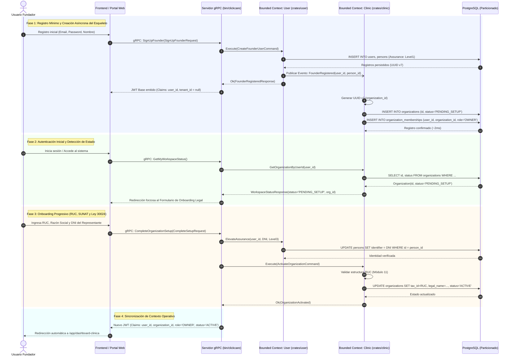
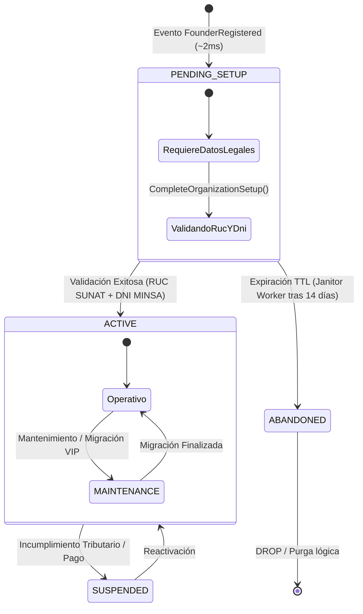
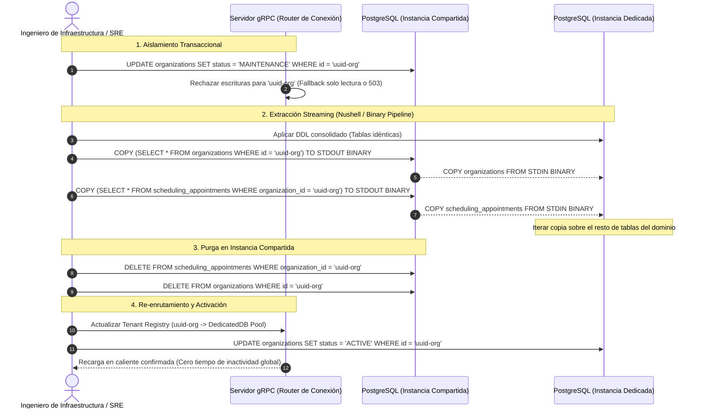

# ESPECIFICACIÓN TÉCNICA DE ARQUITECTURA

| Metadato | Detalle |
| :--- | :--- |
| **Documento** | RFC-004: Aislamiento Multi-Inquilino, Persistencia Particionada y Aprovisionamiento Reactivo de Organizaciones |
| **Estado** | Aprobado / Especificación Normativa |
| **Alcance** | `crates/user`, `crates/clinic`, `crates/scheduling`, `crates/clinical`, Capa de Infraestructura |
| **Motor de Persistencia** | PostgreSQL 16+ (Particionamiento Declarativo por Hash) |
| **Estándares** | HL7 FHIR R4 (`Person`, `Organization`), Ley N° 30024 (RNHCE - MINSA), Arquitectura Cebolla |

---

### 1. Objeto y Alcance del Diseño

La presente especificación formaliza el ciclo de vida, aprovisionamiento e infraestructura multi-inquilino (*multi-tenant*) del sistema. Se adopta un modelo reactivo guiado por eventos del dominio con **particionamiento declarativo por Hash** en PostgreSQL.

Este diseño elimina la ejecución de sentencias DDL en tiempo de ejecución (`CREATE SCHEMA` o `CREATE TABLE` dinámicos), suprime tiempos de espera artificiales en la experiencia de usuario y garantiza que la creación técnica de una clínica se complete en milisegundos mediante un registro esquelético mínimo, difiriendo la captura de información fiscal y regulatoria al primer inicio de sesión.

---

### 2. Invariantes Arquitectónicas y Reglas de Persistencia

#### 2.1. Creación Reactiva Mínima por Evento

* **Disparo**: Al completarse el registro de un usuario con intención de fundador en `crates/user`, se emite el evento de dominio `FounderRegistered`.
* **Reacción en `crates/clinic`**: Un manejador de eventos (*Event Consumer*) inicializa de forma asíncrona in-process la organización clínica, generando un identificador UUID v7 e insertando un registro en la tabla particionada `organizations` con `status = 'PENDING_SETUP'`.
* **Latencia Operacional**: La persistencia del esqueleto toma $\approx 2\text{ ms}$, prescindiendo de colas de espera pesadas o pantallas de bloqueo en el cliente.
* **Cero Datos Fiscales Preliminares**: El evento no requiere ni procesa RUC, razón social, dirección fiscal ni licencias operativas.

#### 2.2. Ubicuidad de la Clave de Partición (`organization_id`)

* Toda tabla que almacene datos transaccionales, clínicos o administrativos (`appointments`, `encounters`, `prescriptions`, `invoices`) debe declarar de manera mandatoria la columna `organization_id UUID NOT NULL` indexada y prefijada.
* Queda terminantemente prohibido resolver la pertenencia a una clínica mediante recorridos transitivos entre tablas.

#### 2.3. Claves Primarias Compuestas para Poda de Particiones (*Partition Pruning*)

* Las tablas particionadas por hash sobre `organization_id` definen su clave primaria como:
  $$\text{PRIMARY KEY } (organization\_id, id)$$
* Esto asegura unicidad estricta y garantiza que el planificador de PostgreSQL descarte las cubetas no coincidentes de forma determinista.

---

### 3. Modelo DDL Canónico (Particionamiento por Hash)

Las cubetas físicas se configuran en el despliegue inicial de infraestructura; ninguna migración DDL ocurre durante la interacción del usuario:

```sql
-- 1. Tabla de Organizaciones (FHIR Organization)
CREATE TABLE organizations (
    id              UUID NOT NULL DEFAULT gen_random_uuid(),
    status          VARCHAR(32) NOT NULL DEFAULT 'PENDING_SETUP', -- PENDING_SETUP, ACTIVE, SUSPENDED, MAINTENANCE
    tax_id          VARCHAR(11),                                  -- RUC (11 dígitos - SUNAT)
    legal_name      VARCHAR(255),
    trade_name      VARCHAR(255),
    created_at      TIMESTAMPTZ NOT NULL DEFAULT clock_timestamp(),
    updated_at      TIMESTAMPTZ NOT NULL DEFAULT clock_timestamp(),

    CONSTRAINT pk_organizations PRIMARY KEY (id),
    CONSTRAINT uq_organizations_tax_id UNIQUE (tax_id)
);

-- 2. Tabla Transaccional Particionada (Ejemplo: Citas Médicas)
CREATE TABLE scheduling_appointments (
    organization_id UUID NOT NULL,
    id              UUID NOT NULL DEFAULT gen_random_uuid(),
    patient_id      UUID NOT NULL,
    practitioner_id UUID NOT NULL,
    start_time      TIMESTAMPTZ NOT NULL,
    end_time        TIMESTAMPTZ NOT NULL,
    status          VARCHAR(32) NOT NULL,
    created_at      TIMESTAMPTZ NOT NULL DEFAULT clock_timestamp(),

    CONSTRAINT pk_scheduling_appointments PRIMARY KEY (organization_id, id)
) PARTITION BY HASH (organization_id);

-- 3. Pre-aprovisionamiento de Cubetas Fijas (Módulo 8)
CREATE TABLE scheduling_appointments_p0 PARTITION OF scheduling_appointments FOR VALUES WITH (MODULUS 8, REMAINDER 0);
CREATE TABLE scheduling_appointments_p1 PARTITION OF scheduling_appointments FOR VALUES WITH (MODULUS 8, REMAINDER 1);
CREATE TABLE scheduling_appointments_p2 PARTITION OF scheduling_appointments FOR VALUES WITH (MODULUS 8, REMAINDER 2);
CREATE TABLE scheduling_appointments_p3 PARTITION OF scheduling_appointments FOR VALUES WITH (MODULUS 8, REMAINDER 3);
CREATE TABLE scheduling_appointments_p4 PARTITION OF scheduling_appointments FOR VALUES WITH (MODULUS 8, REMAINDER 4);
CREATE TABLE scheduling_appointments_p5 PARTITION OF scheduling_appointments FOR VALUES WITH (MODULUS 8, REMAINDER 5);
CREATE TABLE scheduling_appointments_p6 PARTITION OF scheduling_appointments FOR VALUES WITH (MODULUS 8, REMAINDER 6);
CREATE TABLE scheduling_appointments_p7 PARTITION OF scheduling_appointments FOR VALUES WITH (MODULUS 8, REMAINDER 7);

-- 4. Índice de Cobertura para Poda
CREATE INDEX idx_appointments_lookup
    ON scheduling_appointments (organization_id, practitioner_id, start_time);
```

---

### 4. Ciclo de Vida: Registro Mínimo por Evento y Onboarding Progresivo

El aprovisionamiento se articula en dos fases disjuntas: el nacimiento reactivo de la entidad y la posterior formalización regulatoria ante MINSA/SUNAT al iniciar sesión.



---

### 5. Máquina de Estados de la Organización



* **`PENDING_SETUP`**: Estado inicial esquelético. La entidad existe a nivel relacional, pero tiene prohibido agendar citas (`crates/scheduling`), admitir pacientes (`crates/patient`) o emitir recetas (`crates/clinical`).
* **`ACTIVE`**: Organización validada con RUC formal y DNI del representante legal verificado conforme a la Ley N° 30024. Acceso operativo irrestricto.
* **`MAINTENANCE`**: Bloqueo selectivo de peticiones mutables (`POST`, `PUT`, `DELETE` retornan `gRPC: UNAVAILABLE` / HTTP 503) durante ventanas de migración o exportación hacia infraestructura dedicada.

---

### 6. Protocolo de Extracción Hacia Base de Datos Dedicada

Cuando un cliente requiere cómputo aislado o soberanía de datos estricta, la presencia ubicua de `organization_id` permite realizar la extracción sin transformaciones intermedias ni reconstrucción de árboles de relaciones:



#### Script Operativo de Extracción en Nushell (`export_tenant.nu`)

```bash
#!/usr/bin/env nu

def export-tenant [
    org_id: string,
    shared_url: string,
    dedicated_url: string
] {
    let target_tables = [
        "organizations",
        "organization_memberships",
        "scheduling_appointments",
        "clinical_encounters",
        "clinical_prescriptions",
        "billing_invoices"
    ]

    print $"Iniciando extracción para Organización: ($org_id)"

    for table in $target_tables {
        let condition = if $table == "organizations" {
            $"id = '($org_id)'"
        } else {
            $"organization_id = '($org_id)'"
        }

        print $"Transfiriendo tabla ($table)..."

        psql $shared_url -c $"COPY (SELECT * FROM ($table) WHERE ($condition)) TO STDOUT BINARY;"
        | psql $dedicated_url -c $"COPY ($table) FROM STDIN BINARY;"
    }

    print "Transferencia binaria completada exitosamente."
}
```

---

### 7. Criterios de Aceptación Normativa

1. **Latencia del Alta**: El endpoint de registro del fundador debe retornar una respuesta exitosa en un tiempo $\le 100\text{ ms}$, completando la inserción de `organizations` en segundo plano en $\le 5\text{ ms}$.
2. **Barrera de Acceso (`Guard`)**: Toda llamada a los servicios de citas (`scheduling`), pacientes (`patient`) o historias clínicas (`clinical`) debe validar a nivel de middleware que el `organization_id` posea el estado `ACTIVE`.
3. **Verificación Formal**: Es condición ineludible para la activación que el RUC sea validado mediante el algoritmo oficial de Módulo 11 (SUNAT) y que el DNI del titular quede registrado en `crates/user` con nivel de aseguramiento verificado.
