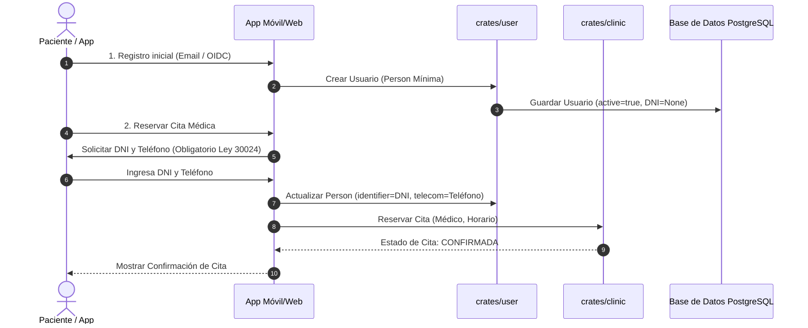
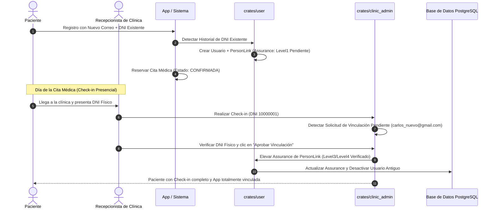
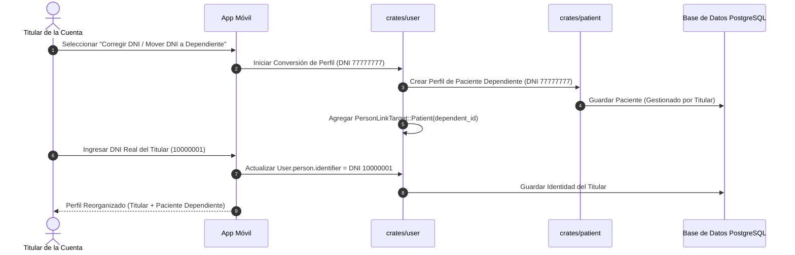
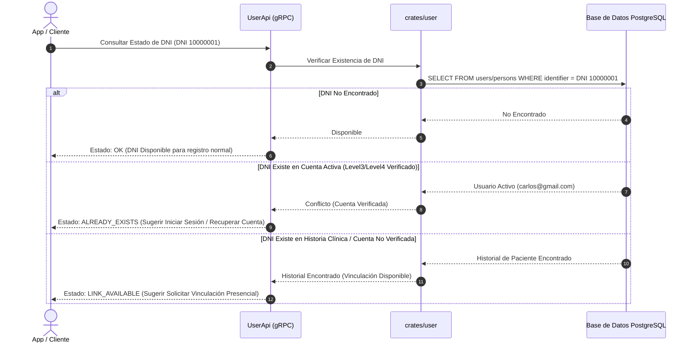
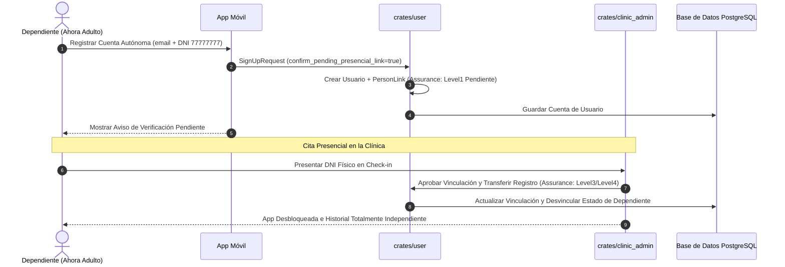
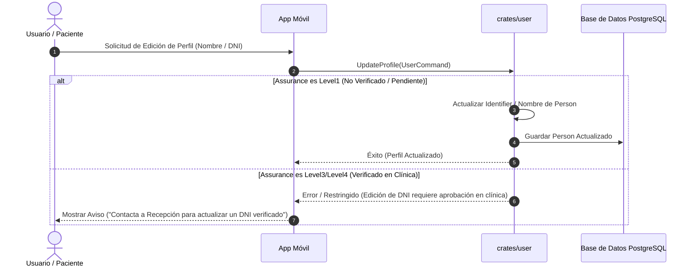
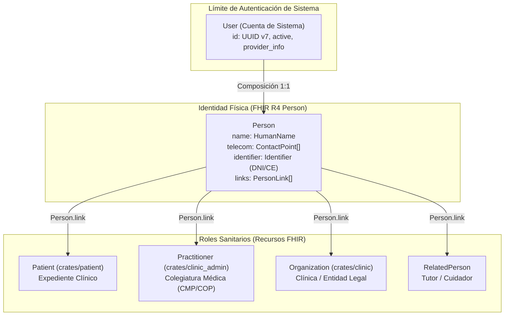
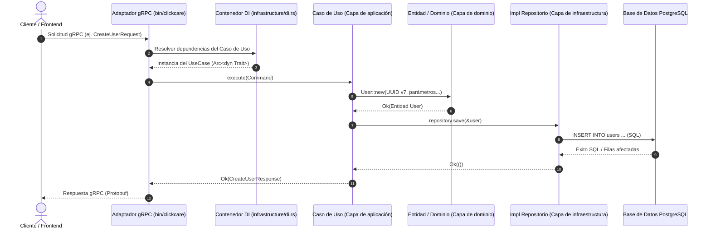

# Guías del Repositorio y Visión General del Proyecto

## Descripción del Proyecto

**My Health Record (Backend)** es un servicio de backend en Rust 2024 para la gestión de salud que sigue la **Arquitectura Cebolla (Onion Architecture)**. Proporciona una API gRPC de alto rendimiento (utilizando `tonic` y `axum`) con soporte gRPC-Web, manejando contextos delimitados del dominio como usuarios, pacientes, clínicas y administración clínica.

### Principios Arquitectónicos y Directivas de Memoria

#### 1. Diseño Guiado por el Dominio (DDD) y Alineación con HL7 FHIR
- **Protección y Limites del Dominio**: Adherencia estricta a los principios de DDD para proteger el dominio y mantener los contextos delimitados aislados, asegurando que la lógica de negocio y sus invariantes estén protegidos contra filtraciones de infraestructura o externas. Los límites y entidades del dominio se modelan siguiendo las especificaciones de **HL7 FHIR** como guía principal siempre que sea posible.
- **Contextos Delimitados y Mapeo de Recursos FHIR**:

  | Crate / Bounded Context | Recurso FHIR Principal | Responsabilidad y Alcance del Dominio |
  |---|---|---|
  | **`crates/user`** | **`Person`** + `User` | **Cuenta de Sistema e Identidad Física**: `User` gestiona la autenticación del sistema (`id`, `active`, `provider_info`, `is_owner`). La identidad física humana vive strictly en **FHIR R4 `Person`** (`name`, `telecom`, `identifier`, `links`). |
  | **`crates/patient`** | **`Patient`** | **Expediente Clínico**: Registro de salud del paciente, contactos de emergencia, médico principal (`generalPractitioner`) e historiales de atención. |
  | **`crates/clinic`** | **`Organization`** / **`Location`** | **Clínica y Instalaciones Físicas**: `Organization` representa la entidad legal (RUC, razón social, facturación). `Location` representa sedes físicas, consultorios o áreas de atención. |
  | **`crates/clinic_admin`** | **`Practitioner`** / **`PractitionerRole`** | **Profesionales de Salud y Admisión**: `Practitioner` almacena credenciales médicas (CMP/COP, especialidad). `PractitionerRole` mapea roles médicos, horarios y vinculaciones a clínicas. |
  | **`crates/core`** | Tipos de Datos FHIR | Value Objects compartidos (`HumanName`, `ContactPoint`, `Identifier`, `Address`). |
- **Composición de Cuenta e Identidad de Usuario (`User` -> `Person`)**: `User` representa el límite de autenticación / cuenta del sistema (`id`, `active`, `person`, `provider_info`, `is_owner`). La identidad humana física y su demografía viven estrictamente dentro de `User.person`, siguiendo **HL7 FHIR R4 Person** (`name`, `telecom`, `identifier`, `links`). Nunca aplanar los campos de `Person` directamente dentro de `User`.
- **Enlaces de Roles vía `Person.link`**: Una `Person` se conecta con sus roles sanitarios mediante los destinos de `PersonLink` (`Patient`, `Practitioner`, `RelatedPerson`, `Organization`). Esto permite que una sola cuenta de usuario gestione múltiples perfiles de pacientes (ej. padres administrando a sus hijos) o administre una clínica sin requerir un registro de paciente ficticio.
- **Terminología y Convenciones FHIR**: `HumanName` utiliza `given`, `family`, `second_family` (extensión hispana) y `text`. `ContactPoint` utiliza `system` (`Phone`, `Email`, etc.) y `use_type`. Nota: FHIR `Account` se refiere exclusivamente a cuentas financieras de facturación/cobertura; las cuentas de autenticación del sistema se mapean a `User` / `Person`.

#### 2. Encapsulamiento del Dominio y Convenciones de Código
- **Encapsulamiento de Value Objects del Dominio y Convenciones de Getters (Rust C-GETTER)**: Los Value Objects y Entidades del Dominio mantienen sus campos internos encapsulados para hacer cumplir los invariantes de negocio. Los Smart Constructors (`new`) pre-calculan y garantizan campos válidos (ej. `text: String`). Los getters de solo lectura siguen las guías de API de Rust (convención `C-GETTER`) y se auto-generan vía `derive_getters::Getters` (o `bon::Builder` para construcción fluente) para eliminar código repetitivo manteniendo un estricto encapsulamiento.
- **Patrón Builder Seguro (`bon`)**: Para objetos con campos internos calculados (ej. `HumanName.text`), no derivar `Builder` directamente en la struct; aplicar `#[bon::bon]` en el bloque `impl` con `#[builder] pub fn builder(...)` delegando a `new()`, evitando que llamadores externos salten las reglas de cálculo.

#### 3. Mapeo de Datos y Cumplimiento de Interoperabilidad
- **Mapeo de Solicitudes BFF vs. Dominio FHIR**: Los DTOs de la API externa (`proto/api.proto`) mantienen campos planos y convenientes alineados a los payloads del frontend y proveedores OAuth (ej. `provider_avatar_url`, `id_token`, `provider_id`). Los Casos de Uso de la Aplicación deben mapear explícitamente estos campos planos a Value Objects ricos del dominio FHIR (`Person`, `HumanName`, `ContactPoint`) al ingresar a la capa de dominio. Nunca filtrar estructuras planas de DTOs dentro de entidades de dominio.
- **Tipos de Datos FHIR Compartidos (`crates/core`)**: Los tipos de datos core de FHIR (`HumanName`, `ContactPoint`, `Identifier`, `Address`, `Attachment`) se definen en `crates/core` (`app_core::domain::fhir`) para que todos los contextos delimitados (`user`, `patient`, `clinic`, `clinic_admin`) compartan Value Objects unificados e inmutables.
- **Cumplimiento Normativo Sanitario Peruano**: Los identificadores nacionales en `Identifier` se mapean a los registros oficiales peruanos (ej. `DNI` utiliza el sistema `http://reniec.gob.pe/dni` o código FHIR `NNPER`). La codificación diagnóstica se alinea con **CIE-10** (oficial MINSA) y **SNOMED CT**, observaciones de laboratorio con **LOINC**, e imágenes médicas con **DICOM**.

#### 4. Estrategia de Negocio y Registro Progresivo
- **Estrategia de Registro Progresivo (Progressive Profiling)**: Flujo de registro unificado con recolección progresiva de datos. La creación inicial de la cuenta requiere datos mínimos (DNI opcional). El registro del documento de identidad nacional (`Identifier`) se exige progresivamente según disparadores operacionales por rol:

  | Rol del Usuario | ¿DNI al registrarse? | Disparador Mandatorio de DNI | Razón de Negocio / Legal (Perú) |
  |---|---|---|---|
  | **Paciente (`Patient`)** | ❌ Opcional | Al **confirmar su primera cita médica** o emitir una receta / atención. | Ley N° 30024 RNHCE / MINSA (asociación de Historia Clínica a persona real). |
  | **Administrador de Clínica (`Clinic Admin`)** | ❌ Opcional | Al **activar/crear la Clínica (`Organization`)** o configurar facturación/RUC. | Verificación de identidad legal del representante de la clínica. |
  | **Profesional de Salud (`Practitioner`)** | ❌ Opcional | Al **activar perfil médico**, habilitar agenda o **firmar atenciones/recetas**. | Verificación de identidad + Colegiatura (CMP/COP) para emitir actos médicos. |

- **Invariantes de Unicidad e Identidad**:
  - `User.email`: Estrictamente único por cuenta de sistema (Credencial principal de autenticación).
  - `User.person.identifier` (DNI): Único por cuenta `User` principal para garantizar una única Historia Clínica Electrónica (HCE / Ley N° 30024) por ciudadano físico.
  - `ContactPoint` (Teléfono): Unicidad no estricta / compartida (permite a familiares o padres administrando dependientes compartir números telefónicos de casa o contacto).

- **Recuperación de Cuenta, Re-vinculación y Verificación Presencial**:
  - **Recuperación por Pérdida de Correo / Teléfono**: Cuando un usuario registra una nueva cuenta con un DNI que ya está vinculado a una identidad existente cuyas credenciales se perdieron:
    1. Se crea una nueva cuenta `User` con `PersonLink` en estado `Pendiente de Verificación` (`LinkAssuranceLevel::Level1`).
    2. **La Reserva de la Cita Médica queda 100% CONFIRMADA** (nunca tentativa; el cupo médico queda totalmente garantizado para el paciente).
    3. **Check-in Presencial y Aprobación**: El día de la cita, durante el check-in presencial en recepción, la recepcionista verifica el DNI físico, completando el check-in y elevando el `LinkAssuranceLevel` a verificado (`Level3`/`Level4`), desbloqueando el acceso a historiales pasados en la App de forma transparente.

- **Estados de Respuesta de Registro en la API (`proto/api.proto`)**:
  - `SignUpStatus::SUCCESS`: Cuenta creada limpiamente. Mensaje de respuesta: `"Usuario registrado exitosamente."`
  - `SignUpStatus::LINK_PENDING_PRESENCIAL_VERIFICATION`: Cuenta creada con confirmación explícita (`confirm_pending_presencial_link = true`); se detectó historial previo del DNI. `PersonLink` configurado en `Level1` (Pendiente). Mensaje de respuesta: `"Cuenta creada exitosamente. Se detectó una Historia Clínica asociada a tu DNI. La vinculación final se completará durante tu verificación presencial en tu próxima cita médica."`
  - `DNI_ALREADY_VERIFIED_CONFLICT` (`Status gRPC: ALREADY_EXISTS`): Devuelto en el intento de registro inicial cuando el DNI ya existe y `confirm_pending_presencial_link` es `false`/`None`. Mensaje de respuesta: `"El DNI ingresado ya está asociado a una cuenta. ¿Deseas iniciar sesión o solicitar la vinculación presencial en tu próxima cita médica?"`

---

### 4.1. Casos de Uso del Ciclo de Vida de Cuentas e Identidad

#### Caso de Uso 1: Registro Progresivo y Cita Confirmada
El usuario se registra con datos mínimos (Google OIDC/Email). Al agendar una cita médica, el DNI y Teléfono se vuelven obligatorios. La cita se guarda **100% CONFIRMADA** en la agenda de la clínica.



#### Caso de Uso 2: Recuperación de Credenciales y Re-vinculación Presencial
El usuario perdió acceso a su correo/teléfono antiguo. Registra una nueva cuenta con su DNI. La cuenta se crea con `LinkAssuranceLevel::Level1` (Pendiente). La cita se guarda **100% CONFIRMADA**. El día de la cita, la recepcionista verifica el DNI físico al hacer Check-in, elevando la certeza a `Level3`/`Level4` (Verificado).



#### Caso de Uso 3: Corrección de DNI Registrado por Error y Conversión a Perfil Familiar
El usuario registró por error el DNI de un familiar (ej. hijo o padre) en su cuenta principal. El usuario convierte el DNI del familiar en un perfil gestionado de `Patient` (`PersonLinkTarget::Patient`) e ingresa su propio DNI en la cuenta principal.



#### Caso de Uso 4: Consulta Previa por DNI y Opciones Dinámicas
La App consulta a la API antes o durante el registro. El backend verifica la existencia y estado del DNI para guiar las opciones de interfaz.



#### Caso de Uso 5: Independización de Perfil Dependiente (Hijo cumple 18 años)
Un hijo registrado como dependiente (`Patient` vinculado a la cuenta del padre) registra su propia cuenta `User` autónoma con su correo y DNI.



#### Caso de Uso 6: Actualización de Datos de Perfil y Controles por Nivel de Certeza
El usuario intenta actualizar campos de identidad (Nombre, DNI, Teléfono). Las actualizaciones se permiten libremente en cuentas no verificadas (`Level1`) y se restringen/auditan en cuentas verificadas (`Level3`/`Level4`).



---

#### 5. Directivas Generales del Stack Tecnológico
- **Arquitectura**: Estricta **Arquitectura Cebolla (Onion Architecture)** (Dominio aislado de detalles de infraestructura).
- **Lenguaje y Stack**: **Rust 2024** para el backend, **Nushell** (`.nu`) para scripts y tareas de automatización.
- **API First**: `proto/api.proto` es la única fuente de verdad para los contratos de la API pública.
- **Identidad**: UUID v7 (`Uuid::now_v7()`) es obligatorio para todas las llaves primarias de usuarios y entidades.

---

### Arquitectura y Composición de Identidad FHIR

El siguiente gráfico ilustra cómo la autenticación del sistema (`User`) compone la identidad física (`Person`) y se vincula con los recursos de roles sanitarios (`Patient`, `Practitioner`, `Organization`):



---

### Diagrama de Clases del Modelo de Dominio

El siguiente diagrama de clases visualiza las entidades de dominio, value objects y relaciones siguiendo HL7 FHIR y DDD:


---

## Estructura del Proyecto y Organización de Módulos

```
backend/
├── Cargo.toml              # Raíz del workspace — versiones de dependencias compartidas
├── bin/
│   └── clickcare/          # Punto de entrada del servidor gRPC (tonic + axum)
│       ├── build.rs        # Compilación de proto vía tonic-prost-build
│       ├── src/
│       │   ├── main.rs
│       │   ├── lib.rs
│       │   └── infrastructure/
│       │       └── grpc/   # Implementaciones de servicios gRPC (ej. UserApiImpl)
│       └── tests/          # Pruebas de integración
├── crates/
│   ├── core/               # app_core — traits compartidos, ClickCareError, contratos base
│   ├── user/               # Bounded context de Usuario
│   ├── patient/            # Bounded context de Paciente
│   ├── clinic/             # Bounded context de Clínica
│   └── clinic_admin/       # Bounded context de Administración de Clínica
├── ddl/                    # Definiciones de esquema SQL
├── docs/                   # Diagramas de arquitectura y referencias FHIR
└── proto/                  # Definiciones Protobuf (api.proto)
```

### Capas de la Arquitectura Cebolla

| Capa | Ruta | Responsabilidad | Dependencias |
|---|---|---|---|
| **Core** | `crates/core/` | Traits base (`UseCase`), error transversal (`ClickCareError`) | Ninguna |
| **Domain** | `crates/*/src/domain/` | Entidades, agregados, eventos de dominio, traits de repositorio | `crates/core` |
| **Application** | `crates/*/src/application/` | Casos de uso de negocio implementando `app_core::application::UseCase` | `domain`, `crates/core` |
| **Infrastructure** | `crates/*/src/infrastructure/` | Repositorios DB, contenedor DI (`di.rs`), adaptadores externos | `application`, `domain`, `crates/core` |
| **gRPC Server** | `bin/clickcare/` | Controladores gRPC y punto de entrada del servicio | `crates/*` |

Las dependencias apuntan estrictamente **hacia adentro**:
```
bin/clickcare (Punto de entrada gRPC)
  └── crates/*/infrastructure (Repositorios DB, cableado DI)
        └── crates/*/application (Casos de uso)
              └── crates/*/domain (Entidades y traits de repositorio)
                    └── crates/core (Contratos app_core)
```

---

## Diagrama de Secuencia del Flujo de Solicitudes

El siguiente diagrama de secuencia ilustra cómo fluye una solicitud a través de las capas de la Arquitectura Cebolla durante la ejecución (ej. Registro de Usuario o creación de expediente de Paciente):



---

## Reglas Principales y Mandatos Técnicos

1. **Inyección de Dependencias Estricta (DI)**
   - Inyectar dependencias como `Arc<dyn Trait + Send + Sync>`.
   - Nunca instanciar tipos concretos fuera de `src/infrastructure/di.rs`.
   - Las crates de dominio exponen `di::new(DBType)` y `DIOverrides` para inyección de mocks en pruebas.

2. **Requerimiento Obligatorio de UUID v7**
   - Todas las Llaves Primarias e IDs de usuario **deben** ser UUID v7 (`Uuid::now_v7()`).
   - Los constructores de dominio validan el cumplimiento de UUID v7 y devuelven `ClickCareError` en formatos inválidos.

3. **Manejo de Errores y Observabilidad**
   - Utilizar `ClickCareError` (`crates/core`) para errores transversales.
   - Utilizar `thiserror` para errores específicos del dominio y propagar con `?`.
   - **Cero `unwrap()` en rutas de producción**.
   - Utilizar macros de `tracing` (`info!`, `warn!`, `error!`), **nunca** usar `println!`.

4. **Scripts y Herramientas**
   - Para automatización, despliegue o scripts auxiliares, **preferir scripts de Nushell (`.nu`)**.

5. **Protobuf API como Única Fuente de Verdad**
   - `proto/api.proto` define todos los endpoints externos. Cualquier cambio en la API debe comenzar actualizando las definiciones `.proto`.

---

## Comandos de Compilación, Pruebas y Desarrollo

```bash
# Verificar compilación en todo el workspace
cargo check --workspace

# Compilar el servidor gRPC
cargo build -p clickcare

# Ejecutar todas las pruebas (unitarias + integración)
cargo test --workspace

# Ejecutar pruebas para una crate específica
cargo test -p user

# Formatear código
cargo fmt --all

# Linter (Modo estricto CI)
cargo clippy --workspace -- -D warnings
```
