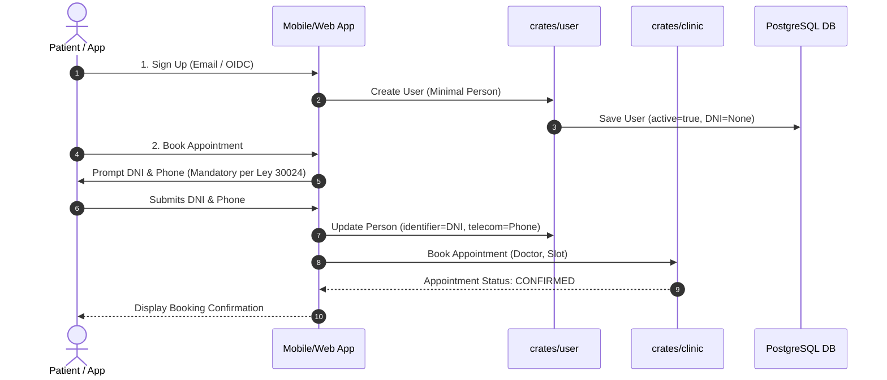
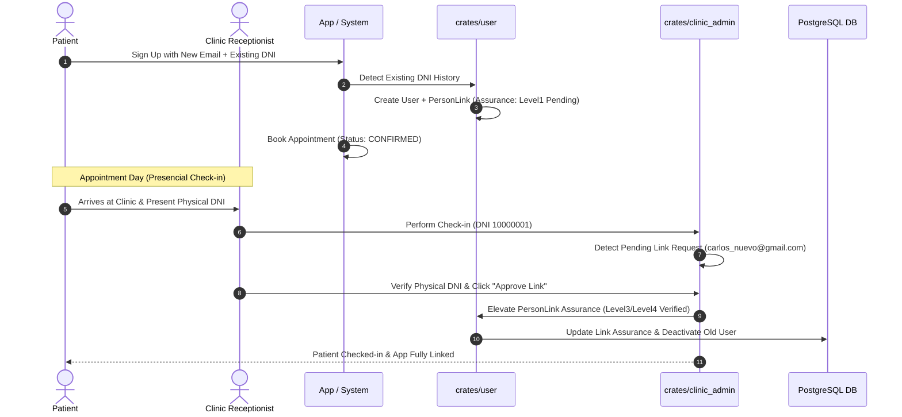
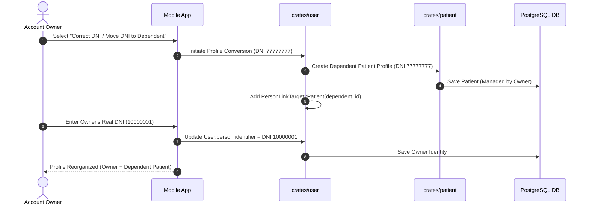
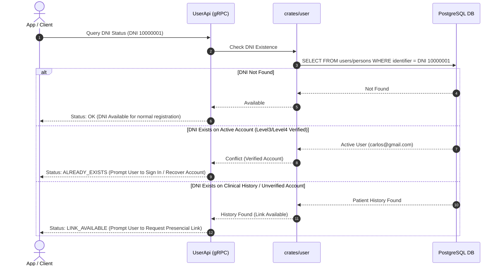
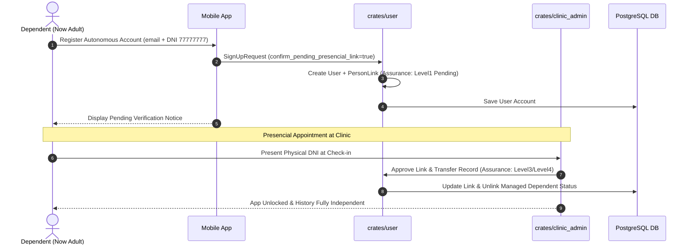
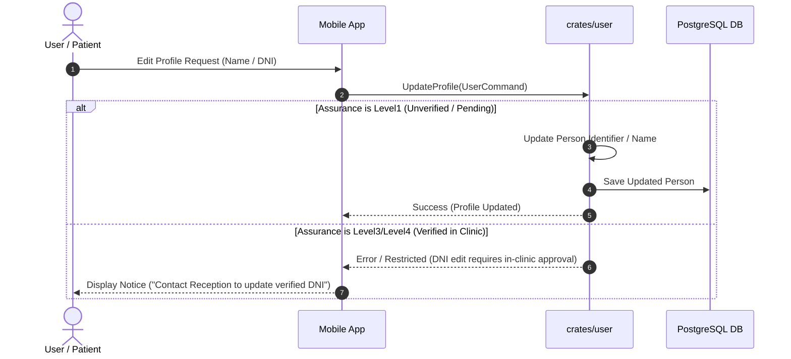
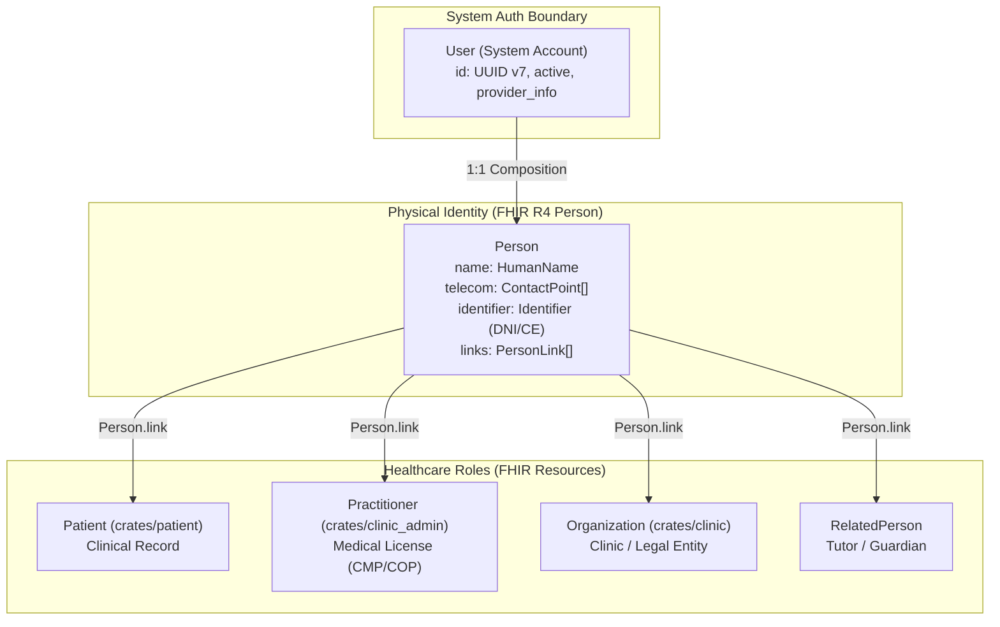
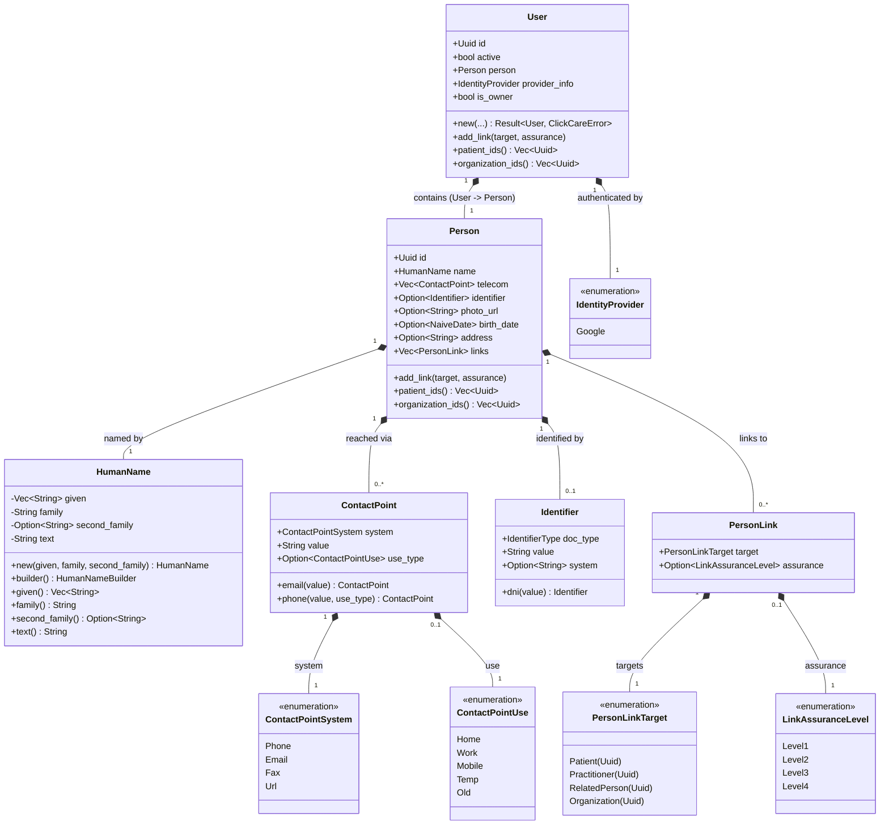
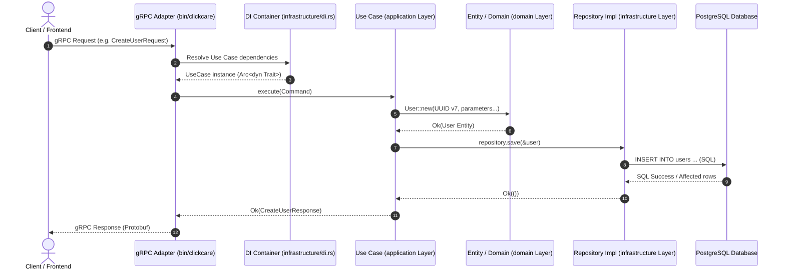

# Repository Guidelines & Project Overview

## Project Description

**My Health Record (Backend)** is a Rust 2024 backend service for healthcare management following **Onion Architecture**. It provides a high-performance gRPC API (using `tonic` and `axum`) with gRPC-Web support, handling domain bounded contexts such as users, patients, clinics, and clinic administration.

### Architectural Principles & Memory Directives

#### 1. Domain-Driven Design (DDD) & HL7 FHIR Alignment
- **Domain Boundaries & Protection**: Strict adherence to DDD principles to protect the domain and keep bounded contexts isolated, ensuring business logic and invariants are guarded from infrastructure or external leaks. Domain boundaries and entities are modeled following **HL7 FHIR** specifications as the primary guide whenever possible.
- **Bounded Contexts & FHIR Resource Mapping**:
  | Crate / Bounded Context | Primary FHIR Resource | Responsibility & Domain Scope |
  |---|---|---|
  | **`crates/user`** | **`Person`** + `User` | **System Account & Physical Identity**: `User` manages system auth (`id`, `active`, `provider_info`, `is_owner`). Physical human identity lives strictly in **FHIR R4 `Person`** (`name`, `telecom`, `identifier`, `birth_date`, `photo_url`, `address`, `links`). |
  | **`crates/patient`** | **`Patient`** | **Clinical Record**: Patient health record, emergency contacts, primary practitioner (`generalPractitioner`), and care histories. |
  | **`crates/clinic`** | **`Organization`** / **`Location`** | **Clinic & Physical Facilities**: `Organization` represents legal entity (RUC, legal name, billing). `Location` represents physical branches, consult rooms, or care areas. |
  | **`crates/clinic_admin`** | **`Practitioner`** / **`PractitionerRole`** | **Health Practitioners & Admin**: `Practitioner` stores medical credentials (CMP/COP, specialty). `PractitionerRole` maps doctor roles, schedules, and clinic associations. |
  | **`crates/core`** | FHIR Data Types | Shared Value Objects (`HumanName`, `ContactPoint`, `Identifier`, `Address`). |
- **User Account & Identity Composition (`User` -> `Person`)**: `User` represents the authentication / system account boundary (`id`, `active`, `person`, `provider_info`, `is_owner`). Physical human identity and demographics strictly live inside `User.person`, following **HL7 FHIR R4 Person** (`name`, `telecom`, `identifier`, `photo_url`, `birth_date`, `address`, `links`). Never flatten `Person` fields directly inside `User`.
- **Role Links via `Person.link`**: A `Person` connects to its healthcare roles via `PersonLink` targets (`Patient`, `Practitioner`, `RelatedPerson`, `Organization`). This allows a single user account to manage multiple patient profiles (e.g., parents managing children) or administer a clinic without requiring a dummy patient record.
- **FHIR Terminology & Conventions**: `HumanName` uses `given`, `family`, `second_family` (hispanic extension), and `text`. `ContactPoint` uses `system` (`Phone`, `Email`, etc.) and `use_type`. Note: FHIR `Account` refers exclusively to financial billing/coverage accounts; authentication accounts are mapped to `User` / `Person`.

#### 2. Domain Encapsulation & Code Conventions
- **Domain Value Object Encapsulation & Getter Conventions (Rust C-GETTER)**: Domain Value Objects and Entities keep internal fields encapsulated to enforce domain invariants. Smart constructors (`new`) pre-compute and guarantee valid fields (e.g. `text: String`). Read-only getters follow Rust API Guidelines (`C-GETTER` convention) and are auto-generated via `derive_getters::Getters` (or `bon::Builder` for fluent construction) to eliminate boilerplate while maintaining strict encapsulation.
- **Safe Builder Pattern (`bon`)**: For objects with computed internal fields (e.g. `HumanName.text`), do not derive `Builder` on the struct directly; apply `#[bon::bon]` on the `impl` block with `#[builder] pub fn builder(...)` delegating to `new()`, preventing external callers from bypassing calculation rules.

#### 3. Data Mapping & Interoperability Compliance
- **BFF Request vs. FHIR Domain Mapping**: External API DTOs (`proto/api.proto`) keep flat, convenient fields matching frontend and OAuth provider payloads (e.g., `provider_avatar_url`, `id_token`, `provider_id`). Application Use Cases must explicitly map these flat request fields into rich FHIR domain Value Objects (`Person`, `HumanName`, `ContactPoint`, `photo_url`) upon entering the domain layer. Never leak raw DTO structures into domain entities.
- **Shared FHIR Data Types (`crates/core`)**: Core FHIR Data Types (`HumanName`, `ContactPoint`, `Identifier`, `Address`, `Attachment`) are defined in `crates/core` (`app_core::domain::fhir`) so all bounded contexts (`user`, `patient`, `clinic`, `clinic_admin`) share unified, immutable Value Objects.
- **Peruvian Healthcare & Terminology Compliance**: National identifiers in `Identifier` map to official Peruvian registries (e.g., `DNI` uses system `http://reniec.gob.pe/dni` or FHIR code `NNPER`). Diagnostic coding aligns with **CIE-10** (official MINSA) and **SNOMED CT**, laboratory observations with **LOINC**, and imaging with **DICOM**.

#### 4. Business & Onboarding Strategy
- **User Onboarding Strategy (Progressive Profiling)**: Single unified user registration flow with progressive data collection. Initial user creation requires minimal data (DNI optional). National identity document registration (`Identifier`) is enforced progressively depending on role-based operational triggers:

  | Rol del Usuario | ¿DNI al registrarse? | Disparador Mandatorio de DNI | Razón de Negocio / Legal (Perú) |
  |---|---|---|---|
  | **Paciente (`Patient`)** | ❌ Opcional | Al **confirmar su primera cita médica** o emitir una receta / atención. | Ley N° 30024 RNHCE / MINSA (asociación de Historia Clínica a persona real). |
  | **Administrador de Clínica (`Clinic Admin`)** | ❌ Opcional | Al **activar/crear la Clínica (`Organization`)** o configurar facturación/RUC. | Verificación de identidad legal del representante de la clínica. |
  | **Profesional de Salud (`Practitioner`)** | ❌ Opcional | Al **activar perfil médico**, habilitar agenda o **firmar atenciones/recetas**. | Verificación de identidad + Colegiatura (CMP/COP) para emitir actos médicos. |

- **Uniqueness & Identity Invariants**:
  - `User.email`: Strictly unique per system account (Primary authentication credential).
  - `User.person.identifier` (DNI): Unique per primary `User` account to ensure a single Electronic Health Record (EHR / Ley N° 30024) per physical citizen.
  - `ContactPoint` (Phone): Non-strict / Shared uniqueness (allows family members or parents managing dependents to share home/contact numbers).

- **Account Recovery, Re-binding & Presencial Verification**:
  - **Lost Email / Phone Recovery**: When a user registers a new account with a DNI that is already bound to an existing identity whose credentials were lost:
    1. A new `User` account is created with `PersonLink` in a `Pending Verification` state (`LinkAssuranceLevel::Level1`).
    2. **Appointment Booking is 100% CONFIRMED** (never tentative; medical slot is fully guaranteed for the patient).
    3. **Presencial Check-in & Approval**: On the appointment date, during physical receptionist check-in, the receptionist verifies the physical DNI card, completing the check-in and elevating `LinkAssuranceLevel` to verified (`Level3`/`Level4`), unlocking past medical history access in the app seamlessly.

- **API Onboarding Response Statuses (`proto/api.proto`)**:
  - `SignUpStatus::SUCCESS`: Account created cleanly. Response message: `"Usuario registrado exitosamente."`
  - `SignUpStatus::LINK_PENDING_PRESENCIAL_VERIFICATION`: Account created with explicit confirmation (`confirm_pending_presencial_link = true`); prior DNI history detected. `PersonLink` set to `Level1` (Pending). Response message: `"Cuenta creada exitosamente. Se detectó una Historia Clínica asociada a tu DNI. La vinculación final se completará durante tu verificación presencial en tu próxima cita médica."`
  - `DNI_ALREADY_VERIFIED_CONFLICT` (`gRPC Status: ALREADY_EXISTS`): Returned on initial registration attempt when DNI already exists and `confirm_pending_presencial_link` is `false`/`None`. Response message: `"El DNI ingresado ya está asociado a una cuenta. ¿Deseas iniciar sesión o solicitar la vinculación presencial en tu próxima cita médica?"`

---

### 4.1. Account & Identity Lifecycle Use Cases

#### Use Case 1: Progressive Onboarding & Confirmed Booking
User signs up with minimal info (Google OIDC/Email). When booking an appointment, DNI & Phone become mandatory. The appointment is **100% CONFIRMED** in the clinic schedule.



#### Use Case 2: Lost Credentials Recovery & Presencial Re-binding
User lost access to email/phone. Registers a new account with their DNI. Account is created with `LinkAssuranceLevel::Level1` (Pending). Appointment is **100% CONFIRMED**. On appointment day, Receptionist verifies physical DNI at check-in, promoting assurance to `Level3`/`Level4` (Verified).



#### Use Case 3: DNI Mistake Correction & Family Profile Conversion
User accidentally registered a family member's DNI (e.g., child or parent) on their main account. User converts the family member's DNI to a managed `Patient` profile (`PersonLinkTarget::Patient`) and sets their own DNI on the main account.



#### Use Case 4: Pre-check Query by DNI & Dynamic Options
App queries API before or during registration. Backend checks DNI existence and status to guide UX choices.



#### Use Case 5: Dependent Profile Independence (Child Turns 18)
A managed dependent child (`Patient` linked to parent's account) registers their own autonomous `User` account with their email and DNI.



#### Use Case 6: Profile Data Updates & Assurance Level Controls
User attempts to update identity fields (Name, DNI, Telecom). Updates are allowed freely for unverified accounts (`Level1`) and restricted/audit-logged for verified accounts (`Level3`/`Level4`).



---

#### 5. General Tech Stack Directives
- **Architecture**: Strict **Onion Architecture** (Domain isolated from infrastructure details).
- **Language & Stack**: **Rust 2024** for backend code, **Nushell** (`.nu`) for scripting and automation tasks.
- **API First**: `proto/api.proto` is the single source of truth for public API contracts.
- **Identity**: UUID v7 (`Uuid::now_v7()`) is mandatory for all user and entity primary keys.

---

### Architecture & FHIR Identity Composition

The diagram below illustrates how system authentication (`User`) composes physical identity (`Person`) and links to healthcare role resources (`Patient`, `Practitioner`, `Organization`):



---

### Domain Model Class Diagram

The following class diagram visualizes the domain entities, value objects, and relationships following HL7 FHIR and DDD:




---

## Project Structure & Module Organization

```
backend/
├── Cargo.toml              # Workspace root — shared dependency versions live here
├── bin/
│   └── clickcare/          # gRPC server entry point (tonic + axum)
│       ├── build.rs        # Proto compilation via tonic-prost-build
│       ├── src/
│       │   ├── main.rs
│       │   ├── lib.rs
│       │   └── infrastructure/
│       │       └── grpc/   # gRPC service implementations (e.g. UserApiImpl)
│       └── tests/          # Integration tests
├── crates/
│   ├── core/               # app_core — shared traits, ClickCareError, base contracts
│   ├── user/               # User bounded context
│   ├── patient/            # Patient bounded context
│   ├── clinic/             # Clinic bounded context
│   └── clinic_admin/       # Clinic admin bounded context
├── ddl/                    # SQL schema definitions
├── docs/                   # Architecture diagrams and FHIR references
└── proto/                  # Protobuf definitions (api.proto)
```

### Onion Architecture Layers

| Layer | Path | Responsibility | Dependencies |
|---|---|---|---|
| **Core** | `crates/core/` | Base traits (`UseCase`), cross-cutting error (`ClickCareError`) | None |
| **Domain** | `crates/*/src/domain/` | Entities, aggregates, domain events, repository traits | `crates/core` |
| **Application** | `crates/*/src/application/` | Business use cases implementing `app_core::application::UseCase` | `domain`, `crates/core` |
| **Infrastructure** | `crates/*/src/infrastructure/` | DB repositories, DI container (`di.rs`), external integrations | `application`, `domain`, `crates/core` |
| **gRPC Server** | `bin/clickcare/` | gRPC controllers & service entry point | `crates/*` |

Dependencies strictly point **inward**:
```
bin/clickcare (gRPC entry point)
  └── crates/*/infrastructure (DB repos, DI wiring)
        └── crates/*/application (use cases)
              └── crates/*/domain (entities & repository traits)
                    └── crates/core (app_core contracts)
```

---

## Request Flow Sequence Diagram

The following sequence diagram illustrates how a request flows through the Onion Architecture layers during execution (e.g., User Sign-Up or Patient Record creation):



---

## Core Rules & Technical Mandates

1. **Strict Dependency Injection (DI)**
   - Inject dependencies as `Arc<dyn Trait + Send + Sync>`.
   - Never instantiate concrete types outside `src/infrastructure/di.rs`.
   - Domain crates expose `di::new(DBType)` and `DIOverrides` for test mock injection.

2. **UUID v7 Requirement**
   - All Primary Keys and User IDs **must** be UUID v7 (`Uuid::now_v7()`).
   - Domain constructors validate UUID v7 compliance and return `ClickCareError` on invalid formats.

3. **Error Handling & Observability**
   - Use `ClickCareError` (`crates/core`) for cross-cutting errors.
   - Use `thiserror` for domain-specific errors and propagate with `?`.
   - **Zero `unwrap()` in production paths**.
   - Use `tracing` macros (`info!`, `warn!`, `error!`), **never** use `println!`.

4. **Scripts & Tooling**
   - For automation, deployment, or helper scripts, **prefer Nushell scripts (`.nu`)**.

5. **Protobuf API Single Source of Truth**
   - `proto/api.proto` defines all external endpoints. Any API change must begin by updating `.proto` definitions.

---

## Build, Test, and Development Commands

```bash
# Check compilation across the entire workspace
cargo check --workspace

# Build the gRPC server
cargo build -p clickcare

# Run all tests (unit + integration)
cargo test --workspace

# Run tests for a specific crate
cargo test -p user

# Format code
cargo fmt --all

# Linting (CI strict mode)
cargo clippy --workspace -- -D warnings
```

