# Guías del Repositorio y Visión General del Proyecto

## Descripción del Proyecto

**My Health Record (Backend)** es un servicio de backend en Rust 2024 para la gestión de salud que sigue la **Arquitectura Cebolla (Onion Architecture)** y un **Cargo Workspace por Contextos Acotados (*Bounded Context Crates*)** estrictamente alineado con el estándar **HL7 FHIR R4**. Proporciona una API gRPC de alto rendimiento (utilizando `tonic` y `axum`) con soporte gRPC-Web.

---

## 1. Principios Arquitectónicos

### 1.1. Diseño Guiado por el Dominio (DDD) y Alineación con HL7 FHIR
- **Protección y Límites del Dominio**: Adherencia estricta a DDD para proteger el dominio y mantener los contextos acotados aislados. Las entidades del dominio se modelan siguiendo **HL7 FHIR R4**.
- **Arquitectura de Crates por Bounded Contexts (C4 Nivel 2)**:

```mermaid
flowchart TB
    classDef container fill:#2d3748,stroke:#4a5568,stroke-width:2px,color:#fff;
    classDef domainMod fill:#1a202c,stroke:#718096,stroke-width:1px,color:#cbd5e0;
    classDef db fill:#0d1117,stroke:#4a5568,stroke-width:1.5px,color:#cbd5e0;

    subgraph Boundaries["ClickCare - Ecosistema Ampliado FHIR (Cargo Workspace)"]
        
        subgraph Domain_User["crates/user (Identity & Security)"]
            direction TB
            UserC["<b>Auth & Account</b><br/><i>Gestión de credenciales e identidades.</i><br/>──────<br/><b>[Foundation / Security]</b><br/>• User / Auth Account<br/>• Person"]:::container
            UM_Auth["src/domain/auth_account.rs"]:::domainMod
            UM_Person["src/domain/person.rs"]:::domainMod
            UserDB[("User DB")]:::db
            UserC --- UM_Auth
            UserC --- UM_Person
            UserC --- UserDB
        end

        subgraph Domain_Administration["crates/administration (Gestión Administrativa)"]
            direction TB
            AdminC["<b>Gestión Administrativa</b><br/><i>Actores de salud, locaciones e infraestructura.</i><br/>──────<br/><b>[FHIR Individuals & Entities]</b><br/>• Patient<br/>• Practitioner<br/>• Location<br/>• HealthcareService"]:::container
            AM_Patient["src/domain/patient.rs"]:::domainMod
            AM_Practitioner["src/domain/practitioner.rs"]:::domainMod
            AM_Location["src/domain/location.rs"]:::domainMod
            AM_Service["src/domain/healthcare_service.rs"]:::domainMod
            AdminDB[("Administration DB")]:::db
            AdminC --- AM_Patient
            AdminC --- AM_Practitioner
            AdminC --- AM_Location
            AdminC --- AM_Service
            AdminC --- AdminDB
        end

        subgraph Domain_Scheduling["crates/scheduling (Reserva de Citas)"]
            direction TB
            SchedC["<b>Reserva de Citas</b><br/><i>Agendas, disponibilidad y flujo de citas.</i><br/>──────<br/><b>[FHIR Workflow]</b><br/>• Schedule<br/>• Slot<br/>• Appointment"]:::container
            SM_Schedule["src/domain/schedule.rs"]:::domainMod
            SM_Slot["src/domain/slot.rs"]:::domainMod
            SM_Appointment["src/domain/appointment.rs"]:::domainMod
            SchedDB[("Scheduling DB")]:::db
            SchedC --- SM_Schedule
            SchedC --- SM_Slot
            SchedC --- SM_Appointment
            SchedC --- SchedDB
        end

        subgraph Domain_Clinical["crates/clinical (Historia Clínica)"]
            direction TB
            ClinicalC["<b>Historia Clínica</b><br/><i>Encuentros, diagnósticos, alergias y recetas.</i><br/>──────<br/><b>[FHIR Management / Summary / Care / Forms]</b><br/>• Encounter<br/>• Condition<br/>• AllergyIntolerance<br/>• CarePlan<br/>• MedicationRequest<br/>• Questionnaire"]:::container
            CM_Encounter["src/domain/encounter.rs"]:::domainMod
            CM_Condition["src/domain/condition.rs"]:::domainMod
            CM_Allergy["src/domain/allergy_intolerance.rs"]:::domainMod
            CM_CarePlan["src/domain/care_plan.rs"]:::domainMod
            CM_MedReq["src/domain/medication_request.rs"]:::domainMod
            CM_Quest["src/domain/questionnaire.rs"]:::domainMod
            ClinicalDB[("Clinical DB")]:::db
            ClinicalC --- CM_Encounter
            ClinicalC --- CM_Condition
            ClinicalC --- CM_Allergy
            ClinicalC --- CM_CarePlan
            ClinicalC --- CM_MedReq
            ClinicalC --- CM_Quest
            ClinicalC --- ClinicalDB
        end

        subgraph Domain_Diagnostics["crates/diagnostics (Laboratorio e Imágenes)"]
            direction TB
            DiagC["<b>Laboratorio e Imágenes</b><br/><i>Órdenes clínicas, hallazgos y estudios radiológicos.</i><br/>──────<br/><b>[FHIR Diagnostics]</b><br/>• ServiceRequest<br/>• Observation<br/>• DiagnosticReport<br/>• ImagingStudy<br/>• Specimen"]:::container
            DM_ServiceReq["src/domain/service_request.rs"]:::domainMod
            DM_Observation["src/domain/observation.rs"]:::domainMod
            DM_Report["src/domain/diagnostic_report.rs"]:::domainMod
            DM_Imaging["src/domain/imaging_study.rs"]:::domainMod
            DM_Specimen["src/domain/specimen.rs"]:::domainMod
            DiagDB[("Diagnostics DB")]:::db
            DiagC --- DM_ServiceReq
            DiagC --- DM_Observation
            DiagC --- DM_Report
            DiagC --- DM_Imaging
            DiagC --- DM_Specimen
            DiagC --- DiagDB
        end

        subgraph Domain_Pharmacy["crates/pharmacy (Farmacia e Insumos)"]
            direction TB
            PharmC["<b>Farmacia e Insumos</b><br/><i>Vademécum, dispensa, aplicación y stock.</i><br/>──────<br/><b>[FHIR Medications & Supply]</b><br/>• Medication<br/>• MedicationDispense<br/>• MedicationAdministration<br/>• SupplyRequest / SupplyDelivery"]:::container
            PM_Medication["src/domain/medication.rs"]:::domainMod
            PM_Dispense["src/domain/medication_dispense.rs"]:::domainMod
            PM_Admin["src/domain/medication_administration.rs"]:::domainMod
            PM_Supply["src/domain/supply.rs"]:::domainMod
            PharmDB[("Pharmacy DB")]:::db
            PharmC --- PM_Medication
            PharmC --- PM_Dispense
            PharmC --- PM_Admin
            PharmC --- PM_Supply
            PharmC --- PharmDB
        end

        subgraph Domain_Coverage["crates/coverage (Aseguradoras y Coberturas)"]
            direction TB
            CovC["<b>Aseguradoras y Coberturas</b><br/><i>Pólizas, elegibilidad y reclamos.</i><br/>──────<br/><b>[FHIR Financial / Claims]</b><br/>• Coverage<br/>• Claim / ClaimResponse<br/>• CoverageEligibilityRequest"]:::container
            CovM_Policy["src/domain/policy.rs"]:::domainMod
            CovM_Claim["src/domain/claim.rs"]:::domainMod
            CovM_Eligibility["src/domain/eligibility.rs"]:::domainMod
            CovDB[("Coverage DB")]:::db
            CovC --- CovM_Policy
            CovC --- CovM_Claim
            CovC --- CovM_Eligibility
            CovC --- CovDB
        end

        subgraph Domain_Billing["crates/billing (Facturación)"]
            direction TB
            BillingC["<b>Facturación</b><br/><i>Cargos, comprobantes y balances de cuenta.</i><br/>──────<br/><b>[FHIR Financial]</b><br/>• Account<br/>• Invoice<br/>• ChargeItem"]:::container
            BM_Account["src/domain/account.rs"]:::domainMod
            BM_Invoice["src/domain/invoice.rs"]:::domainMod
            BM_ChargeItem["src/domain/charge_item.rs"]:::domainMod
            BillingDB[("Billing DB")]:::db
            BillingC --- BM_Account
            BillingC --- BM_Invoice
            BillingC --- BM_ChargeItem
            BillingC --- BillingDB
        end

        subgraph Domain_Legal["crates/legal_archive (Archivo Legal y Auditoría)"]
            direction TB
            LegalC["<b>Archivo Legal y Auditoría</b><br/><i>Documentación clínica consolidada y auditoría.</i><br/>──────<br/><b>[FHIR Documents & Security]</b><br/>• Composition<br/>• DocumentReference<br/>• AuditEvent<br/>• Provenance"]:::container
            LM_Composition["src/domain/composition.rs"]:::domainMod
            LM_DocRef["src/domain/document_reference.rs"]:::domainMod
            LM_AuditEvent["src/domain/audit_event.rs"]:::domainMod
            LM_Provenance["src/domain/provenance.rs"]:::domainMod
            LegalDB[("Legal Archive DB")]:::db
            LegalC --- LM_Composition
            LegalC --- LM_DocRef
            LegalC --- LM_AuditEvent
            LegalC --- LM_Provenance
            LegalC --- LegalDB
        end

        subgraph Domain_Communication["crates/communication (Notificaciones y Alertas)"]
            direction TB
            CommC["<b>Notificaciones y Alertas</b><br/><i>Mensajería, avisos y alertas clínicas.</i><br/>──────<br/><b>[FHIR Workflow / Support]</b><br/>• Communication<br/>• Flag"]:::container
            ComM_Message["src/domain/message.rs"]:::domainMod
            ComM_Flag["src/domain/flag.rs"]:::domainMod
            CommDB[("Communication DB")]:::db
            CommC --- ComM_Message
            CommC --- ComM_Flag
            CommC --- CommDB
        end

        %% Relaciones débiles (Apuntadores de Identificador UUIDv7)
        AdminC -.->|user_id| UserC
        SchedC -.->|patient_id / practitioner_id / location_id| AdminC
        ClinicalC -.->|encounter_id / appointment_id| SchedC
        ClinicalC -.->|patient_id / practitioner_id| AdminC
        DiagC -.->|patient_id| AdminC
        DiagC -.->|encounter_id| ClinicalC
        PharmC -.->|patient_id / practitioner_id| AdminC
        PharmC -.->|encounter_id / medication_request_id| ClinicalC
        CovC -.->|patient_id| AdminC
        BillingC -.->|patient_id| AdminC
        BillingC -.->|encounter_id| ClinicalC
        BillingC -.->|coverage_id / claim_id| CovC
        LegalC -.->|patient_id / practitioner_id| AdminC
        LegalC -.->|encounter_id| ClinicalC
        CommC -.->|patient_id| AdminC
    end
```

  Estructurado en un **Cargo Workspace por Contextos Acotados** (`members = ["crates/*"]`), donde cada Bounded Context es una Crate de Rust (`crates/<dominio>`) que agrupa sus Entidades y Agregados (`src/domain/`).



### 1.2. Decisiones de Diseño y Convenciones
- **Estrategia de Identificadores (UUIDv7)**: Claves primarias e IDs de usuario utilizan UUIDv7 (`Uuid::now_v7()`) para ordenamiento temporal optimizado en índices B-Tree de PostgreSQL.
- **Particionamiento por Hash en PostgreSQL**: Aplicado sobre la clave primaria (UUIDv7) para tablas maestras de crecimiento continuo (`Patient`, `Encounter`).
- **Encapsulamiento del Dominio y Convención C-GETTER**: Getters de solo lectura autogenerados vía `derive_getters::Getters` (o `bon::Builder` para construcción fluente).
- **Tipos de Datos FHIR Compartidos (`crates/core`)**: `HumanName`, `ContactPoint`, `Identifier`, `Address`, `Attachment` se definen en `app_core::domain::fhir`.
- **Arquitectura Orientada a Eventos con Apalis (`apalis-postgres`)**: `crates/user` emite `UserCreatedEvent` para sincronización asíncrona at-least-once entre Bounded Contexts.
- **Un Esquema PostgreSQL por Bounded Context**: cada contexto acotado es dueño de su propio esquema, para poder gestionar permisos, ownership y backups por dominio.

| Crate | Esquema | Tablas |
| :--- | :--- | :--- |
| `crates/user` | `identity` | `user_account` |
| `crates/administration` | `administration` | `clinic`, `patient`, `patient_search` |

  El dominio `user` usa el esquema **`identity`** (no `user`): `USER` es palabra reservada en PostgreSQL y `CREATE SCHEMA user` es un error de sintaxis; `identity` coincide además con el nombre del bounded context.

  **Las tablas se referencian SIN calificar** (`user_account`, no `identity.user_account`), tanto en `#[table = "..."]` como en SQL crudo. Dos limitaciones de toasty 0.8 lo imponen:
  1. No soporta nombres calificados por esquema: serializa `#[table = "x"]` como el identificador `"x"` sin separar por el punto, así que `#[table = "identity.user_account"]` buscaría una tabla llamada literalmente `identity.user_account`.
  2. Su parser de URL solo honra `host`, `port`, `user`, `password`, `dbname` y `application_name`, y descarta el resto; por eso `?options=-c search_path=...` **no** llega al servidor.

  La resolución se hace con un `search_path` fijado **a nivel de base de datos** en `ddl/table.sql` (`ALTER DATABASE ... SET search_path = identity, administration, public`), que aplica a toda conexión nueva sin importar el driver. Al crear tablas nuevas, califícalas explícitamente en el DDL (`CREATE TABLE administration.foo`) y déjalas sin calificar en el código Rust.

---

## 2. Mapa de Documentación y Contextos Acotados

Para consultar la especificación detallada del modelo de dominio de cada contexto acotado, consulta sus guías dedicadas:

| Bounded Context | Crate | Recurso FHIR Mapeado | Documentación dedicada |
| :--- | :--- | :--- | :--- |
| **Casos de Uso e Identidad** | N/A | Flujos de Identidad y Registro | [docs/use_cases.md](docs/use_cases.md) |
| **Identity & Security** | `crates/user` | `Person` + `User` | [crates/user/AGENTS.md](crates/user/AGENTS.md) |
| **Gestión Administrativa** | `crates/administration` | `Patient`, `Practitioner`, `Location`, `HealthcareService` | [crates/administration/AGENTS.md](crates/administration/AGENTS.md) |
| **Reserva de Citas** | `crates/scheduling` | `Schedule`, `Slot`, `Appointment` | [crates/scheduling/AGENTS.md](crates/scheduling/AGENTS.md) |
| **Historia Clínica** | `crates/clinical` | `Encounter`, `Condition`, `AllergyIntolerance`, `CarePlan`, `MedicationRequest`, `Questionnaire` | [crates/clinical/AGENTS.md](crates/clinical/AGENTS.md) |
| **Laboratorio e Imágenes** | `crates/diagnostics` | `ServiceRequest`, `Observation`, `DiagnosticReport`, `ImagingStudy`, `Specimen` | [crates/diagnostics/AGENTS.md](crates/diagnostics/AGENTS.md) |
| **Farmacia e Insumos** | `crates/pharmacy` | `Medication`, `MedicationDispense`, `MedicationAdministration`, `SupplyRequest` / `SupplyDelivery` | [crates/pharmacy/AGENTS.md](crates/pharmacy/AGENTS.md) |
| **Aseguradoras y Coberturas** | `crates/coverage` | `Coverage`, `Claim`, `ClaimResponse`, `CoverageEligibilityRequest` | [crates/coverage/AGENTS.md](crates/coverage/AGENTS.md) |
| **Facturación** | `crates/billing` | `Account`, `Invoice`, `ChargeItem` | [crates/billing/AGENTS.md](crates/billing/AGENTS.md) |
| **Archivo Legal y Auditoría** | `crates/legal_archive` | `Composition`, `DocumentReference`, `AuditEvent`, `Provenance` | [crates/legal_archive/AGENTS.md](crates/legal_archive/AGENTS.md) |
| **Notificaciones y Alertas** | `crates/communication` | `Communication`, `CommunicationRequest`, `Flag` | [crates/communication/AGENTS.md](crates/communication/AGENTS.md) |

---

## 3. Reglas Principales y Mandatos Técnicos

1. **Inyección de Dependencias Estricta (DI)**
   - Inyectar dependencias como `Arc<dyn Trait + Send + Sync>`.
   - Nunca instanciar tipos concretos fuera de `src/infrastructure/di.rs`.
   - Las crates de dominio exponen `di::new(DBType)` y `DIOverrides` para inyección de mocks en pruebas.

2. **Requerimiento Obligatorio de UUID v7**
   - Todas las Llaves Primarias e IDs de usuario **deben** ser UUID v7 (`Uuid::now_v7()`).
   - Los constructores de dominio validan el cumplimiento de UUID v7 y devuelven `ClickCareError` en formatos inválidos.

3. **Manejo de Errores y Observabilidad**
   - Utilizar `ClickCareError` (`crates/core`) para errores transversales.
   - Utilizar `thiserror` para errores específicos del dominio y propagar con `?`.
   - **Cero `unwrap()` en rutas de producción**.
   - Utilizar macros de `tracing` (`info!`, `warn!`, `error!`), **nunca** usar `println!`.

4. **Scripts y Herramientas**
   - Para automatización, despliegue o scripts auxiliares, **preferir scripts de Nushell (`.nu`)**.

5. **Protobuf API como Única Fuente de Verdad**
   - `proto/api.proto` define todos los endpoints externos. Cualquier cambio en la API debe comenzar actualizando las definiciones `.proto`.

6. **Marca de Commits Generados por Antigravity**
   - Cada vez que se realice un commit con cambios producidos por la IA (**Antigravity**), el mensaje del commit **debe incluir obligatoriamente la marca `[antigravity]`** (por ejemplo: `feat(user): [antigravity] implement user domain model` o en el cuerpo/footer del commit).

---

## 4. Comandos de Compilación, Pruebas y Desarrollo

```bash
# Verificar compilación en todo el workspace
cargo check --workspace

# Compilar el servidor gRPC
cargo build -p clickcare

# Ejecutar todas las pruebas (unitarias + integración)
cargo test --workspace

# Ejecutar pruebas para una crate específica (ej. user)
cargo test -p user

# Formatear código
cargo fmt --all

# Linter (Modo estricto CI)
cargo clippy --workspace -- -D warnings
```

<!-- BEGIN BEADS INTEGRATION v:1 profile:minimal hash:970c3bf2 -->
## Agent Context Profiles

The managed Beads block is task-tracking guidance, not permission to override repository, user, or orchestrator instructions.

- **Conservative (default)**: Use `bd` for task tracking. Do not run git commits, git pushes, or Dolt remote sync unless explicitly asked. At handoff, report changed files, validation, and suggested next commands.
- **Minimal**: Keep tool instruction files as pointers to `bd prime`; use the same conservative git policy unless active instructions say otherwise.
- **Team-maintainer**: Only when the repository explicitly opts in, agents may close beads, run quality gates, commit, and push as part of session close. A current "do not commit" or "do not push" instruction still wins.

## Session Completion

This protocol applies when ending a Beads implementation workflow. It is subordinate to explicit user, repository, and orchestrator instructions.

1. **File issues for remaining work** - Create beads for anything that needs follow-up
2. **Run quality gates** (if code changed) - Tests, linters, builds
3. **Update issue status** - Close finished work, update in-progress items
4. **Handle git/sync by active profile**:
   ```bash
   # Conservative/minimal/default: report status and proposed commands; wait for approval.
   git status

   # Team-maintainer opt-in only, unless current instructions forbid it:
   git pull --rebase
   bd dolt push
   git push
   git status
   ```
5. **Hand off** - Summarize changes, validation, issue status, and any blocked sync/commit/push step

**Critical rules:**
- Explicit user or orchestrator instructions override this Beads block.
- Do not commit or push without clear authority from the active profile or the current user request.
- If a required sync or push is blocked, stop and report the exact command and error.
<!-- END BEADS INTEGRATION -->

<!-- BEGIN BEADS CODEX SETUP: generated by bd setup codex -->
## Beads Issue Tracker

Use Beads (`bd`) for durable task tracking in repositories that include it. Use the `beads` skill at `.agents/skills/beads/SKILL.md` (project install) or `~/.agents/skills/beads/SKILL.md` (global install) for Beads workflow guidance, then use the `bd` CLI for issue operations.

### Quick Reference

```bash
bd ready                # Find available work
bd show <id>            # View issue details
bd update <id> --claim  # Claim work
bd close <id>           # Complete work
bd prime                # Refresh Beads context
```

### Rules

- Use `bd` for all task tracking; do not create markdown TODO lists.
- Run `bd prime` when Beads context is missing or stale. Codex 0.129.0+ can load Beads context automatically through native hooks; use `/hooks` to inspect or toggle them.
- Keep persistent project memory in Beads via `bd remember`; do not create ad hoc memory files.

**Architecture in one line:** issues live in a local Dolt DB; sync uses `refs/dolt/data` on your git remote; `.beads/issues.jsonl` is a passive export. See https://github.com/gastownhall/beads/blob/main/docs/SYNC_CONCEPTS.md for details and anti-patterns.
<!-- END BEADS CODEX SETUP -->
