# Guías del Repositorio y Visión General del Proyecto

## Descripción del Proyecto

**My Health Record (Backend)** es un servicio de backend en Rust 2024 para la gestión de salud que sigue la **Arquitectura Cebolla (Onion Architecture)** y un **Cargo Workspace Jerárquico (*Nested Crates*)** estrictamente alineado con el estándar **HL7 FHIR R4**. Proporciona una API gRPC de alto rendimiento (utilizando `tonic` y `axum`) con soporte gRPC-Web, manejando el ecosistema ampliado de contextos acotados del dominio (usuarios e identidad, administración, citas, historia clínica, diagnósticos, farmacia, coberturas, facturación, archivo legal y comunicaciones).

---

## 1. Principios Arquitectónicos y Directivas de Memoria

### 1.1. Diseño Guiado por el Dominio (DDD) y Alineación con HL7 FHIR
- **Documento de Referencia Principal del Dominio**: La especificación completa del modelo de dominio FHIR por contextos acotados, sub-crates jerárquicos y grupos funcionales del ecosistema ampliado está detallada en [`ClickCare - Modelo de Dominio FHIR por Contextos Acotados.md`](file:///home/miuler/proyectos/my-health-record/backend/ClickCare%20-%20Modelo%20de%20Dominio%20FHIR%20por%20Contextos%20Acotados.md).
- **Protección y Límites del Dominio**: Adherencia estricta a los principios de DDD para proteger el dominio y mantener los contextos acotados aislados, asegurando que la lógica de negocio y sus invariantes estén protegidos contra filtraciones de infraestructura o externas. Los límites y entidades del dominio se modelan siguiendo las especificaciones de **HL7 FHIR R4** como guía principal siempre que sea posible.
- **Arquitectura de Crates Jerárquicos (*Nested Crates*), Grupos FHIR y Desacoplamiento (C4 Nivel 2)**:
  En el modelo C4 Nivel 2, un **Contenedor** representa una unidad ejecutable y desplegable de software o almacenamiento de datos. En Rust, este sistema se estructura mediante un **Cargo Workspace Jerárquico** (*Nested Crates*), donde cada Bounded Context es un **Crate Padre (Contenedor)** que agrupa **Sub-crates de Entidad** para cada agregado principal de FHIR.

```mermaid
flowchart TB
    classDef container fill:#2d3748,stroke:#4a5568,stroke-width:2px,color:#fff;
    classDef entityCrate fill:#1a202c,stroke:#718096,stroke-width:1px,color:#cbd5e0;
    classDef db fill:#0d1117,stroke:#4a5568,stroke-width:1.5px,color:#cbd5e0;

    subgraph Boundaries["ClickCare - Ecosistema Ampliado FHIR (Cargo Workspace)"]
        
        subgraph Domain_User["crates/user (Identity & Security)"]
            direction TB
            UserC["<b>Auth & Account</b><br/><i>Gestión de credenciales e identidades.</i><br/>──────<br/><b>[Foundation / Security]</b><br/>• User / Auth Account<br/>• Person"]:::container
            UC_Auth["crates/user/auth_account"]:::entityCrate
            UC_Person["crates/user/person"]:::entityCrate
            UserDB[("User DB")]:::db
            UserC --- UC_Auth
            UserC --- UC_Person
            UserC --- UserDB
        end

        subgraph Domain_Administration["crates/administration (Gestión Administrativa)"]
            direction TB
            AdminC["<b>Gestión Administrativa</b><br/><i>Actores de salud, locaciones e infraestructura.</i><br/>──────<br/><b>[FHIR Individuals & Entities]</b><br/>• Patient<br/>• Practitioner<br/>• Location<br/>• HealthcareService"]:::container
            AC_Patient["crates/administration/patient"]:::entityCrate
            AC_Practitioner["crates/administration/practitioner"]:::entityCrate
            AC_Location["crates/administration/location"]:::entityCrate
            AC_Service["crates/administration/healthcare_service"]:::entityCrate
            AdminDB[("Administration DB")]:::db
            AdminC --- AC_Patient
            AdminC --- AC_Practitioner
            AdminC --- AC_Location
            AdminC --- AC_Service
            AdminC --- AdminDB
        end

        subgraph Domain_Scheduling["crates/scheduling (Reserva de Citas)"]
            direction TB
            SchedC["<b>Reserva de Citas</b><br/><i>Agendas, disponibilidad y flujo de citas.</i><br/>──────<br/><b>[FHIR Workflow]</b><br/>• Schedule<br/>• Slot<br/>• Appointment"]:::container
            SC_Schedule["crates/scheduling/schedule"]:::entityCrate
            SC_Slot["crates/scheduling/slot"]:::entityCrate
            SC_Appointment["crates/scheduling/appointment"]:::entityCrate
            SchedDB[("Scheduling DB")]:::db
            SchedC --- SC_Schedule
            SchedC --- SC_Slot
            SchedC --- SC_Appointment
            SchedC --- SchedDB
        end

        subgraph Domain_Clinical["crates/clinical (Historia Clínica)"]
            direction TB
            ClinicalC["<b>Historia Clínica</b><br/><i>Encuentros, diagnósticos, alergias y recetas.</i><br/>──────<br/><b>[FHIR Management / Summary / Care / Forms]</b><br/>• Encounter<br/>• Condition<br/>• AllergyIntolerance<br/>• CarePlan<br/>• MedicationRequest<br/>• Questionnaire"]:::container
            CC_Encounter["crates/clinical/encounter"]:::entityCrate
            CC_Condition["crates/clinical/condition"]:::entityCrate
            CC_Allergy["crates/clinical/allergy_intolerance"]:::entityCrate
            CC_CarePlan["crates/clinical/care_plan"]:::entityCrate
            CC_MedReq["crates/clinical/medication_request"]:::entityCrate
            CC_Quest["crates/clinical/questionnaire"]:::entityCrate
            ClinicalDB[("Clinical DB")]:::db
            ClinicalC --- CC_Encounter
            ClinicalC --- CC_Condition
            ClinicalC --- CC_Allergy
            ClinicalC --- CC_CarePlan
            ClinicalC --- CC_MedReq
            ClinicalC --- CC_Quest
            ClinicalC --- ClinicalDB
        end

        subgraph Domain_Diagnostics["crates/diagnostics (Laboratorio e Imágenes)"]
            direction TB
            DiagC["<b>Laboratorio e Imágenes</b><br/><i>Órdenes clínicas, hallazgos y estudios radiológicos.</i><br/>──────<br/><b>[FHIR Diagnostics]</b><br/>• ServiceRequest<br/>• Observation<br/>• DiagnosticReport<br/>• ImagingStudy<br/>• Specimen"]:::container
            DC_ServiceReq["crates/diagnostics/service_request"]:::entityCrate
            DC_Observation["crates/diagnostics/observation"]:::entityCrate
            DC_Report["crates/diagnostics/diagnostic_report"]:::entityCrate
            DC_Imaging["crates/diagnostics/imaging_study"]:::entityCrate
            DC_Specimen["crates/diagnostics/specimen"]:::entityCrate
            DiagDB[("Diagnostics DB")]:::db
            DiagC --- DC_ServiceReq
            DiagC --- DC_Observation
            DiagC --- DC_Report
            DiagC --- DC_Imaging
            DiagC --- DC_Specimen
            DiagC --- DiagDB
        end

        subgraph Domain_Pharmacy["crates/pharmacy (Farmacia e Insumos)"]
            direction TB
            PharmC["<b>Farmacia e Insumos</b><br/><i>Vademécum, dispensa, aplicación y stock.</i><br/>──────<br/><b>[FHIR Medications & Supply]</b><br/>• Medication<br/>• MedicationDispense<br/>• MedicationAdministration<br/>• SupplyRequest / SupplyDelivery"]:::container
            PC_Medication["crates/pharmacy/medication"]:::entityCrate
            PC_Dispense["crates/pharmacy/medication_dispense"]:::entityCrate
            PC_Admin["crates/pharmacy/medication_administration"]:::entityCrate
            PC_Supply["crates/pharmacy/supply"]:::entityCrate
            PharmDB[("Pharmacy DB")]:::db
            PharmC --- PC_Medication
            PharmC --- PC_Dispense
            PharmC --- PC_Admin
            PharmC --- PC_Supply
            PharmC --- PharmDB
        end

        subgraph Domain_Coverage["crates/coverage (Aseguradoras y Coberturas)"]
            direction TB
            CovC["<b>Aseguradoras y Coberturas</b><br/><i>Pólizas, elegibilidad y reclamos.</i><br/>──────<br/><b>[FHIR Financial / Claims]</b><br/>• Coverage<br/>• Claim / ClaimResponse<br/>• CoverageEligibilityRequest"]:::container
            CovC_Policy["crates/coverage/policy"]:::entityCrate
            CovC_Claim["crates/coverage/claim"]:::entityCrate
            CovC_Eligibility["crates/coverage/eligibility"]:::entityCrate
            CovDB[("Coverage DB")]:::db
            CovC --- CovC_Policy
            CovC --- CovC_Claim
            CovC --- CovC_Eligibility
            CovC --- CovDB
        end

        subgraph Domain_Billing["crates/billing (Facturación)"]
            direction TB
            BillingC["<b>Facturación</b><br/><i>Cargos, comprobantes y balances de cuenta.</i><br/>──────<br/><b>[FHIR Financial]</b><br/>• Account<br/>• Invoice<br/>• ChargeItem"]:::container
            BC_Account["crates/billing/account"]:::entityCrate
            BC_Invoice["crates/billing/invoice"]:::entityCrate
            BC_ChargeItem["crates/billing/charge_item"]:::entityCrate
            BillingDB[("Billing DB")]:::db
            BillingC --- BC_Account
            BillingC --- BC_Invoice
            BillingC --- BC_ChargeItem
            BillingC --- BillingDB
        end

        subgraph Domain_Legal["crates/legal_archive (Archivo Legal y Auditoría)"]
            direction TB
            LegalC["<b>Archivo Legal y Auditoría</b><br/><i>Documentación clínica consolidada y auditoría.</i><br/>──────<br/><b>[FHIR Documents & Security]</b><br/>• Composition<br/>• DocumentReference<br/>• AuditEvent<br/>• Provenance"]:::container
            LC_Composition["crates/legal_archive/composition"]:::entityCrate
            LC_DocRef["crates/legal_archive/document_reference"]:::entityCrate
            LC_AuditEvent["crates/legal_archive/audit_event"]:::entityCrate
            LC_Provenance["crates/legal_archive/provenance"]:::entityCrate
            LegalDB[("Legal Archive DB")]:::db
            LegalC --- LC_Composition
            LegalC --- LC_DocRef
            LegalC --- LC_AuditEvent
            LegalC --- LC_Provenance
            LegalC --- LegalDB
        end

        subgraph Domain_Communication["crates/communication (Notificaciones y Alertas)"]
            direction TB
            CommC["<b>Notificaciones y Alertas</b><br/><i>Mensajería, avisos y alertas clínicas.</i><br/>──────<br/><b>[FHIR Workflow / Support]</b><br/>• Communication<br/>• Flag"]:::container
            ComC_Message["crates/communication/message"]:::entityCrate
            ComC_Flag["crates/communication/flag"]:::entityCrate
            CommDB[("Communication DB")]:::db
            CommC --- ComC_Message
            CommC --- ComC_Flag
            CommC --- CommDB
        end

        %% Relaciones débiles (Apuntadores de Identificador UUIDv7)
        AdminC -.->|user_id| UserC
        SchedC -.->|patient_id / practitioner_id / location_id| AdminC
        ClinicalC -.->|encounter_id / appointment_id| SchedC
        ClinicalC -.->|patient_id / practitioner_id| AdminC
        DiagC -.->|patient_id| AdminC
        DiagC -.->|encounter_id| ClinicalC
        PharmC -.->|patient_id / practitioner_id| AdminC
        PharmC -.->|encounter_id / medication_request_id| ClinicalC
        CovC -.->|patient_id| AdminC
        BillingC -.->|patient_id| AdminC
        BillingC -.->|encounter_id| ClinicalC
        BillingC -.->|coverage_id / claim_id| CovC
        LegalC -.->|patient_id / practitioner_id| AdminC
        LegalC -.->|encounter_id| ClinicalC
        CommC -.->|patient_id| AdminC
    end
```

#### Resumen de Contextos Acotados y Recursos FHIR Mapeados

| Crate Contenedor | Sub-crates de Entidad | Recurso FHIR Mapeado | Responsabilidad y Alcance del Dominio |
|---|---|---|---|
| **`crates/user`** | `auth_account`, `person` | **`Person`** + `User` | **Cuenta de Sistema e Identidad Física**: `User` gestiona credenciales y autenticación (`id`, `active`, `provider_info`, `is_owner`). La identidad humana vive en **FHIR R4 `Person`** (`name`, `telecom`, `identifier`, `links`). |
| **`crates/administration`** | `patient`, `practitioner`, `location`, `healthcare_service` | **`Patient`**, **`Practitioner`**, **`Location`**, **`HealthcareService`** | **Gestión Administrativa y Actores**: Expedientes de pacientes, profesionales de salud con credenciales (CMP/COP), locaciones físicas/consultorios y oferta de servicios sanitarios. |
| **`crates/scheduling`** | `schedule`, `slot`, `appointment` | **`Schedule`**, **`Slot`**, **`Appointment`** | **Reserva de Citas y Agendas**: Definición de agendas médicas (`Schedule`), bloques de tiempo disponibles (`Slot`) y reservas/citas de atención (`Appointment`). |
| **`crates/clinical`** | `encounter`, `condition`, `allergy_intolerance`, `care_plan`, `medication_request`, `questionnaire` | **`Encounter`**, **`Condition`**, **`AllergyIntolerance`**, **`CarePlan`**, **`MedicationRequest`**, **`Questionnaire`** | **Historia Clínica Electrónica**: Registros de encuentros médicos, diagnósticos (CIE-10), alergias, planes de cuidado, recetas de medicamentos y formularios dinámicos. |
| **`crates/diagnostics`** | `service_request`, `observation`, `diagnostic_report`, `imaging_study`, `specimen` | **`ServiceRequest`**, **`Observation`**, **`DiagnosticReport`**, **`ImagingStudy`**, **`Specimen`** | **Laboratorio e Imágenes Médicas**: Órdenes de exámenes, resultados de observación (LOINC), reportes diagnósticos, muestras biológicas y estudios DICOM. |
| **`crates/pharmacy`** | `medication`, `medication_dispense`, `medication_administration`, `supply` | **`Medication`**, **`MedicationDispense`**, **`MedicationAdministration`**, **`SupplyRequest`** / **`SupplyDelivery`** | **Farmacia e Insumos**: Catálogo de medicamentos (SNOMED CT), dispensación en farmacia, administración de fármacos e insumos médicos. |
| **`crates/coverage`** | `policy`, `claim`, `eligibility` | **`Coverage`**, **`Claim`**, **`ClaimResponse`**, **`CoverageEligibilityRequest`** | **Aseguradoras y Coberturas**: Pólizas de seguro médico, verificación de elegibilidad de cobertura y gestión de reclamaciones financieras. |
| **`crates/billing`** | `account`, `invoice`, `charge_item` | **`Account`**, **`Invoice`**, **`ChargeItem`** | **Facturación y Cuentas**: Acumulación de ítems cobrables por atención (`ChargeItem`), estados de cuenta del paciente (`Account`) e inserción de facturas (`Invoice`). |
| **`crates/legal_archive`** | `composition`, `document_reference`, `audit_event`, `provenance` | **`Composition`**, **`DocumentReference`**, **`AuditEvent`**, **`Provenance`** | **Archivo Legal y Auditoría**: Documentos clínicos consolidados (HCE en formato legal), adjuntos, registro inmutable de auditoría y firmas digitales de autoría. |
| **`crates/communication`** | `message`, `flag` | **`Communication`**, **`CommunicationRequest`**, **`Flag`** | **Notificaciones y Alertas**: Mensajería directa entre actores de salud, notificaciones operacionales y banderas/alertas de riesgo clínico sobre pacientes. |
| **`crates/core`** | N/A | Value Objects FHIR compartidos | Value Objects transversales e inmutables (`HumanName`, `ContactPoint`, `Identifier`, `Address`, `Attachment`), traits base (`UseCase`) y `ClickCareError`. |

- **Composición de Cuenta e Identidad de Usuario (`User` -> `Person`)**: `User` representa el límite de autenticación / cuenta del sistema (`id`, `active`, `person`, `provider_info`, `is_owner`). La identidad humana física y su demografía viven strictly dentro de `User.person`, siguiendo **HL7 FHIR R4 Person** (`name`, `telecom`, `identifier`, `links`). Nunca aplanar los campos de `Person` directamente dentro de `User`.
- **Enlaces de Roles vía `Person.link`**: Una `Person` se conecta con sus roles sanitarios mediante los destinos de `PersonLink` (`Patient`, `Practitioner`, `RelatedPerson`, `Organization`). Esto permite que una sola cuenta de usuario gestione múltiples perfiles de pacientes (ej. padres administrando a sus hijos) o administre una clínica sin requerir un registro de paciente ficticio.
- **Terminología y Convenciones FHIR**: `HumanName` utiliza `given`, `family`, `second_family` (extensión hispana) y `text`. `ContactPoint` utiliza `system` (`Phone`, `Email`, etc.) y `use_type`. Nota: FHIR `Account` se refiere exclusivamente a cuentas financieras de facturación/cobertura; las cuentas de autenticación del sistema se mapean a `User` / `Person`.

---

### 1.2. Decisiones de Diseño, Particionamiento de Datos y Estructura en Rust
- **Organización del Cargo Workspace**: Archivo `Cargo.toml` raíz define los miembros de la solución: `members = ["crates/*", "crates/*/*"]`.
- **Estrategia de Identificadores (UUIDv7)**: Identificadores UUIDv7 primarios para asegurar ordenamiento temporal implícito y optimización en índices B-Tree de PostgreSQL.
- **Particionamiento por Hash en PostgreSQL**:
  - Para tablas maestras cuyo crecimiento es continuo sin obsolescencia (`Patient`, `Encounter`), se aplica **Particionamiento por Hash** sobre la clave primaria (`UUIDv7`).
  - *Lógica de Enrutamiento*: PostgreSQL aplica una función hash criptográfica con efecto avalancha y resuelve $\text{hash}(\text{UUIDv7}) \bmod N_{\text{particiones}} = \text{residuo}$. Esto garantiza una distribución probabilística y estadísticamente uniforme de datos entre particiones sin sesgar cargas en un solo nodo.
  - *Transparencia en Consultas*: El motor enruta automáticamente las consultas `WHERE id = $1` calculando el hash internamente, eliminando la necesidad de pasar el hash en la cláusula SQL.
- **Criterios de Depreciación vs. Conservación Histórica**:
  - **Conservación Permanente (Particionamiento por Hash / Rango de Clave)**: Tablas maestras e historiales normativos obligatorios (`Patient`, `Encounter`, `Legal Archive`).
  - **Depreciación / Archivo por Fecha (Range Partitioning)**: Entidades transaccionales sujetas a caducidad o menor valor operativo pasado un ciclo de retención legal/financiero (`Invoice`, `AuditEvent`, `Communication`).

---

### 1.3. Encapsulamiento del Dominio y Convenciones de Código
- **Encapsulamiento de Value Objects del Dominio y Convenciones de Getters (Rust C-GETTER)**: Los Value Objects y Entidades del Dominio mantienen sus campos internos encapsulados para hacer cumplir los invariantes de negocio. Los Smart Constructors (`new`) pre-calculan y garantizan campos válidos (ej. `text: String`). Los getters de solo lectura siguen las guías de API de Rust (convención `C-GETTER`) y se auto-generan vía `derive_getters::Getters` (o `bon::Builder` para construcción fluente) para eliminar código repetitivo manteniendo un estricto encapsulamiento.
- **Patrón Builder Seguro (`bon`)**: Para objetos con campos internos calculados (ej. `HumanName.text`), no derivar `Builder` directamente en la struct; aplicar `#[bon::bon]` en el bloque `impl` con `#[builder] pub fn builder(...)` delegando a `new()`, evitando que llamadores externos salten las reglas de cálculo.
- **Nomenclatura Clara y Descriptiva (Naming)**: Seguir los estándares idiomáticos de Rust (`PascalCase` para tipos/traits, `snake_case` para funciones/variables/módulos, `SCREAMING_SNAKE_CASE` para constantes). Además, los nombres de variables, funciones y campos **deben ser descriptivos y completos**. Está estrictamente prohibido el uso de variables de una sola letra (ej. `e`, `f`) o abreviaturas crípticas (como iniciales de palabras). Toda variable debe comunicar explícitamente su propósito.

---

### 1.4. Mapeo de Datos y Cumplimiento de Interoperabilidad
- **Mapeo de Solicitudes BFF vs. Dominio FHIR**: Los DTOs de la API externa (`proto/api.proto`) mantienen campos planos y convenientes alineados a los payloads del frontend y proveedores OAuth (ej. `provider_avatar_url`, `id_token`, `provider_id`). Los Casos de Uso de la Aplicación deben mapear explícitamente estos campos planos a Value Objects ricos del dominio FHIR (`Person`, `HumanName`, `ContactPoint`) al ingresar a la capa de dominio. Nunca filtrar estructuras planas de DTOs dentro de entidades de dominio.
- **Tipos de Datos FHIR Compartidos (`crates/core`)**: Los tipos de datos core de FHIR (`HumanName`, `ContactPoint`, `Identifier`, `Address`, `Attachment`) se definen en `crates/core` (`app_core::domain::fhir`) para que todos los contextos delimitados compartan Value Objects unificados e inmutables.
- **Cumplimiento Normativo Sanitario Peruano**: Los identificadores nacionales en `Identifier` se mapean a los registros oficiales peruanos (ej. `DNI` utiliza el sistema `http://reniec.gob.pe/dni` o código FHIR `NNPER`). La codificación diagnóstica se alinea con **CIE-10** (oficial MINSA) y **SNOMED CT**, observaciones de laboratorio con **LOINC**, e imágenes médicas con **DICOM**.

---

### 1.5. Estrategia de Negocio y Registro Progresivo
- **Estrategia de Registro Progresivo (Progressive Profiling)**: Flujo de registro unificado con recolección progresiva de datos. La creación inicial de la cuenta requiere datos mínimos (DNI opcional). El registro del documento de identidad nacional (`Identifier`) se exige progresivamente según disparadores operacionales por rol:

  | Rol del Usuario | ¿DNI al registrarse? | Disparador Mandatorio de DNI | Razón de Negocio / Legal (Perú) |
  |---|---|---|---|
  | **Paciente (`Patient`)** | ❌ Opcional | Al **confirmar su primera cita médica** o emitir una receta / atención. | Ley N° 30024 RNHCE / MINSA (asociación de Historia Clínica a persona real). |
  | **Administrador de Clínica (`Clinic Admin`)** | ❌ Opcional | Al **activar/crear la Clínica (`Organization`)** o configurar facturación/RUC. | Verificación de identidad legal del representante de la clínica. |
  | **Profesional de Salud (`Practitioner`)** | ❌ Opcional | Al **activar perfil médico**, habilitar agenda o **firmar atenciones/recetas**. | Verificación de identidad + Colegiatura (CMP/COP) para emitir actos médicos. |

- **Invariantes de Unicidad e Identidad**:
  - `User.email`: Estrictamente único por cuenta de sistema (Credencial principal de autenticación).
  - `User.person.identifier` (DNI): Único por cuenta `User` principal para garantizar una única Historia Clínica Electrónica (HCE / Ley N° 30024) por ciudadano físico.
  - `ContactPoint` (Teléfono): Unicidad no estricta / compartida (permite a familiares o padres administrando dependientes compartir números telefónicos de casa o contacto).

- **Recuperación de Cuenta, Re-vinculación y Verificación Presencial**:
  - **Recuperación por Pérdida de Correo / Teléfono**: Cuando un usuario registra una nueva cuenta con un DNI que ya está vinculado a una identidad existente cuyas credenciales se perdieron:
    1. Se crea una nueva cuenta `User` con `PersonLink` en estado `Pendiente de Verificación` (`LinkAssuranceLevel::Level1`).
    2. **La Reserva de la Cita Médica queda 100% CONFIRMADA** (nunca tentativa; el cupo médico queda totalmente garantizado para el paciente).
    3. **Check-in Presencial y Aprobación**: El día de la cita, durante el check-in presencial en recepción, la recepcionista verifica el DNI físico, completando el check-in y elevando el `LinkAssuranceLevel` a verificado (`Level3`/`Level4`), desbloqueando el acceso a historiales pasados en la App de forma transparente.

- **Estados de Respuesta de Registro en la API (`proto/api.proto`)**:
  - `SignUpStatus::SUCCESS`: Cuenta creada limpiamente. Mensaje de respuesta: `"Usuario registrado exitosamente."`
  - `SignUpStatus::LINK_PENDING_PRESENCIAL_VERIFICATION`: Cuenta creada con confirmación explícita (`confirm_pending_presencial_link = true`); se detectó historial previo del DNI. `PersonLink` configurado en `Level1` (Pendiente). Mensaje de respuesta: `"Cuenta creada exitosamente. Se detectó una Historia Clínica asociada a tu DNI. La vinculación final se completará durante tu verificación presencial en tu próxima cita médica."`
  - `DNI_ALREADY_VERIFIED_CONFLICT` (`Status gRPC: ALREADY_EXISTS`): Devuelto en el intento de registro inicial cuando el DNI ya existe y `confirm_pending_presencial_link` es `false`/`None`. Mensaje de respuesta: `"El DNI ingresado ya está asociado a una cuenta. ¿Deseas iniciar sesión o solicitar la vinculación presencial en tu próxima cita médica?"`

---

## 2. Casos de Uso del Ciclo de Vida de Cuentas e Identidad

### Caso de Uso 1: Registro Progresivo y Cita Confirmada
El usuario se registra con datos mínimos (Google OIDC/Email). Al agendar una cita médica, el DNI y Teléfono se vuelven obligatorios. La cita se guarda **100% CONFIRMADA** en la agenda de la clínica.

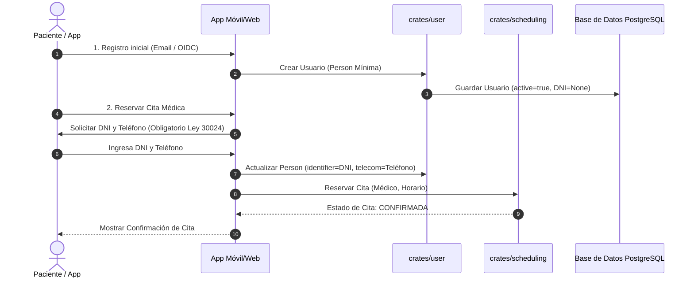

### Caso de Uso 2: Recuperación de Credenciales y Re-vinculación Presencial
El usuario perdió acceso a su correo/teléfono antiguo. Registra una nueva cuenta con su DNI. La cuenta se crea con `LinkAssuranceLevel::Level1` (Pendiente). La cita se guarda **100% CONFIRMADA**. El día de la cita, la recepcionista verifica el DNI físico al hacer Check-in, elevando la certeza a `Level3`/`Level4` (Verificado).


### Caso de Uso 3: Corrección de DNI Registrado por Error y Conversión a Perfil Familiar
El usuario registró por error el DNI de un familiar (ej. hijo o padre) en su cuenta principal. El usuario convierte el DNI del familiar en un perfil gestionado de `Patient` (`PersonLinkTarget::Patient`) e ingresa su propio DNI en la cuenta principal.

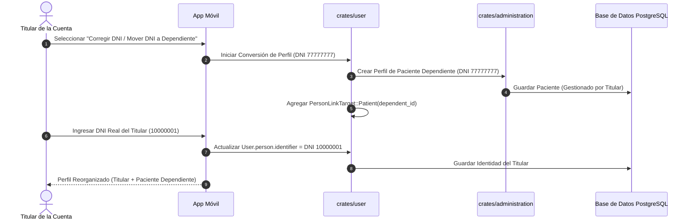

### Caso de Uso 4: Consulta Previa por DNI y Opciones Dinámicas
La App consulta a la API antes o durante el registro. El backend verifica la existencia y estado del DNI para guiar las opciones de interfaz.

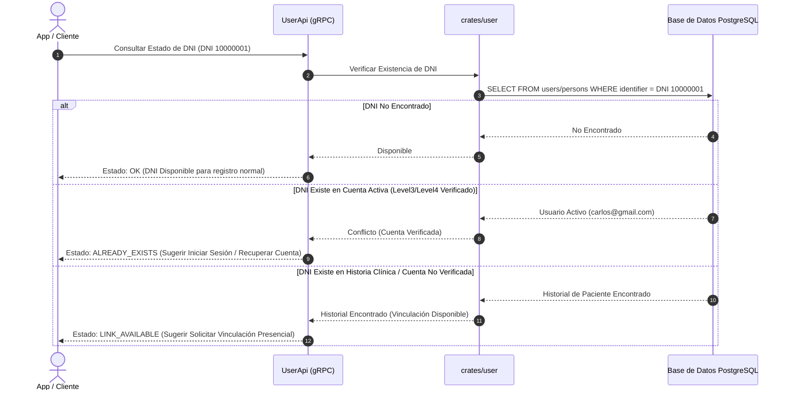

### Caso de Uso 5: Independización de Perfil Dependiente (Hijo cumple 18 años)
Un hijo registrado como dependiente (`Patient` vinculado a la cuenta del padre) registra su propia cuenta `User` autónoma con su correo y DNI.

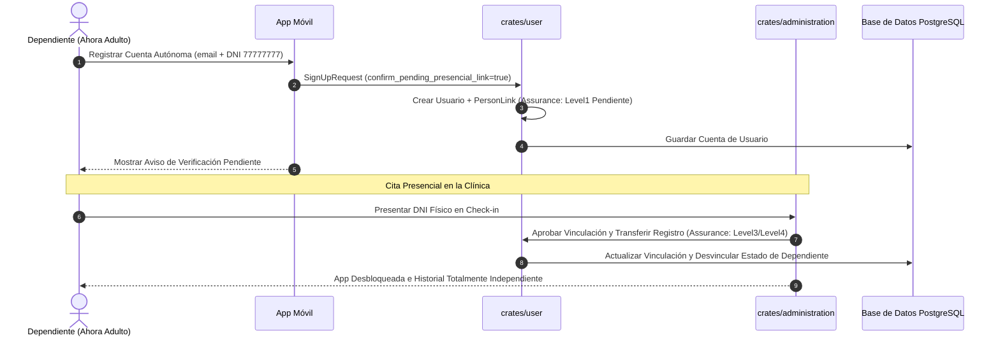

### Caso de Uso 6: Actualización de Datos de Perfil y Controles por Nivel de Certeza
El usuario intenta actualizar campos de identidad (Nombre, DNI, Teléfono). Las actualizaciones se permiten libremente en cuentas no verificadas (`Level1`) y se restringen/auditan en cuentas verificadas (`Level3`/`Level4`).

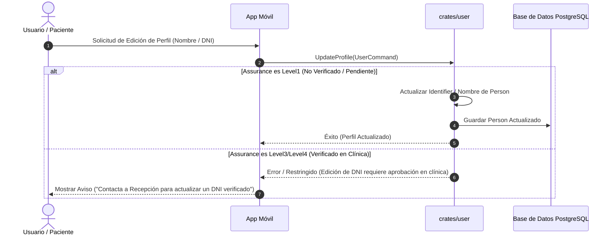

---

## 3. Arquitectura y Modelo de Clases por Contexto Acotado

### 3.1. Arquitectura y Composición de Identidad FHIR

El siguiente gráfico ilustra cómo la autenticación del sistema (`User`) compone la identidad física (`Person`) y se vincula con los recursos de roles sanitarios (`Patient`, `Practitioner`, `Organization`):

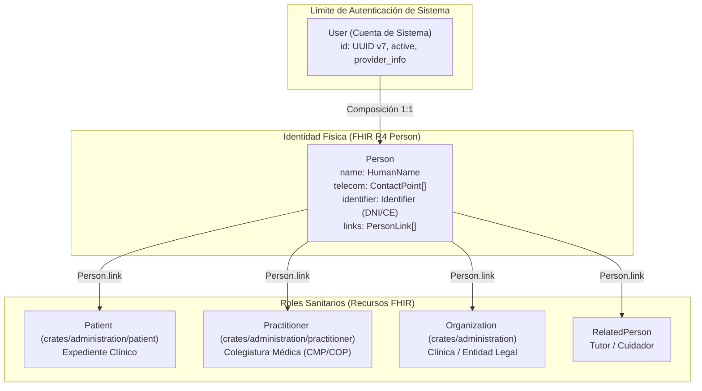

---

### 3.2. Diagramas de Clases del Modelo de Dominio por Bounded Context

#### 3.2.1. Identity & Security (`crates/user`)
* **Grupo FHIR**: Foundation / Security.
* **Sub-crates**: `crates/user/auth_account`, `crates/user/person`.

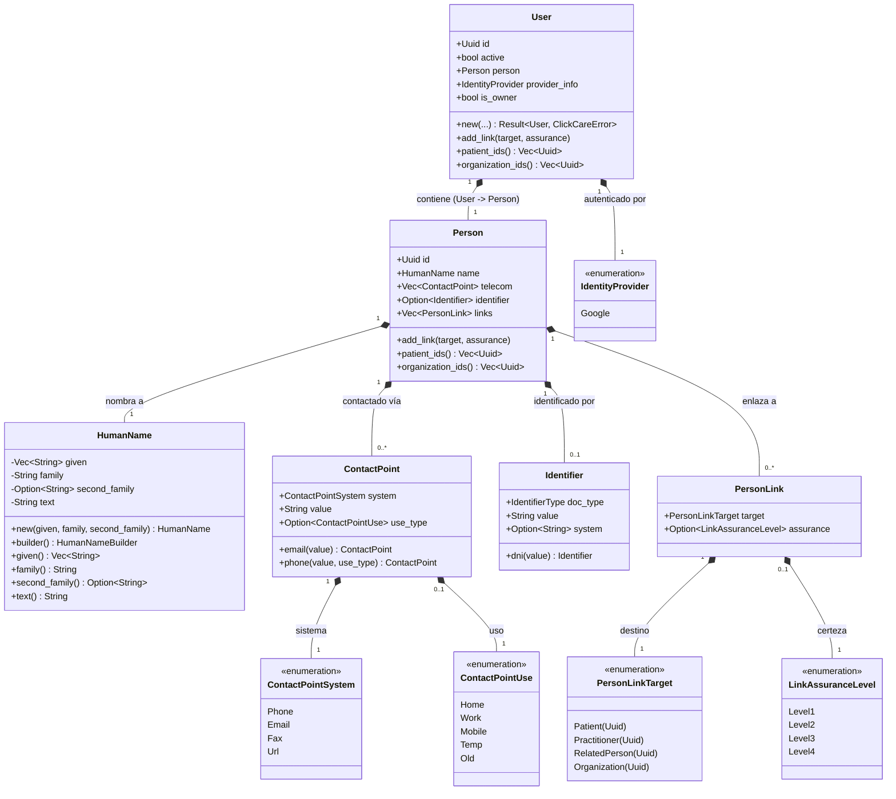

#### 3.2.2. Gestión Administrativa (`crates/administration`)
* **Grupos FHIR**: FHIR Individuals / FHIR Entities.
* **Sub-crates**: `crates/administration/patient`, `crates/administration/practitioner`, `crates/administration/location`, `crates/administration/healthcare_service`.

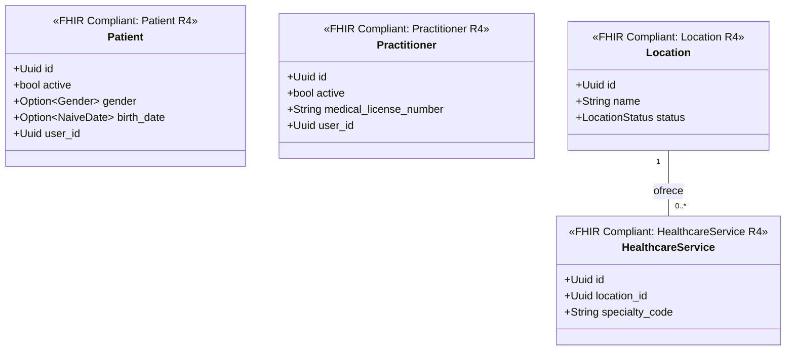

#### 3.2.3. Reserva de Citas (`crates/scheduling`)
* **Grupo FHIR**: FHIR Workflow.
* **Sub-crates**: `crates/scheduling/schedule`, `crates/scheduling/slot`, `crates/scheduling/appointment`.

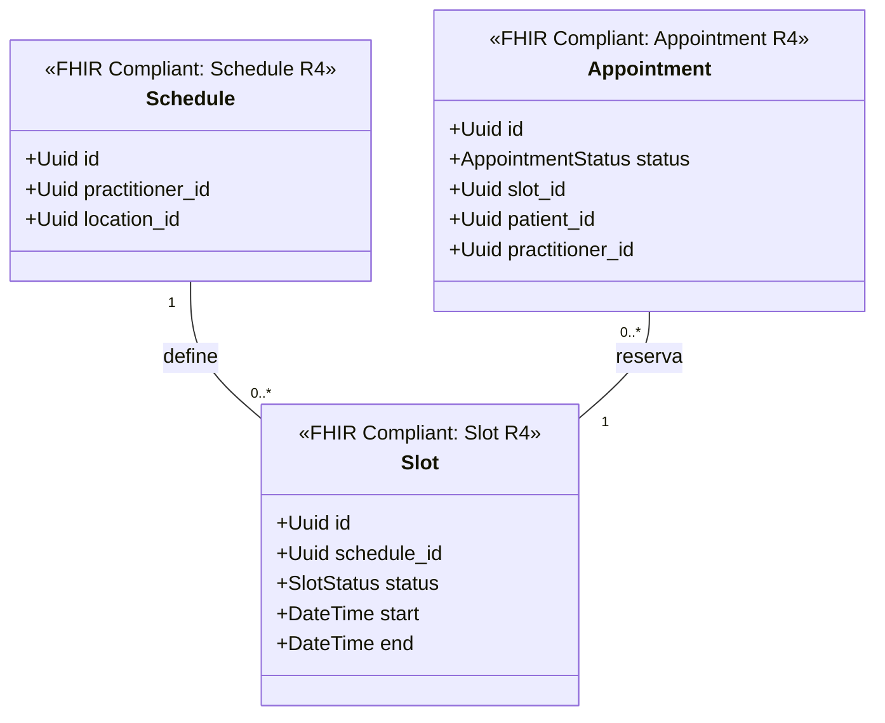

#### 3.2.4. Historia Clínica (`crates/clinical`)
* **Grupos FHIR**: FHIR Management / FHIR Clinical Summary / FHIR Care Provision / FHIR Diagnostics & Forms.
* **Sub-crates**: `crates/clinical/encounter`, `crates/clinical/condition`, `crates/clinical/allergy_intolerance`, `crates/clinical/care_plan`, `crates/clinical/medication_request`, `crates/clinical/questionnaire`.

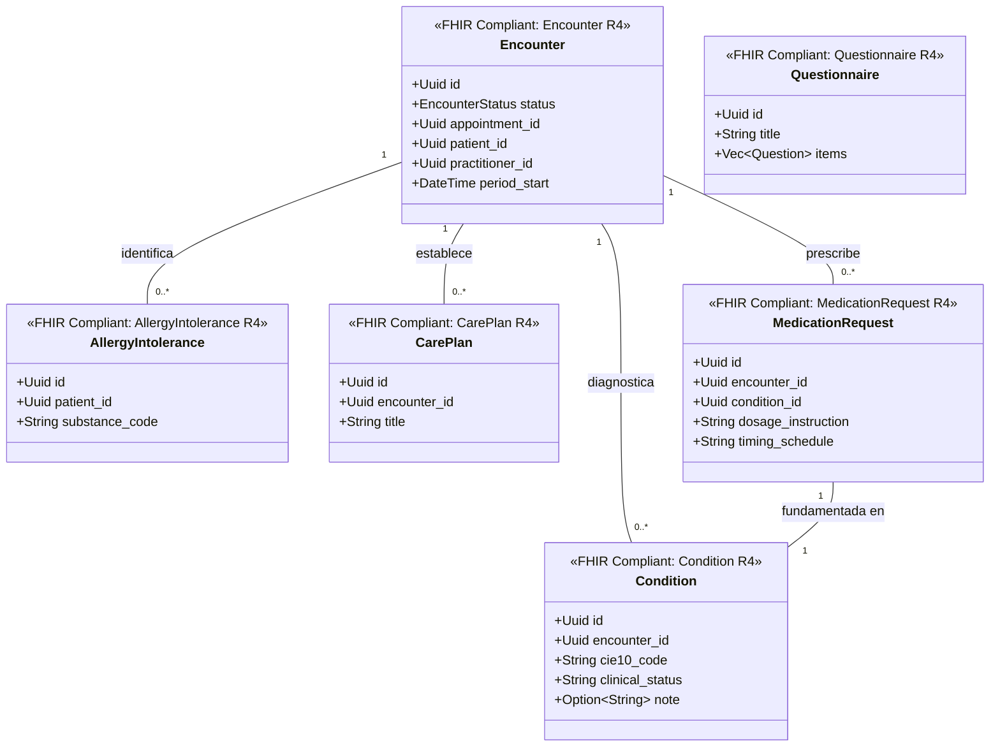

#### 3.2.5. Laboratorio e Imágenes (`crates/diagnostics`)
* **Grupo FHIR**: FHIR Diagnostics.
* **Sub-crates**: `crates/diagnostics/service_request`, `crates/diagnostics/observation`, `crates/diagnostics/diagnostic_report`, `crates/diagnostics/imaging_study`, `crates/diagnostics/specimen`.

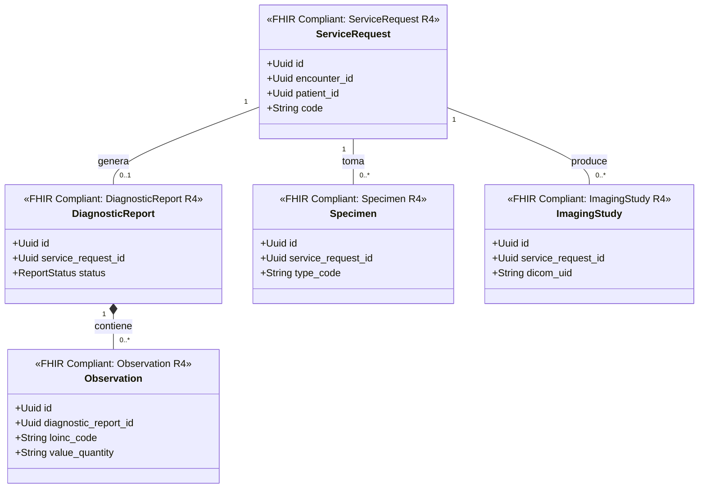

#### 3.2.6. Farmacia e Insumos (`crates/pharmacy`)
* **Grupo FHIR**: FHIR Medications & Supply.
* **Sub-crates**: `crates/pharmacy/medication`, `crates/pharmacy/medication_dispense`, `crates/pharmacy/medication_administration`, `crates/pharmacy/supply`.

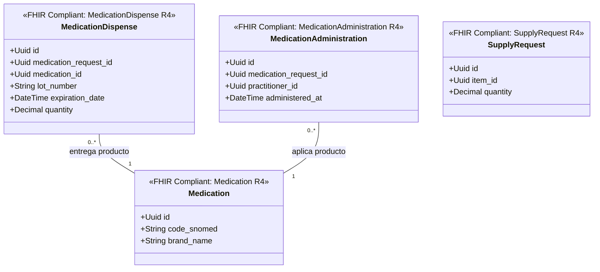

#### 3.2.7. Aseguradoras y Coberturas (`crates/coverage`)
* **Grupo FHIR**: FHIR Financial / Claims.
* **Sub-crates**: `crates/coverage/policy`, `crates/coverage/claim`, `crates/coverage/eligibility`.

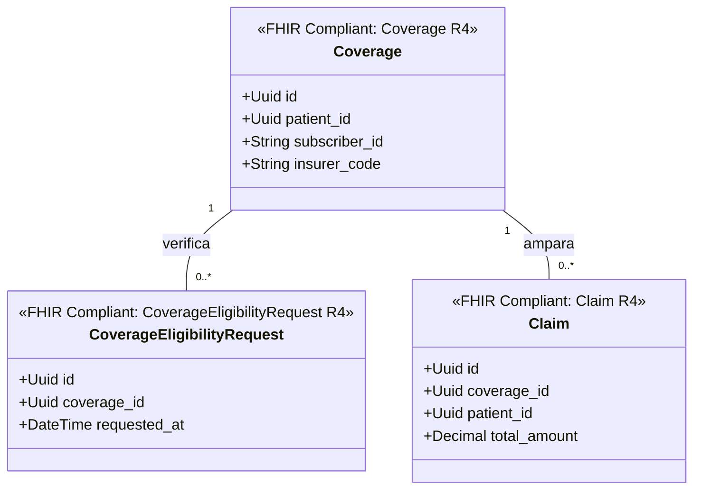

#### 3.2.8. Facturación (`crates/billing`)
* **Grupo FHIR**: FHIR Financial.
* **Sub-crates**: `crates/billing/account`, `crates/billing/invoice`, `crates/billing/charge_item`.

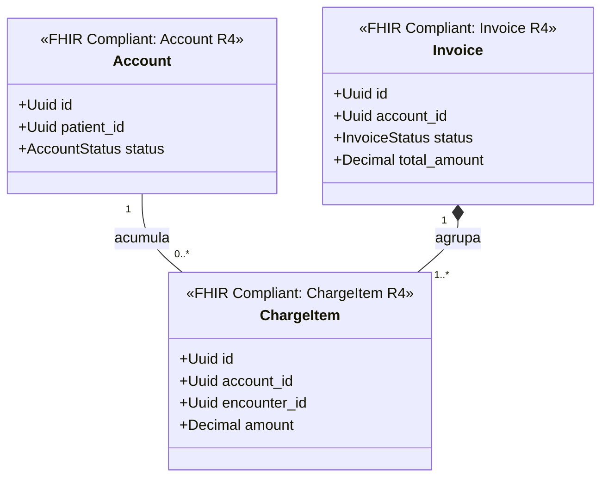

#### 3.2.9. Archivo Legal y Auditoría (`crates/legal_archive`)
* **Grupo FHIR**: FHIR Documents & Security.
* **Sub-crates**: `crates/legal_archive/composition`, `crates/legal_archive/document_reference`, `crates/legal_archive/audit_event`, `crates/legal_archive/provenance`.

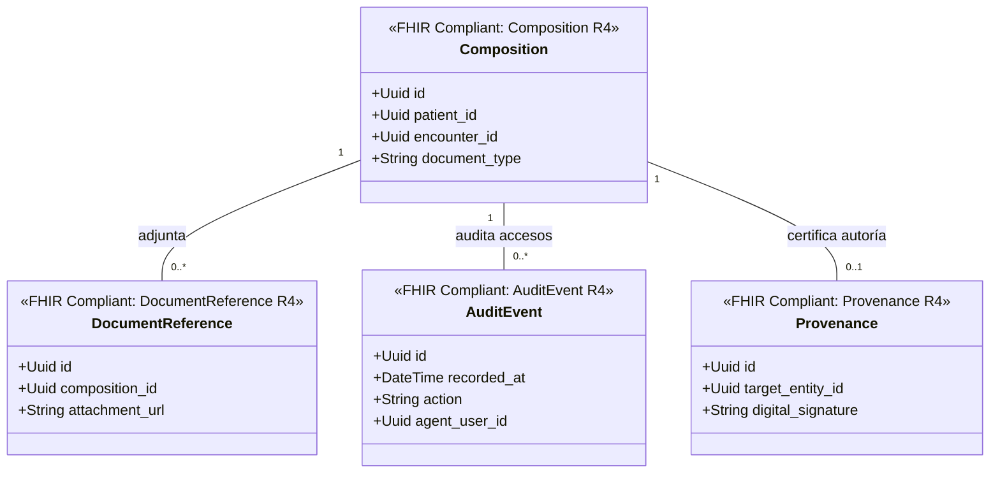

#### 3.2.10. Notificaciones y Alertas (`crates/communication`)
* **Grupo FHIR**: FHIR Workflow / Support.
* **Sub-crates**: `crates/communication/message`, `crates/communication/flag`.

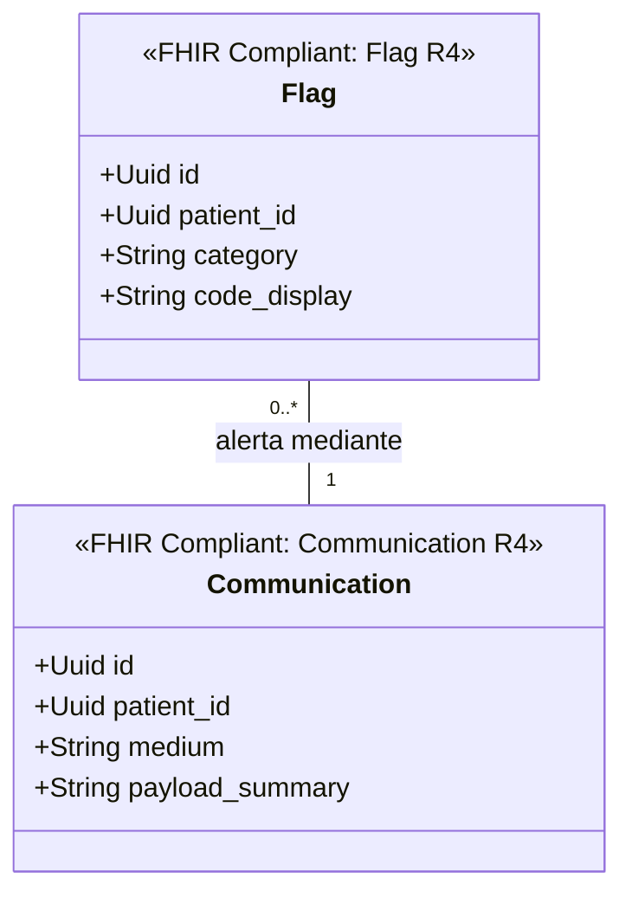

---

## 4. Matriz Resumen de Cumplimiento FHIR y Estructura de Sub-crates

| Crate Contenedor (C4 Nivel 2) | Sub-crates de Entidad (C4 Nivel 3) | Grupo / Módulo FHIR | Recurso FHIR Mapeado | ¿FHIR Compliant? | Proyección / Apuntador Débil |
| :--- | :--- | :--- | :--- | :--- | :--- |
| `crates/user` | `auth_account`, `person` | Foundation / Security | `Person` | 100% FHIR R4 (Person) | N/A (Dueño de la identidad física). |
| `crates/administration` | `patient`, `practitioner`, `location`, `healthcare_service` | FHIR Individuals / Entities | `Patient`, `Practitioner`, `Location`, `HealthcareService` | 100% FHIR R4 | Apunta débilmente a `user_id`. |
| `crates/scheduling` | `schedule`, `slot`, `appointment` | FHIR Workflow | `Schedule`, `Slot`, `Appointment` | 100% FHIR R4 | Apunta débilmente a `patient_id`, `practitioner_id`, `location_id`. |
| `crates/clinical` | `encounter`, `condition`, `allergy_intolerance`, `care_plan`, `medication_request`, `questionnaire` | FHIR Management / Summary / Care Provision / Forms | `Encounter`, `Condition`, `MedicationRequest`, `CarePlan`, `Questionnaire` | 100% FHIR R4 | Apunta débilmente a `patient_id`, `practitioner_id`, `appointment_id`. |
| `crates/diagnostics` | `service_request`, `observation`, `diagnostic_report`, `imaging_study`, `specimen` | FHIR Diagnostics | `ServiceRequest`, `Observation`, `DiagnosticReport`, `ImagingStudy`, `Specimen` | 100% FHIR R4 | Apunta débilmente a `patient_id`, `encounter_id`. |
| `crates/pharmacy` | `medication`, `medication_dispense`, `medication_administration`, `supply` | FHIR Medications & Supply | `Medication`, `MedicationDispense`, `MedicationAdministration`, `SupplyRequest` / `SupplyDelivery` | 100% FHIR R4 | Apunta débilmente a `medication_request_id`, `patient_id`, `encounter_id`. |
| `crates/coverage` | `policy`, `claim`, `eligibility` | FHIR Financial / Claims | `Coverage`, `Claim`, `ClaimResponse`, `CoverageEligibilityRequest` | 100% FHIR R4 | Apunta débilmente a `patient_id`. |
| `crates/billing` | `account`, `invoice`, `charge_item` | FHIR Financial | `Account`, `Invoice`, `ChargeItem` | 100% FHIR R4 | Apunta débilmente a `patient_id`, `encounter_id`, `coverage_id`. |
| `crates/legal_archive` | `composition`, `document_reference`, `audit_event`, `provenance` | FHIR Documents & Security | `Composition`, `DocumentReference`, `AuditEvent`, `Provenance` | 100% FHIR R4 | Apunta débilmente a `patient_id`, `practitioner_id`, `encounter_id`. |
| `crates/communication` | `message`, `flag` | FHIR Workflow / Support | `Communication`, `CommunicationRequest`, `Flag` | 100% FHIR R4 | Apunta débilmente a `patient_id`. |

---

## 5. Estructura del Proyecto y Organización de Módulos

### 5.1. Estructura de Directorios en Cargo Workspace (Ecosistema de Crates y Sub-crates)

```
clickcare/
├── Cargo.toml                      # Root Workspace Definition (members = ["crates/*", "crates/*/*"])
├── bin/
│   └── clickcare/                  # Servidor ejecutable (Monolito Modular / API Gateway / gRPC Entrypoint)
│       ├── Cargo.toml
│       ├── build.rs                # Compilación de proto vía tonic-prost-build
│       ├── src/
│       │   ├── main.rs
│       │   ├── lib.rs
│       │   └── infrastructure/
│       │       └── grpc/           # Implementaciones de servicios gRPC (ej. UserApiImpl)
│       └── tests/                  # Pruebas de integración
└── crates/
    ├── core/                       # app_core — traits compartidos, ClickCareError, VOs FHIR compartidos
    │   ├── Cargo.toml
    │   └── src/
    │
    ├── user/                       # Crate Contenedor: Auth & Identity
    │   ├── Cargo.toml
    │   ├── src/                    # Controladores, gRPC handlers, BD
    │   ├── auth_account/           # Sub-crate: Auth Account
    │   │   ├── Cargo.toml
    │   │   └── src/lib.rs
    │   └── person/                 # Sub-crate: Person (FHIR R4 Person)
    │       ├── Cargo.toml
    │       └── src/lib.rs
    │
    ├── administration/             # Crate Contenedor: Gestión Administrativa
    │   ├── Cargo.toml
    │   ├── src/
    │   ├── patient/                # Sub-crate: Patient (FHIR R4 Patient)
    │   │   ├── Cargo.toml
    │   │   └── src/lib.rs
    │   ├── practitioner/           # Sub-crate: Practitioner (FHIR R4 Practitioner)
    │   │   ├── Cargo.toml
    │   │   └── src/lib.rs
    │   ├── location/               # Sub-crate: Location (FHIR R4 Location)
    │   │   ├── Cargo.toml
    │   │   └── src/lib.rs
    │   └── healthcare_service/     # Sub-crate: HealthcareService (FHIR R4 HealthcareService)
    │       ├── Cargo.toml
    │       └── src/lib.rs
    │
    ├── scheduling/                 # Crate Contenedor: Reserva de Citas
    │   ├── Cargo.toml
    │   ├── src/
    │   ├── schedule/               # Sub-crate: Schedule (FHIR R4 Schedule)
    │   │   ├── Cargo.toml
    │   │   └── src/lib.rs
    │   ├── slot/                   # Sub-crate: Slot (FHIR R4 Slot)
    │   │   ├── Cargo.toml
    │   │   └── src/lib.rs
    │   └── appointment/            # Sub-crate: Appointment (FHIR R4 Appointment)
    │       ├── Cargo.toml
    │       └── src/lib.rs
    │
    ├── clinical/                   # Crate Contenedor: Historia Clínica
    │   ├── Cargo.toml
    │   ├── src/
    │   ├── encounter/              # Sub-crate: Encounter (FHIR R4 Encounter)
    │   │   ├── Cargo.toml
    │   │   └── src/lib.rs
    │   ├── condition/              # Sub-crate: Condition (FHIR R4 Condition)
    │   │   ├── Cargo.toml
    │   │   └── src/lib.rs
    │   ├── allergy_intolerance/    # Sub-crate: AllergyIntolerance (FHIR R4 AllergyIntolerance)
    │   │   ├── Cargo.toml
    │   │   └── src/lib.rs
    │   ├── care_plan/              # Sub-crate: CarePlan (FHIR R4 CarePlan)
    │   │   ├── Cargo.toml
    │   │   └── src/lib.rs
    │   ├── medication_request/     # Sub-crate: MedicationRequest (FHIR R4 MedicationRequest)
    │   │   ├── Cargo.toml
    │   │   └── src/lib.rs
    │   └── questionnaire/          # Sub-crate: Questionnaire (FHIR R4 Questionnaire)
    │       ├── Cargo.toml
    │       └── src/lib.rs
    │
    ├── diagnostics/                # Crate Contenedor: Laboratorio e Imágenes
    │   ├── Cargo.toml
    │   ├── src/
    │   ├── service_request/        # Sub-crate: ServiceRequest (FHIR R4 ServiceRequest)
    │   │   ├── Cargo.toml
    │   │   └── src/lib.rs
    │   ├── observation/            # Sub-crate: Observation (FHIR R4 Observation)
    │   │   ├── Cargo.toml
    │   │   └── src/lib.rs
    │   ├── diagnostic_report/      # Sub-crate: DiagnosticReport (FHIR R4 DiagnosticReport)
    │   │   ├── Cargo.toml
    │   │   └── src/lib.rs
    │   ├── imaging_study/          # Sub-crate: ImagingStudy (FHIR R4 ImagingStudy)
    │   │   ├── Cargo.toml
    │   │   └── src/lib.rs
    │   └── specimen/               # Sub-crate: Specimen (FHIR R4 Specimen)
    │       ├── Cargo.toml
    │       └── src/lib.rs
    │
    ├── pharmacy/                   # Crate Contenedor: Farmacia e Insumos
    │   ├── Cargo.toml
    │   ├── src/
    │   ├── medication/             # Sub-crate: Medication (FHIR R4 Medication)
    │   │   ├── Cargo.toml
    │   │   └── src/lib.rs
    │   ├── medication_dispense/    # Sub-crate: MedicationDispense (FHIR R4 MedicationDispense)
    │   │   ├── Cargo.toml
    │   │   └── src/lib.rs
    │   ├── medication_administration/ # Sub-crate: MedicationAdministration (FHIR R4 MedicationAdministration)
    │   │   ├── Cargo.toml
    │   │   └── src/lib.rs
    │   └── supply/                 # Sub-crate: SupplyRequest / SupplyDelivery (FHIR R4 Supply)
    │       ├── Cargo.toml
    │       └── src/lib.rs
    │
    ├── coverage/                   # Crate Contenedor: Aseguradoras y Coberturas
    │   ├── Cargo.toml
    │   ├── src/
    │   ├── policy/                 # Sub-crate: Coverage (FHIR R4 Coverage)
    │   │   ├── Cargo.toml
    │   │   └── src/lib.rs
    │   ├── claim/                  # Sub-crate: Claim / ClaimResponse (FHIR R4 Claim)
    │   │   ├── Cargo.toml
    │   │   └── src/lib.rs
    │   └── eligibility/            # Sub-crate: CoverageEligibilityRequest (FHIR R4 Eligibility)
    │       ├── Cargo.toml
    │       └── src/lib.rs
    │
    ├── billing/                    # Crate Contenedor: Facturación
    │   ├── Cargo.toml
    │   ├── src/
    │   ├── account/                # Sub-crate: Account (FHIR R4 Account)
    │   │   ├── Cargo.toml
    │   │   └── src/lib.rs
    │   ├── invoice/                # Sub-crate: Invoice (FHIR R4 Invoice)
    │   │   ├── Cargo.toml
    │   │   └── src/lib.rs
    │   └── charge_item/            # Sub-crate: ChargeItem (FHIR R4 ChargeItem)
    │       ├── Cargo.toml
    │       └── src/lib.rs
    │
    ├── legal_archive/              # Crate Contenedor: Archivo Legal y Auditoría
    │   ├── Cargo.toml
    │   ├── src/
    │   ├── composition/            # Sub-crate: Composition (FHIR R4 Composition)
    │   │   ├── Cargo.toml
    │   │   └── src/lib.rs
    │   ├── document_reference/     # Sub-crate: DocumentReference (FHIR R4 DocumentReference)
    │   │   ├── Cargo.toml
    │   │   └── src/lib.rs
    │   ├── audit_event/            # Sub-crate: AuditEvent (FHIR R4 AuditEvent)
    │   │   ├── Cargo.toml
    │   │   └── src/lib.rs
    │   └── provenance/             # Sub-crate: Provenance (FHIR R4 Provenance)
    │       ├── Cargo.toml
    │       └── src/lib.rs
    │
    └── communication/              # Crate Contenedor: Notificaciones y Alertas
        ├── Cargo.toml
        ├── src/
        ├── message/                # Sub-crate: Communication (FHIR R4 Communication)
        │   ├── Cargo.toml
        │   └── src/lib.rs
        └── flag/                   # Sub-crate: Flag (FHIR R4 Flag)
            ├── Cargo.toml
            └── src/lib.rs
```

---

### 5.2. Capas de la Arquitectura Cebolla

| Capa | Ruta | Responsabilidad | Dependencias |
|---|---|---|---|
| **Core** | `crates/core/` | Traits base (`UseCase`), error transversal (`ClickCareError`), VOs FHIR compartidos | Ninguna |
| **Domain** | `crates/*/*/src/` y `crates/*/src/domain/` | Entidades, agregados, eventos de dominio, traits de repositorio | `crates/core` |
| **Application** | `crates/*/src/application/` | Casos de uso de negocio implementando `app_core::application::UseCase` | `domain`, `crates/core` |
| **Infrastructure** | `crates/*/src/infrastructure/` | Repositorios DB, contenedor DI (`di.rs`), adaptadores externos | `application`, `domain`, `crates/core` |
| **gRPC Server** | `bin/clickcare/` | Controladores gRPC y punto de entrada del servicio | `crates/*` |

Las dependencias apuntan estrictamente **hacia adentro**:
```
bin/clickcare (Punto de entrada gRPC)
  └── crates/*/infrastructure (Repositorios DB, cableado DI)
        └── crates/*/application (Casos de uso)
              └── crates/*/domain / crates/*/* (Entidades y sub-crates FHIR)
                    └── crates/core (Contratos app_core)
```

---

### 5.3. Diagrama de Secuencia del Flujo de Solicitudes

El siguiente diagrama de secuencia ilustra cómo fluye una solicitud a través de las capas de la Arquitectura Cebolla durante la ejecución (ej. Registro de Usuario o creación de expediente de Paciente):

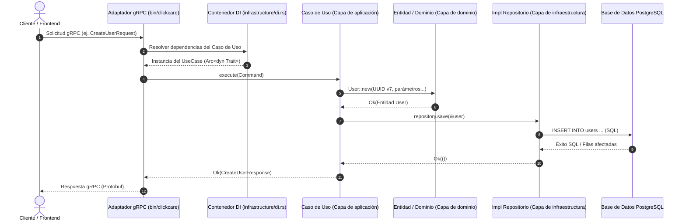

---

## 6. Reglas Principales y Mandatos Técnicos

1. **Inyección de Dependencias Estricta (DI)**
   - Inyectar dependencias como `Arc<dyn Trait + Send + Sync>`.
   - Nunca instanciar tipos concretos fuera de `src/infrastructure/di.rs`.
   - Las crates de dominio exponen `di::new(DBType)` y `DIOverrides` para inyección de mocks en pruebas.

2. **Requerimiento Obligatorio de UUID v7**
   - Todas las Llaves Primarias e IDs de usuario **deben** ser UUID v7 (`Uuid::now_v7()`).
   - Los constructores de dominio validan el cumplimiento de UUID v7 y devuelven `ClickCareError` en formatos inválidos.

3. **Manejo de Errores y Observabilidad**
   - Utilizar `ClickCareError` (`crates/core`) para errores transversales.
   - Utilizar `thiserror` para errores específicos del dominio y propagar con `?`.
   - **Cero `unwrap()` en rutas de producción**.
   - Utilizar macros de `tracing` (`info!`, `warn!`, `error!`), **nunca** usar `println!`.

4. **Scripts y Herramientas**
   - Para automatización, despliegue o scripts auxiliares, **preferir scripts de Nushell (`.nu`)**.

5. **Protobuf API como Única Fuente de Verdad**
   - `proto/api.proto` define todos los endpoints externos. Cualquier cambio en la API debe comenzar actualizando las definiciones `.proto`.

---

## 7. Comandos de Compilación, Pruebas y Desarrollo

```bash
# Verificar compilación en todo el workspace
cargo check --workspace

# Compilar el servidor gRPC
cargo build -p clickcare

# Ejecutar todas las pruebas (unitarias + integración)
cargo test --workspace

# Ejecutar pruebas para una crate específica (ej. user)
cargo test -p user

# Formatear código
cargo fmt --all

# Linter (Modo estricto CI)
cargo clippy --workspace -- -D warnings
```
