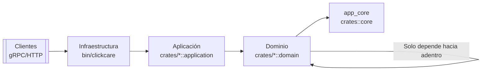
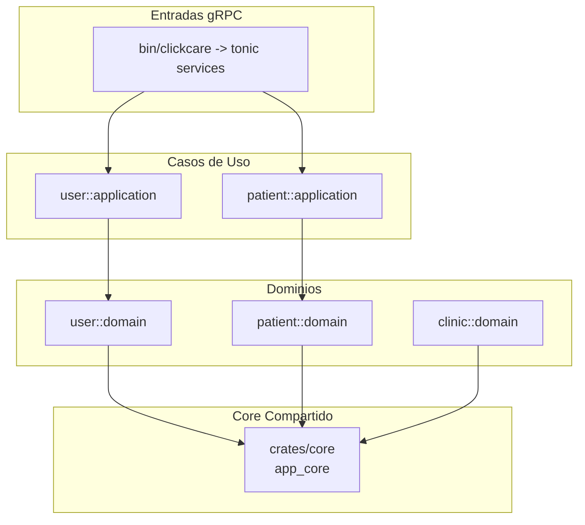

# Proyecto backend

Este backend de Rust organiza sus componentes en una Arquitectura Cebolla para mantener las reglas de negocio aisladas de los detalles de infraestructura. El workspace (`Cargo.toml` raíz) expone los crates funcionales (`user`, `patient`, `clinic`, `clinic_admin`) junto al crate compartido `app_core` y al ejecutable gRPC `bin/clickcare`.

## Arquitectura Cebolla

La arquitectura se compone de capas concéntricas donde el dominio no depende de capas externas. Cada crate sigue esta separación mediante módulos `domain`, `application` e `infrastructure`:

- **Dominio (`crates/*/src/domain`)**: entidades, agregados y contratos (por ejemplo, `User`, `DocumentType`, `UserRepository`). No conocen detalles de persistencia o transporte.
- **Aplicación (`crates/*/src/application`)**: casos de uso que coordinan entidades y repositorios (`CreateUserUseCase` implementa `app_core::application::UseCase`). Sólo recibe interfaces del dominio.
- **Infraestructura (`bin/clickcare/src/infrastructure`, `crates/*/src/infrastructure`)**: adaptadores gRPC/HTTP, implementaciones de repositorios, logging y orquestación (`start_server` monta los servicios tonic y la reflexión).
- **Core compartido (`crates/core`)**: contratos transversales como `ClickCareError` y traits comunes que evitan duplicación entre dominios.

### Diagrama de capas

### Interacción de crates

## Implementación en Rust

1. **Workspace unificado**: `backend/Cargo.toml` registra todos los crates y reutiliza dependencias (por ejemplo, `strum`, `tokio`, `tonic`).
2. **Contratos compartidos**: `app_core` define rasgos (`UseCase`, errores, repositorios base) que el resto de crates importan mediante dependencias de workspace.
3. **Crates feature-oriented**: cada contexto (`user`, `patient`, `clinic`, `clinic_admin`) publica su API en `lib.rs` reexportando dominios y casos de uso, lo que facilita testing y composición.
4. **Punto de entrada**: `bin/clickcare` configura el servidor gRPC, aplica cross-cutting concerns (logging, `GrpcWebLayer`) y expone servicios generados desde `proto/api.proto`.
5. **Adaptadores**: las implementaciones concretas de repositorios o servicios externos residen en `infrastructure`, inyectándose en los casos de uso mediante `Box<dyn Trait + Send + Sync>` para respetar las inversiones de dependencia.

Este README captura la vista actual del sistema; conforme evolucionen nuevos módulos o adaptadores, documenta aquí cómo se conectan para mantener clara la separación de capas.
