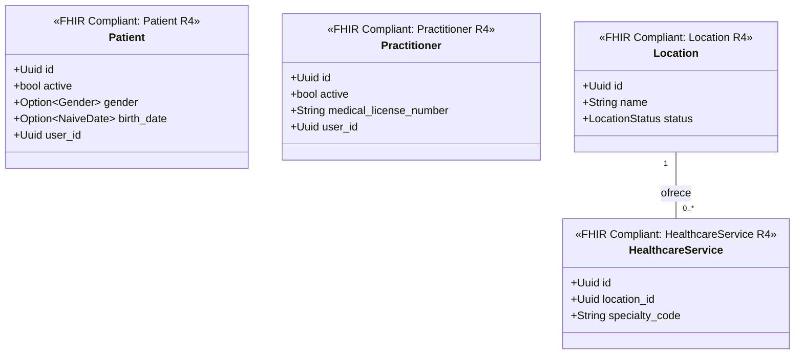

# Gestión Administrativa Bounded Context (`crates/administration`)

## Especificación del Dominio

* **Responsabilidad**: Gestión de expedientes de pacientes, profesionales de salud (con colegiatura CMP/COP), locaciones/consultorios y oferta de servicios sanitarios.
* **Grupos FHIR**: FHIR Individuals / FHIR Entities.
* **Recursos FHIR Mapeados**: `Patient`, `Practitioner`, `Location`, `HealthcareService` (HL7 FHIR R4).
* **Módulos de Dominio (`src/domain/`)**: `patient.rs`, `practitioner.rs`, `location.rs`, `healthcare_service.rs`.
* **Proyección / Apuntador Débil**: Apunta débilmente a `user_id` (UUIDv7).

---

## Consumo de Eventos

Este contexto acotado consume `UserCreatedEvent` de forma asíncrona desde `crates/user`,
usando `apalis-postgres` sobre la cola `UserCreatedEvent::QUEUE` (`"user.created"`).

* **Handler**: `src/application/event_handlers.rs::handle_user_created_event`. Es una función
  de aplicación pura: no conoce Apalis ni tipos de infraestructura.
* **Worker**: `src/infrastructure/di.rs`. `di::new(DBType)` prepara el schema `apalis` y
  devuelve un `DI`; `DI::run_worker()` construye y ejecuta el worker sin exponer los tipos
  genéricos de `WorkerBuilder` fuera del crate.
* **Aislamiento transaccional**: el worker abre su **propio** pool, exclusivo de la cola. No
  comparte conexión ni transacción con los repositorios de entidades de ningún contexto.

---

## Diagrama de Clases

