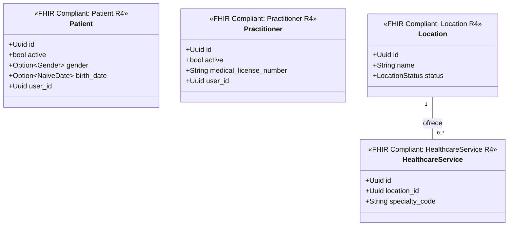

# Gestión Administrativa Bounded Context (`crates/administration`)

## Especificación del Dominio

* **Responsabilidad**: Gestión de expedientes de pacientes, profesionales de salud (con colegiatura CMP/COP), locaciones/consultorios y oferta de servicios sanitarios.
* **Grupos FHIR**: FHIR Individuals / FHIR Entities.
* **Recursos FHIR Mapeados**: `Patient`, `Practitioner`, `Organization` (HL7 FHIR R4). `Location` y `HealthcareService` están previstos y aún no implementados.
* **Módulos de Dominio (`src/domain/`)**: `organization.rs`, `patient.rs`, `practitioner.rs`, `repository/`.
* **Proyección / Apuntador Débil**: Apunta débilmente a `user_id` (UUIDv7).

---

## Reglas de Dominio

### Réplicas Demográficas Autónomas

* Este contexto **no consulta** a `crates/user` para leer la demografía de una persona: recibe la entidad `Person` completa dentro de `UserCreatedEvent` y construye sus propias entidades locales. Esa réplica es deliberada y mantiene la **autonomía operativa de cada clínica** frente a la caída o la evolución del contexto de identidad.
* Al procesar el evento, el handler inicializa la `Organization` (clínica), la ficha `Practitioner` de su dueño y su expediente `Patient` **solo si** `create_clinic == true`. Si el usuario no crea clínica, **no materializa nada**.
* El vínculo hacia identidad es un **apuntador débil** (`user_id: Uuid`), nunca una llave foránea ni un `JOIN` entre contextos acotados.
* La entrega es *at-least-once*: el handler **debe ser idempotente**. Recibir dos veces el mismo `UserCreatedEvent` no puede producir expedientes duplicados.

### Toda Entidad Local Pertenece a una Clínica

* `Patient` y `Practitioner` llevan `organization_id` y **no existen sin él**. No hay expedientes huérfanos: un usuario que todavía no pertenece a ninguna clínica no tiene entidades en este contexto.
* La misma persona atendida en dos clínicas tiene **dos expedientes distintos**, uno por cada una, que comparten el `user_id` global y nada más. Lo mismo vale para un médico que ejerce en varias.
* Toda consulta de existencia se acota por `(organization_id, user_id)`, nunca solo por `user_id`. Sin ese filtro, la primera clínica en atender a una persona bloquearía a todas las demás.
* El discriminador es de fila, no de esquema: los esquemas de Postgres son fronteras de dominio FHIR, no inquilinos.

---

## Consumo de Eventos

Este contexto acotado consume `UserCreatedEvent` de forma asíncrona desde `crates/user`,
usando `apalis-postgres` sobre la cola `UserCreatedEvent::QUEUE` (`"user.created"`).

* **Handler**: `src/application/event_handlers.rs::handle_user_created_event`. Es una función
  de aplicación pura con la firma `async fn(UserCreatedEvent, &AdministrationState)`: no
  conoce Apalis ni tipos de infraestructura. `AdministrationState`
  (`src/application/state.rs`) solo agrupa los tres puertos de repositorio.
* **Worker**: `src/infrastructure/di.rs`. `di::new(DBType)` prepara el schema `apalis` y
  devuelve un `DI`; `DI::run_worker()` construye y ejecuta el worker sin exponer los tipos
  genéricos de `WorkerBuilder` fuera del crate. El handler se registra envuelto en un cierre
  que extrae el estado del `Data<AdministrationState>` de Apalis, de modo que el extractor
  nunca entra en la capa de aplicación.
* **Aislamiento transaccional**: `di::new` abre **dos conexiones independientes** a la misma
  base de datos — una exclusiva de la cola (`PgPool` de `apalis-postgres`) y otra para los
  repositorios de entidades (`toasty::Db`). Consumir un evento nunca comparte pool ni
  transacción con la persistencia del agregado.

---

## Persistencia

Los repositorios viven en `src/infrastructure/repository/` e implementan los puertos de
`src/domain/repository/`. Las tablas están en el esquema **`administration`** de Postgres
(`ddl/table.sql`).

| Puerto de dominio | Implementación | Tabla |
| :--- | :--- | :--- |
| `OrganizationRepository` | `organization_repository_impl.rs` | `administration.organization` |
| `PractitionerRepository` | `practitioner_repository_impl.rs` | `administration.practitioner` |
| `PatientRepository` | `patient_repository_impl.rs` | `administration.patient` |

* **`OrganizationRepository` devuelve el id, no un booleano**: `find_id_by_owner_user_id` existe porque quien procesa el evento necesita la clínica para colgar de ella las entidades locales, tanto si acaba de crearla como si ya existía.

* **`Person` se guarda serializado como JSON en una sola columna `TEXT`**, no aplanado en
  columnas sueltas. El expediente conserva el recurso FHIR completo tal como llegó en el
  evento, sin perder campos ni duplicar el modelo de `crates/core`.
* **`UNIQUE` compuesto `(organization_id, user_id)`**: respalda en la base de datos la
  idempotencia que el handler implementa con el par `exists_by_*` / `save`, sin impedir que
  la misma persona exista en varias clínicas. La organización mantiene su `UNIQUE` simple
  sobre `owner_user_id`. Los índices B-Tree son compuestos `(organization_id, id)`, porque
  toda consulta de este contexto entra acotada por clínica.
* **`save` todavía no resuelve conflictos**: `toasty` 0.8.0 no tiene `ON CONFLICT` ni upsert
  —no aparece en su código fuente—, así que `save` usa `toasty::create!` a secas y dos
  escrituras concurrentes del mismo par chocarían contra el `UNIQUE` en vez de resolverse.
  El `ON CONFLICT ... DO NOTHING` que exige la especificación de multi-clínica requiere SQL
  crudo y queda pendiente.
* **Toasty no admite nombres de tabla calificados por esquema**: `#[table = "..."]` se
  serializa como un único identificador entrecomillado. Por eso `administration` debe estar
  en el `search_path` de la base de datos, y las consultas SQL crudas sí califican el
  esquema de forma explícita.

---

## Diagrama de Clases

