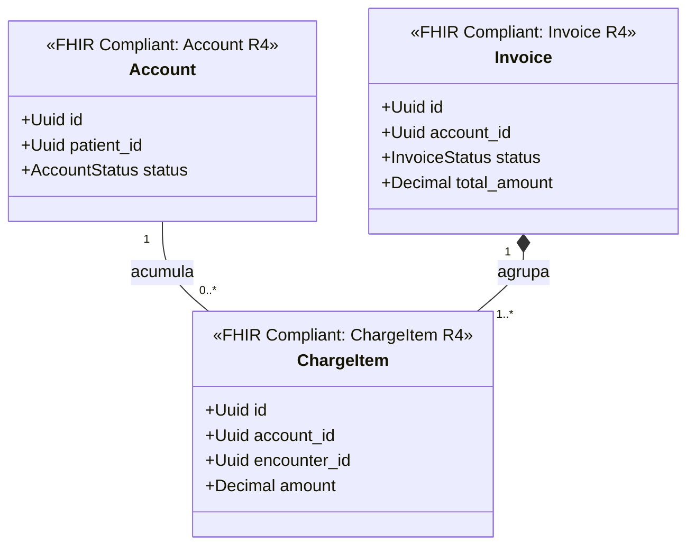

# Facturación Bounded Context (`crates/billing`)

## Especificación del Dominio

* **Responsabilidad**: Cuentas de facturación del paciente (`Account`), ítems cobrables acumulados por atención médica (`ChargeItem`) e inserción de comprobantes/facturas (`Invoice`).
* **Grupo FHIR**: FHIR Financial.
* **Recursos FHIR Mapeados**: `Account`, `Invoice`, `ChargeItem` (HL7 FHIR R4).
* **Módulos de Dominio (`src/domain/`)**: `account.rs`, `invoice.rs`, `charge_item.rs`.
* **Proyección / Apuntador Débil**: Apunta débilmente a `patient_id`, `encounter_id`, `coverage_id` (UUIDv7).
* **Estado**: contexto acotado **solo diseñado** — aún sin `Cargo.toml` ni código; no es miembro del workspace.

---

## Reglas de Dominio

* **`Account` es financiero, no de autenticación**: en FHIR, `Account` designa exclusivamente la cuenta de facturación y cobertura del paciente. La cuenta de acceso al sistema es `User` / `Person` en `crates/user`. Confundirlas es un error de modelado recurrente.
* **Depreciación por rango de fecha**: `Invoice` es una entidad transaccional que pierde valor operativo pasado su ciclo de retención legal y financiero. Se aplica **Range Partitioning por fecha** para permitir su archivo — a diferencia de las tablas maestras, que se particionan por hash y se conservan de forma permanente.
* **La factura agrupa, no recalcula**: `Invoice` agrupa `ChargeItem` ya acumulados en la `Account`. Los importes no se recalculan al facturar; se congelan al emitir el comprobante.

---

## Diagrama de Clases

