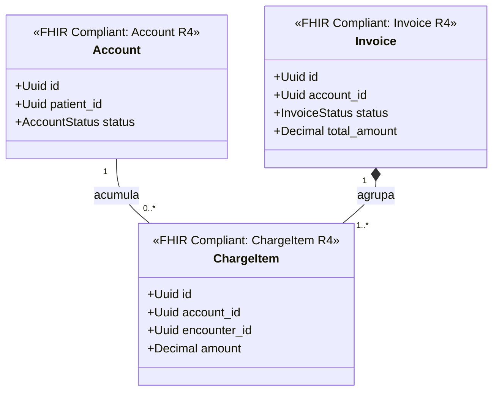

# Facturación Bounded Context (`crates/billing`)

## Especificación del Dominio

* **Responsabilidad**: Cuentas de facturación del paciente (`Account`), ítems cobrables acumulados por atención médica (`ChargeItem`) e inserción de comprobantes/facturas (`Invoice`).
* **Grupo FHIR**: FHIR Financial.
* **Recursos FHIR Mapeados**: `Account`, `Invoice`, `ChargeItem` (HL7 FHIR R4).
* **Módulos de Dominio (`src/domain/`)**: `account.rs`, `invoice.rs`, `charge_item.rs`.
* **Proyección / Apuntador Débil**: Apunta débilmente a `patient_id`, `encounter_id`, `coverage_id` (UUIDv7).

---

## Diagrama de Clases

