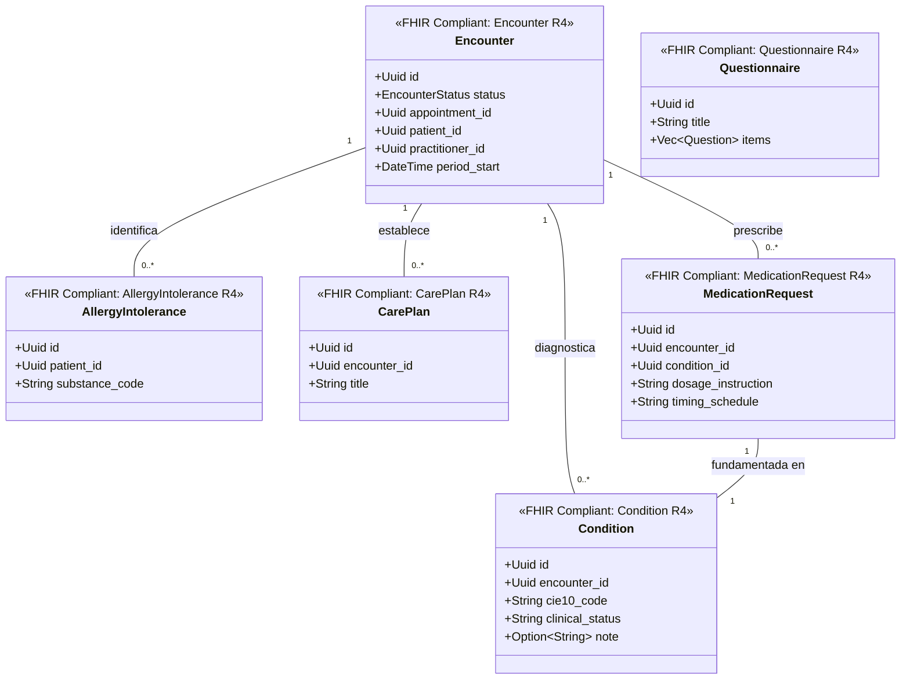

# Historia Clínica Bounded Context (`crates/clinical`)

## Especificación del Dominio

* **Responsabilidad**: Gestión de encuentros clínicos (`Encounter`), diagnósticos CIE-10 (`Condition`), alergias (`AllergyIntolerance`), planes de cuidado (`CarePlan`), prescripciones de medicamentos (`MedicationRequest`) y formularios dinámicos (`Questionnaire`).
* **Grupos FHIR**: FHIR Management / FHIR Clinical Summary / FHIR Care Provision / FHIR Diagnostics & Forms.
* **Recursos FHIR Mapeados**: `Encounter`, `Condition`, `AllergyIntolerance`, `CarePlan`, `MedicationRequest`, `Questionnaire` (HL7 FHIR R4).
* **Módulos de Dominio (`src/domain/`)**: `encounter.rs`, `condition.rs`, `allergy_intolerance.rs`, `care_plan.rs`, `medication_request.rs`, `questionnaire.rs`.
* **Proyección / Apuntador Débil**: Apunta débilmente a `patient_id`, `practitioner_id`, `appointment_id` (UUIDv7). Nota: De acuerdo a HL7 FHIR R4, `appointment_id` es opcional (`Option<Uuid>`) para permitir atenciones directas/urgencias.

---

## Diagrama de Clases

