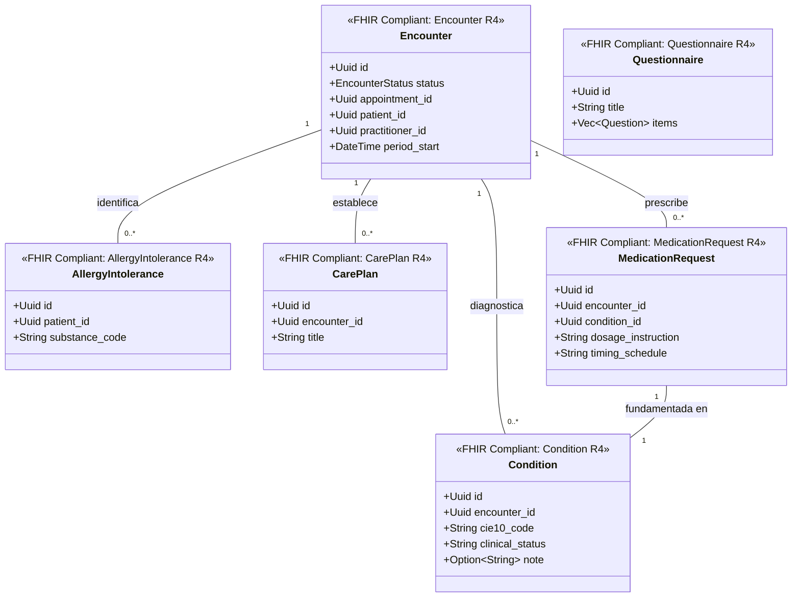

# Historia Clínica Bounded Context (`crates/clinical`)

## Especificación del Dominio

* **Responsabilidad**: Gestión de encuentros clínicos (`Encounter`), diagnósticos CIE-10 (`Condition`), alergias (`AllergyIntolerance`), planes de cuidado (`CarePlan`), prescripciones de medicamentos (`MedicationRequest`) y formularios dinámicos (`Questionnaire`).
* **Grupos FHIR**: FHIR Management / FHIR Clinical Summary / FHIR Care Provision / FHIR Diagnostics & Forms.
* **Recursos FHIR Mapeados**: `Encounter`, `Condition`, `AllergyIntolerance`, `CarePlan`, `MedicationRequest`, `Questionnaire` (HL7 FHIR R4).
* **Módulos de Dominio (`src/domain/`)**: `encounter.rs`, `condition.rs`, `allergy_intolerance.rs`, `care_plan.rs`, `medication_request.rs`, `questionnaire.rs`.
* **Proyección / Apuntador Débil**: Apunta débilmente a `patient_id`, `practitioner_id`, `appointment_id` (UUIDv7).
* **Estado**: contexto acotado **solo diseñado** — aún sin `Cargo.toml` ni código; no es miembro del workspace.

---

## Reglas de Dominio

* **Atención médica directa (`Encounter` sin `Appointment` previo)**: de acuerdo a HL7 FHIR R4, la creación de un `Encounter` **no exige** una cita médica previa. `appointment_id` es `Option<Uuid>` y vale `None` en atenciones de urgencia o *walk-in*. Modelarlo como obligatorio rompe el estándar y bloquea un caso de negocio real.
* **Codificación diagnóstica obligatoria**: `Condition` se codifica con **CIE-10**, la clasificación oficial del MINSA en Perú, complementada con **SNOMED CT** donde aplique. No se admiten diagnósticos como texto libre sin código asociado.
* **Conservación permanente**: los encuentros y diagnósticos son historial normativo obligatorio. Se particionan por **hash sobre la clave primaria** y **nunca** se archivan ni se deprecian por fecha.

---

## Diagrama de Clases

