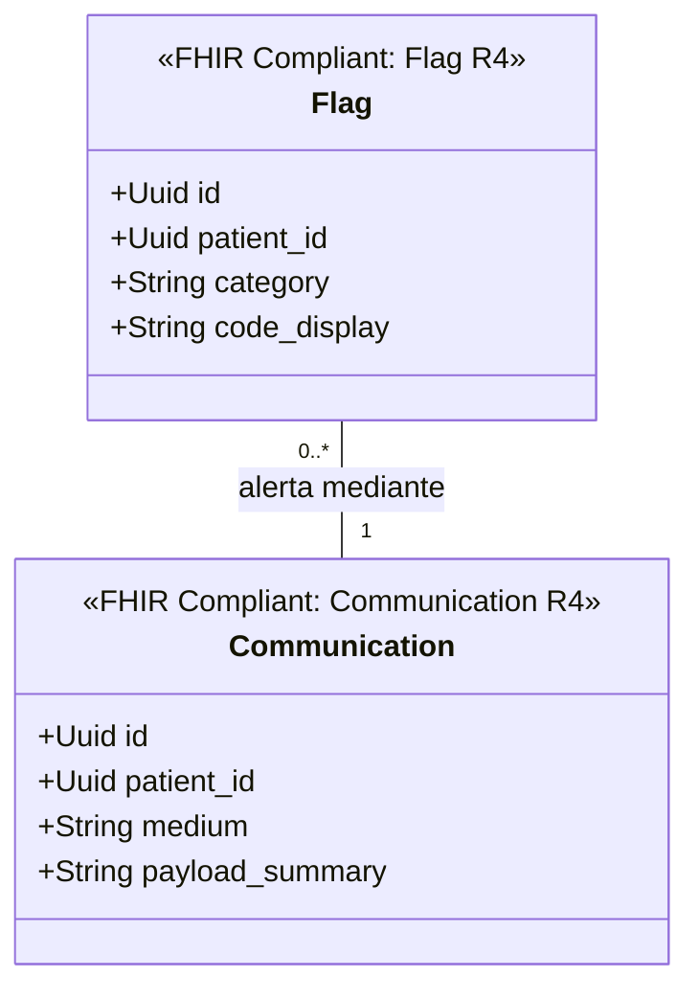

# Notificaciones y Alertas Bounded Context (`crates/communication`)

## Especificación del Dominio

* **Responsabilidad**: Mensajería directa entre actores de salud, notificaciones operacionales (`Communication`) y banderas de alerta/riesgo clínico sobre pacientes (`Flag`).
* **Grupo FHIR**: FHIR Workflow / Support.
* **Recursos FHIR Mapeados**: `Communication`, `CommunicationRequest`, `Flag` (HL7 FHIR R4).
* **Módulos de Dominio (`src/domain/`)**: `message.rs`, `flag.rs`.
* **Proyección / Apuntador Débil**: Apunta débilmente a `patient_id` (UUIDv7).
* **Estado**: contexto acotado **solo diseñado** — aún sin `Cargo.toml` ni código; no es miembro del workspace.

---

## Reglas de Dominio

* **Depreciación por rango de fecha**: `Communication` es tráfico operativo que pierde valor pasado su ciclo de retención. Se aplica **Range Partitioning por fecha** para permitir su archivo. Si un mensaje tiene valor clínico permanente, pertenece a `crates/clinical` o a `crates/legal_archive`, no aquí.
* **`Flag` es alerta, no diagnóstico**: una bandera de riesgo clínico señala y deriva; el diagnóstico formal vive en `Condition` (`crates/clinical`) codificado en CIE-10. No duplicar información clínica en la bandera.
* **Sin datos clínicos en el payload de notificación**: los mensajes salientes a canales externos (correo, SMS, push) no transportan información clínica identificable; llevan una referencia que obliga a autenticarse en la app.

---

## Diagrama de Clases

