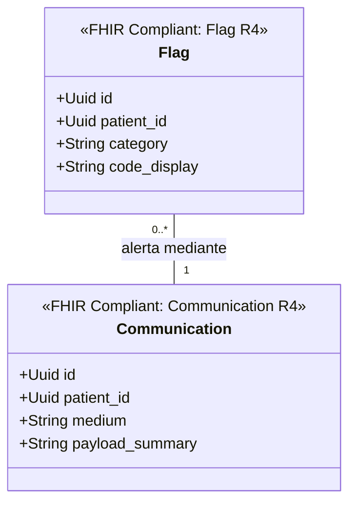

# Notificaciones y Alertas Bounded Context (`crates/communication`)

## Especificación del Dominio

* **Responsabilidad**: Mensajería directa entre actores de salud, notificaciones operacionales (`Communication`) y banderas de alerta/riesgo clínico sobre pacientes (`Flag`).
* **Grupo FHIR**: FHIR Workflow / Support.
* **Recursos FHIR Mapeados**: `Communication`, `CommunicationRequest`, `Flag` (HL7 FHIR R4).
* **Módulos de Dominio (`src/domain/`)**: `message.rs`, `flag.rs`.
* **Proyección / Apuntador Débil**: Apunta débilmente a `patient_id` (UUIDv7).

---

## Diagrama de Clases

