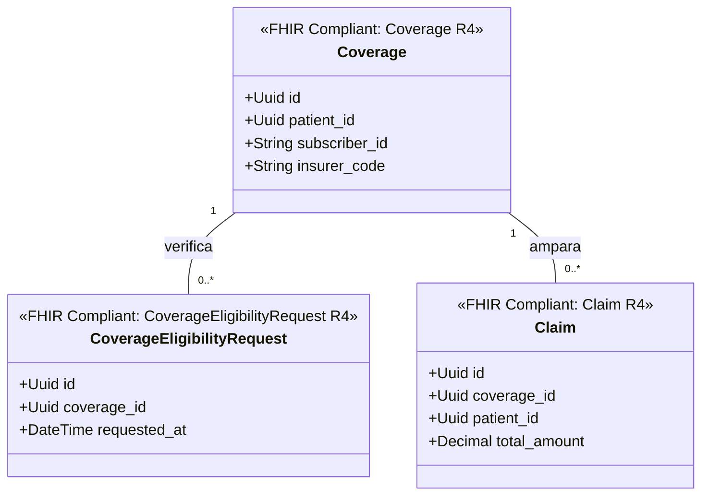

# Aseguradoras y Coberturas Bounded Context (`crates/coverage`)

## Especificación del Dominio

* **Responsabilidad**: Gestión de pólizas de seguro médico (`Coverage`), verificación de elegibilidad (`CoverageEligibilityRequest`) y reclamaciones financieras (`Claim` / `ClaimResponse`).
* **Grupo FHIR**: FHIR Financial / Claims.
* **Recursos FHIR Mapeados**: `Coverage`, `Claim`, `ClaimResponse`, `CoverageEligibilityRequest` (HL7 FHIR R4).
* **Módulos de Dominio (`src/domain/`)**: `policy.rs`, `claim.rs`, `eligibility.rs`.
* **Proyección / Apuntador Débil**: Apunta débilmente a `patient_id` (UUIDv7).
* **Estado**: contexto acotado **solo diseñado** — aún sin `Cargo.toml` ni código; no es miembro del workspace.

---

## Reglas de Dominio

* **La elegibilidad se verifica, no se asume**: un `Claim` solo se emite contra una `Coverage` cuya elegibilidad fue verificada mediante `CoverageEligibilityRequest`. La vigencia de la póliza se evalúa a la fecha de la atención, no a la fecha del reclamo.
* **La cobertura no bloquea la atención**: la ausencia o el rechazo de una `Coverage` nunca impide registrar un `Encounter`. El acto clínico y su financiamiento son contextos acotados independientes.
* **Sin importes en este contexto**: los montos cobrables se acumulan en `crates/billing` (`ChargeItem`). Aquí solo vive lo que la aseguradora ampara.

---

## Diagrama de Clases

