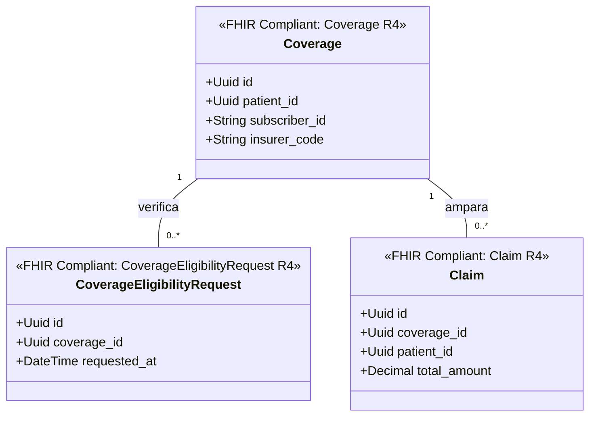

# Aseguradoras y Coberturas Bounded Context (`crates/coverage`)

## Especificación del Dominio

* **Responsabilidad**: Gestión de pólizas de seguro médico (`Coverage`), verificación de elegibilidad (`CoverageEligibilityRequest`) y reclamaciones financieras (`Claim` / `ClaimResponse`).
* **Grupo FHIR**: FHIR Financial / Claims.
* **Recursos FHIR Mapeados**: `Coverage`, `Claim`, `ClaimResponse`, `CoverageEligibilityRequest` (HL7 FHIR R4).
* **Módulos de Dominio (`src/domain/`)**: `policy.rs`, `claim.rs`, `eligibility.rs`.
* **Proyección / Apuntador Débil**: Apunta débilmente a `patient_id` (UUIDv7).

---

## Diagrama de Clases

