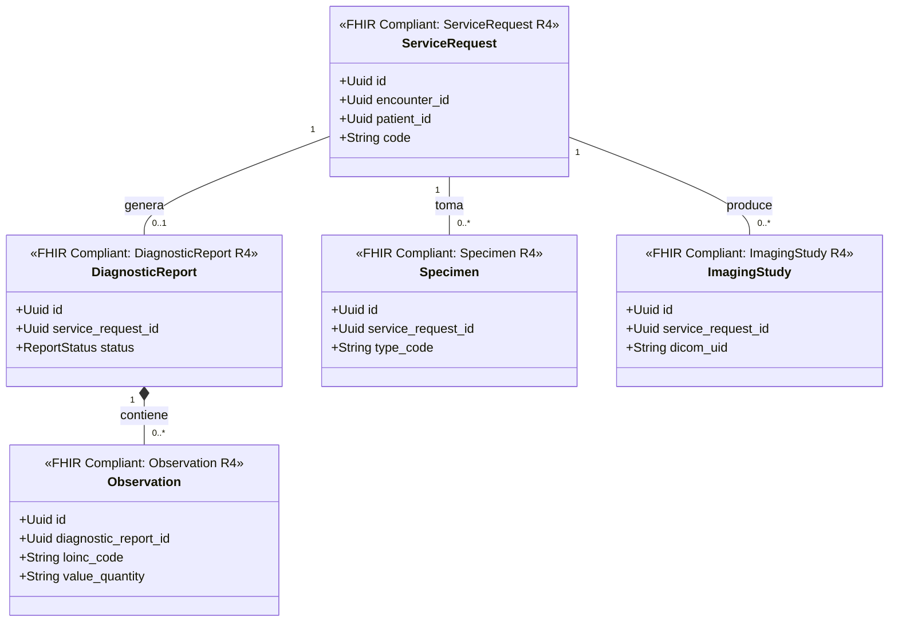

# Laboratorio e Imágenes Bounded Context (`crates/diagnostics`)

## Especificación del Dominio

* **Responsabilidad**: Gestión de órdenes de exámenes clínicos (`ServiceRequest`), hallazgos/observaciones LOINC (`Observation`), reportes diagnósticos (`DiagnosticReport`), muestras biológicas (`Specimen`) y estudios radiológicos DICOM (`ImagingStudy`).
* **Grupo FHIR**: FHIR Diagnostics.
* **Recursos FHIR Mapeados**: `ServiceRequest`, `Observation`, `DiagnosticReport`, `ImagingStudy`, `Specimen` (HL7 FHIR R4).
* **Módulos de Dominio (`src/domain/`)**: `service_request.rs`, `observation.rs`, `diagnostic_report.rs`, `imaging_study.rs`, `specimen.rs`.
* **Proyección / Apuntador Débil**: Apunta débilmente a `patient_id`, `encounter_id` (UUIDv7).

---

## Diagrama de Clases

