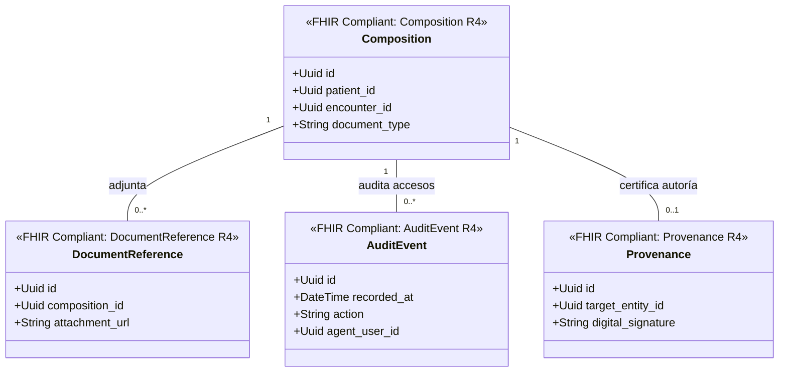

# Archivo Legal y Auditoría Bounded Context (`crates/legal_archive`)

## Especificación del Dominio

* **Responsabilidad**: Documentación clínica consolidada legal (`Composition`), referencias de adjuntos (`DocumentReference`), registros inmutables de auditoría (`AuditEvent`) y trazabilidad/firmas digitales de autoría (`Provenance`).
* **Grupo FHIR**: FHIR Documents & Security.
* **Recursos FHIR Mapeados**: `Composition`, `DocumentReference`, `AuditEvent`, `Provenance` (HL7 FHIR R4).
* **Módulos de Dominio (`src/domain/`)**: `composition.rs`, `document_reference.rs`, `audit_event.rs`, `provenance.rs`.
* **Proyección / Apuntador Débil**: Apunta débilmente a `patient_id`, `practitioner_id`, `encounter_id` (UUIDv7).

---

## Diagrama de Clases

