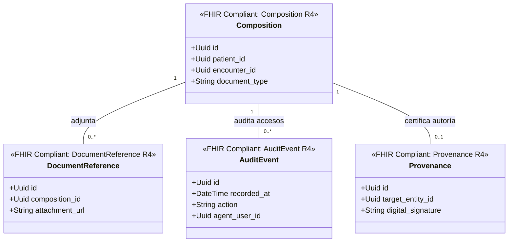

# Archivo Legal y Auditoría Bounded Context (`crates/legal_archive`)

## Especificación del Dominio

* **Responsabilidad**: Documentación clínica consolidada legal (`Composition`), referencias de adjuntos (`DocumentReference`), registros inmutables de auditoría (`AuditEvent`) y trazabilidad/firmas digitales de autoría (`Provenance`).
* **Grupo FHIR**: FHIR Documents & Security.
* **Recursos FHIR Mapeados**: `Composition`, `DocumentReference`, `AuditEvent`, `Provenance` (HL7 FHIR R4).
* **Módulos de Dominio (`src/domain/`)**: `composition.rs`, `document_reference.rs`, `audit_event.rs`, `provenance.rs`.
* **Proyección / Apuntador Débil**: Apunta débilmente a `patient_id`, `practitioner_id`, `encounter_id` (UUIDv7).
* **Estado**: contexto acotado **solo diseñado** — aún sin `Cargo.toml` ni código; no es miembro del workspace.

---

## Reglas de Dominio

* **Inmutabilidad del archivo**: `Composition`, `AuditEvent` y `Provenance` son **append-only**. No se admiten `UPDATE` ni `DELETE` sobre registros ya emitidos; una corrección se modela como un documento nuevo que supersede al anterior.
* **Conservación permanente de la documentación clínica**: `Composition` y `DocumentReference` son historial normativo obligatorio. Particionamiento por **hash** sobre la clave primaria, sin depreciación.
* **Depreciación por rango de fecha del rastro de auditoría**: `AuditEvent` sí caduca pasado su ciclo de retención legal. Se aplica **Range Partitioning por fecha** para permitir su archivo o purga controlada.
* **`Provenance` certifica autoría**: toda firma digital de un acto médico se registra aquí, apuntando débilmente a la entidad firmada. La firma no vive en la entidad de origen.

---

## Diagrama de Clases

