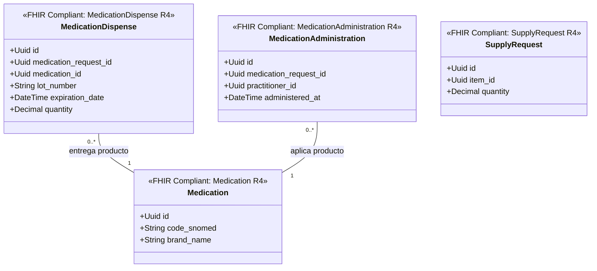

# Farmacia e Insumos Bounded Context (`crates/pharmacy`)

## Especificación del Dominio

* **Responsabilidad**: Vademécum/catálogo SNOMED CT (`Medication`), dispensación en farmacia (`MedicationDispense`), administración de fármacos (`MedicationAdministration`) e insumos médicos (`SupplyRequest` / `SupplyDelivery`).
* **Grupo FHIR**: FHIR Medications & Supply.
* **Recursos FHIR Mapeados**: `Medication`, `MedicationDispense`, `MedicationAdministration`, `SupplyRequest` / `SupplyDelivery` (HL7 FHIR R4).
* **Módulos de Dominio (`src/domain/`)**: `medication.rs`, `medication_dispense.rs`, `medication_administration.rs`, `supply.rs`.
* **Proyección / Apuntador Débil**: Apunta débilmente a `medication_request_id`, `patient_id`, `encounter_id` (UUIDv7).

---

## Diagrama de Clases

