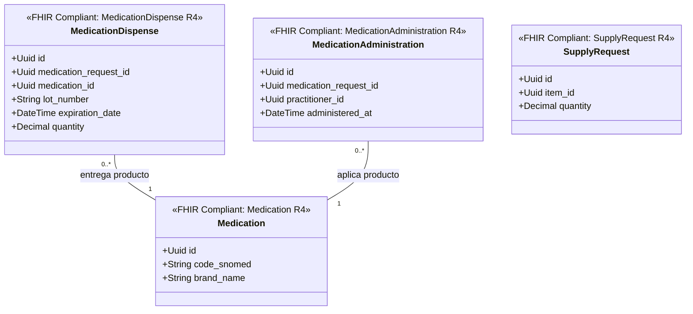

# Farmacia e Insumos Bounded Context (`crates/pharmacy`)

## Especificación del Dominio

* **Responsabilidad**: Vademécum/catálogo SNOMED CT (`Medication`), dispensación en farmacia (`MedicationDispense`), administración de fármacos (`MedicationAdministration`) e insumos médicos (`SupplyRequest` / `SupplyDelivery`).
* **Grupo FHIR**: FHIR Medications & Supply.
* **Recursos FHIR Mapeados**: `Medication`, `MedicationDispense`, `MedicationAdministration`, `SupplyRequest` / `SupplyDelivery` (HL7 FHIR R4).
* **Módulos de Dominio (`src/domain/`)**: `medication.rs`, `medication_dispense.rs`, `medication_administration.rs`, `supply.rs`.
* **Proyección / Apuntador Débil**: Apunta débilmente a `medication_request_id`, `patient_id`, `encounter_id` (UUIDv7).
* **Estado**: contexto acotado **solo diseñado** — aún sin `Cargo.toml` ni código; no es miembro del workspace.

---

## Reglas de Dominio

* **Catálogo codificado con SNOMED CT**: `Medication` se identifica por su código SNOMED CT (`code_snomed`), no por el nombre comercial. `brand_name` es un atributo descriptivo, jamás la clave de negocio.
* **Trazabilidad de lote obligatoria**: toda `MedicationDispense` registra `lot_number` y `expiration_date`. Sin ellos no hay trazabilidad sanitaria ni capacidad de retirar un lote del mercado.
* **Dispensar y administrar son actos distintos**: `MedicationDispense` (la farmacia entrega) y `MedicationAdministration` (el profesional aplica) son entidades separadas. No colapsarlas: pueden ocurrir en momentos y por actores diferentes, y la segunda requiere `practitioner_id`.

---

## Diagrama de Clases

