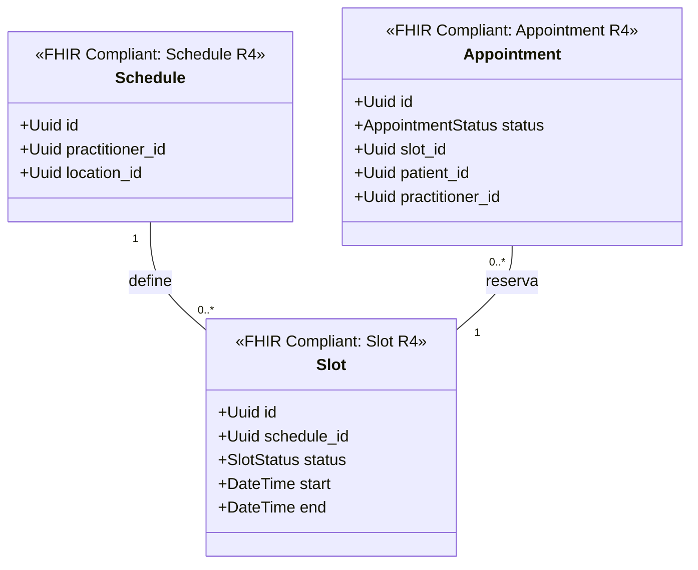

# Reserva de Citas Bounded Context (`crates/scheduling`)

## Especificación del Dominio

* **Responsabilidad**: Gestión de agendas de atención médica (`Schedule`), bloques de disponibilidad (`Slot`) y reserva de citas (`Appointment`).
* **Grupo FHIR**: FHIR Workflow.
* **Recursos FHIR Mapeados**: `Schedule`, `Slot`, `Appointment` (HL7 FHIR R4).
* **Módulos de Dominio (`src/domain/`)**: `schedule.rs`, `slot.rs`, `appointment.rs`.
* **Proyección / Apuntador Débil**: Apunta débilmente a `patient_id`, `practitioner_id`, `location_id` (UUIDv7).

---

## Diagrama de Clases

