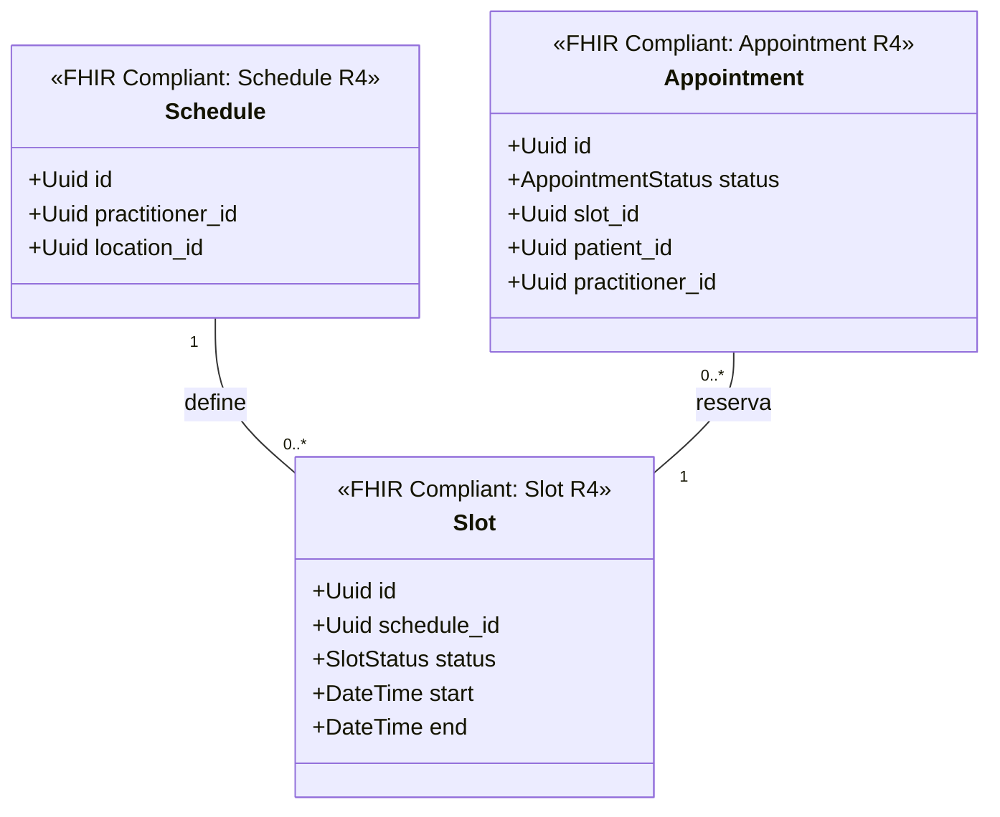

# Reserva de Citas Bounded Context (`crates/scheduling`)

## Especificación del Dominio

* **Responsabilidad**: Gestión de agendas de atención médica (`Schedule`), bloques de disponibilidad (`Slot`) y reserva de citas (`Appointment`).
* **Grupo FHIR**: FHIR Workflow.
* **Recursos FHIR Mapeados**: `Schedule`, `Slot`, `Appointment` (HL7 FHIR R4).
* **Módulos de Dominio (`src/domain/`)**: `schedule.rs`, `slot.rs`, `appointment.rs`.
* **Proyección / Apuntador Débil**: Apunta débilmente a `patient_id`, `practitioner_id`, `location_id` (UUIDv7).
* **Estado**: contexto acotado **solo diseñado** — aún sin `Cargo.toml` ni código; no es miembro del workspace.

---

## Reglas de Dominio

* **La cita se confirma al 100 %, nunca queda tentativa**: aunque la identidad del paciente esté pendiente de verificación presencial (`LinkAssuranceLevel::Level1`), la reserva se guarda **CONFIRMADA** y el cupo médico queda garantizado. El nivel de certeza de la identidad **no** condiciona la disponibilidad del cupo; se resuelve en el check-in.
* **DNI obligatorio al confirmar**: confirmar la primera cita de un paciente es el disparador que vuelve mandatorio su DNI (Ley N° 30024). Ver el registro progresivo en [crates/user/AGENTS.md](../user/AGENTS.md).
* **`Slot` es la unidad de exclusión mutua**: la disponibilidad se reserva sobre el `Slot`, no sobre el `Appointment`. Dos citas no pueden ocupar el mismo `Slot`; la garantía se implementa en la base de datos, no en la capa de aplicación.

---

## Diagrama de Clases

