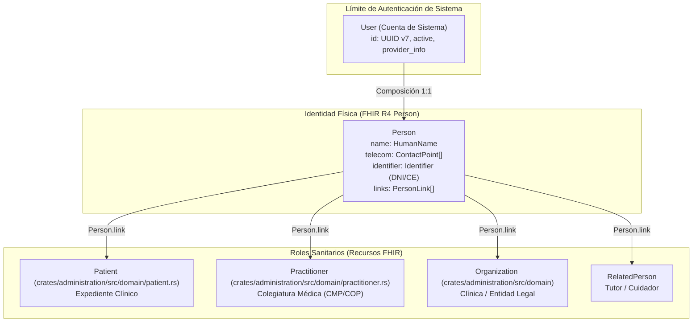

# Identity & Security Bounded Context (`crates/user`)

## Especificación del Dominio

* **Responsabilidad**: Gestión de credenciales, autenticación de sistema e identidad física del usuario.
* **Grupo FHIR**: Foundation / Security.
* **Recurso FHIR Mapeado**: `Person` (HL7 FHIR R4) + `User` (Cuenta de Sistema).
* **Módulos de Dominio (`src/domain/`)**: `user.rs` (incluye el enum `IdentityProvider`), `error.rs`, `repository/`.
* **Nota**: el recurso `Person` **no** vive en este crate: es un Value Object FHIR compartido en `crates/core/src/domain/fhir/person.rs`.

---

## Reglas de Dominio

### Composición de Identidad

* **`User` compone `Person`, no la aplana**: `User` es el límite de autenticación del sistema (`id`, `active`, `person`, `provider_info`, `is_owner`). La identidad humana y su demografía viven estrictamente dentro del recurso **HL7 FHIR R4 `Person`** (`name: HumanName`, `telecom: Vec<ContactPoint>`, `identifier: Option<Identifier>`, `birth_date`, `links: Vec<PersonLink>`). Está **estrictamente prohibido aplanar o duplicar** los campos de `Person` dentro de DTOs, eventos de dominio o filas de repositorio.
* **Enlaces de roles vía `Person.link`**: una `Person` se conecta con sus roles sanitarios mediante los destinos de `PersonLink` (`Patient`, `Practitioner`, `RelatedPerson`, `Organization`). Esto permite que **una sola cuenta gestione múltiples perfiles de paciente** (padres administrando a sus hijos) o que administre una clínica **sin requerir un registro de paciente ficticio**.
* **Terminología FHIR**: `HumanName` usa `given`, `family`, `second_family` (extensión hispana) y `text` calculado por el Smart Constructor. `ContactPoint` usa `system` (`Phone`, `Email`, `Fax`, `Url`) y `use_type`.
* **`Account` no es una cuenta de usuario**: en FHIR, `Account` se refiere exclusivamente a cuentas financieras de facturación y cobertura (`crates/billing`). Las cuentas de autenticación del sistema se mapean a `User` / `Person`. No confundirlas al modelar.

### Invariantes de Unicidad e Identidad

| Campo | Unicidad | Razón |
|---|---|---|
| `User.email` | **Estricta** por cuenta de sistema | Credencial principal de autenticación. |
| `User.person.identifier` (DNI) | **Estricta** por cuenta `User` principal | Garantiza una única Historia Clínica Electrónica por ciudadano físico (Ley N° 30024, RNHCE / MINSA). |
| `ContactPoint` (teléfono) | **No estricta, a propósito** | Familiares y padres que administran dependientes comparten legítimamente el teléfono de casa o de contacto. |

### Identificadores Nacionales (Perú)

* El `Identifier` de tipo DNI se mapea al registro oficial peruano: sistema `http://reniec.gob.pe/dni` (código FHIR `NNPER`). No inventar sistemas propios ni usar cadenas libres.

### Registro Progresivo (Progressive Profiling)

El flujo de registro es único y recolecta datos de forma progresiva: la creación inicial de la cuenta requiere datos mínimos y el DNI es **opcional**. El documento de identidad se exige más adelante, según disparadores operacionales por rol:

| Rol del Usuario | ¿DNI al registrarse? | Disparador mandatorio de DNI | Razón de negocio / legal (Perú) |
|---|---|---|---|
| **Paciente (`Patient`)** | ❌ Opcional | Al **confirmar su primera cita médica** o emitir una receta / atención. | Ley N° 30024 RNHCE / MINSA: asociación de la Historia Clínica a una persona real. |
| **Administrador de Clínica** | ❌ Opcional | Al **activar o crear la Clínica (`Organization`)** o configurar facturación / RUC. | Verificación de identidad legal del representante de la clínica. |
| **Profesional de Salud (`Practitioner`)** | ❌ Opcional | Al **activar el perfil médico**, habilitar agenda o **firmar atenciones / recetas**. | Verificación de identidad + colegiatura (CMP/COP) para emitir actos médicos. |

### Recuperación de Cuenta y Re-vinculación Presencial

Cuando un usuario registra una cuenta nueva con un DNI ya vinculado a una identidad existente cuyas credenciales se perdieron:

1. Se crea una cuenta `User` nueva con un `PersonLink` en estado pendiente (`LinkAssuranceLevel::Level1`).
2. **La reserva de la cita médica queda 100 % CONFIRMADA, nunca tentativa**: el cupo médico se garantiza al paciente aunque la vinculación siga pendiente.
3. En el check-in presencial del día de la cita, recepción verifica el DNI físico y eleva el `LinkAssuranceLevel` a verificado (`Level3` / `Level4`), desbloqueando el acceso al historial previo de forma transparente.

### Estados de Respuesta de `sign_up` (`proto/api.proto`)

| Estado | Cuándo | Mensaje al cliente |
|---|---|---|
| `SignUpStatus::SUCCESS` | Cuenta creada limpiamente. | «Usuario registrado exitosamente.» |
| `SignUpStatus::LINK_PENDING_PRESENCIAL_VERIFICATION` | Se detectó historial previo del DNI y el cliente envió `confirm_pending_presencial_link = true`. `PersonLink` queda en `Level1`. | «Cuenta creada exitosamente. Se detectó una Historia Clínica asociada a tu DNI. La vinculación final se completará durante tu verificación presencial en tu próxima cita médica.» |
| `DNI_ALREADY_VERIFIED_CONFLICT` → gRPC `ALREADY_EXISTS` | El DNI ya existe y `confirm_pending_presencial_link` es `false` o `None`. | «El DNI ingresado ya está asociado a una cuenta. ¿Deseas iniciar sesión o solicitar la vinculación presencial en tu próxima cita médica?» |

### Publicación de Eventos

* Tras persistir el usuario, este contexto emite `UserCreatedEvent` (`user_id`, `person: Person`, `create_clinic`) a la cola `UserCreatedEvent::QUEUE` mediante `ApalisEventPublisher` (`src/infrastructure/event/`).
* **El fallo al encolar no aborta el `sign_up`**: el usuario ya está persistido, así que el error se registra con `tracing::error!` y se devuelve éxito al cliente. La entrega es *at-least-once*, no exactly-once.
* El publicador abre su **propio** pool, independiente del de los repositorios de entidades.

---

## Arquitectura y Composición de Identidad FHIR

---

## Diagrama de Clases

