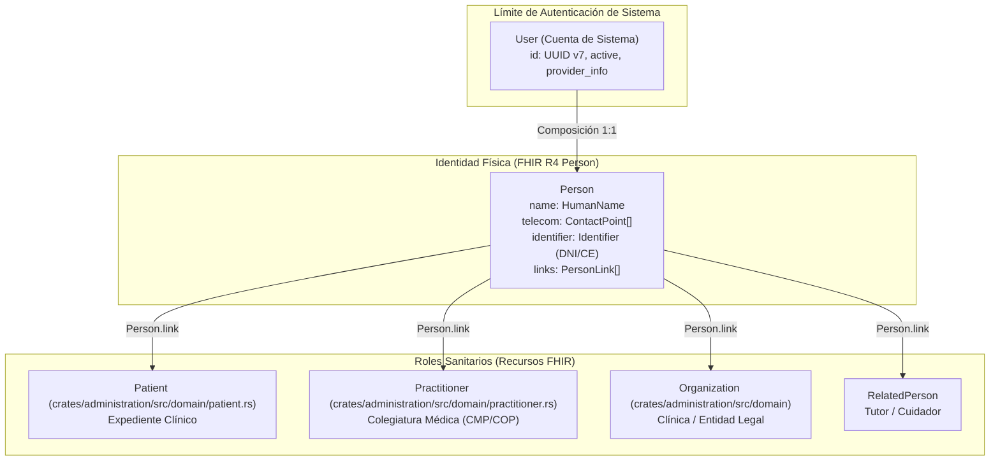
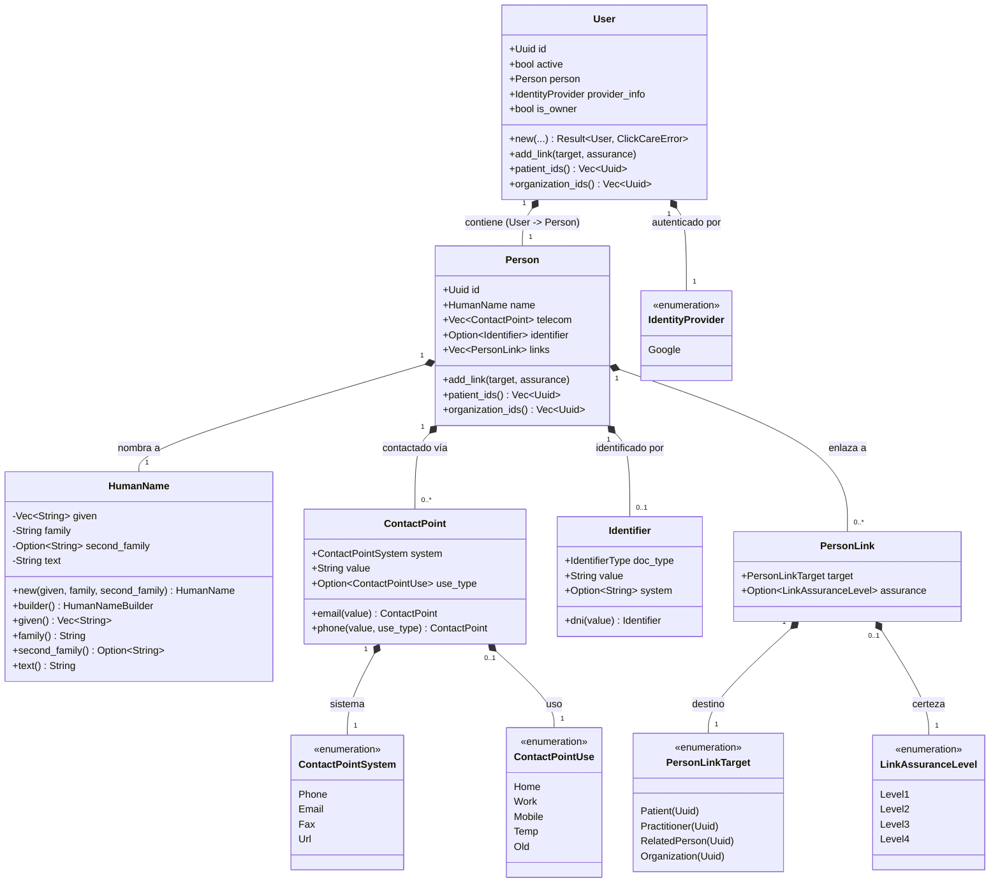

# Identity & Security Bounded Context (`crates/user`)

## Especificación del Dominio

* **Responsabilidad**: Gestión de credenciales, autenticación de sistema e identidad física del usuario.
* **Grupo FHIR**: Foundation / Security.
* **Recurso FHIR Mapeado**: `Person` (HL7 FHIR R4) + `User` (Cuenta de Sistema).
* **Módulos de Dominio (`src/domain/`)**: `user.rs`, `person.rs`, `identity_provider.rs`.

---

## Arquitectura y Composición de Identidad FHIR

---

## Diagrama de Clases

