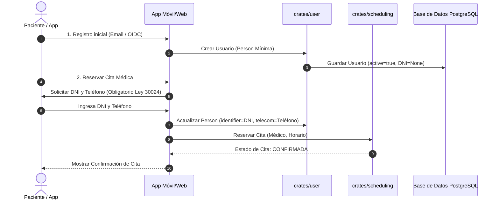
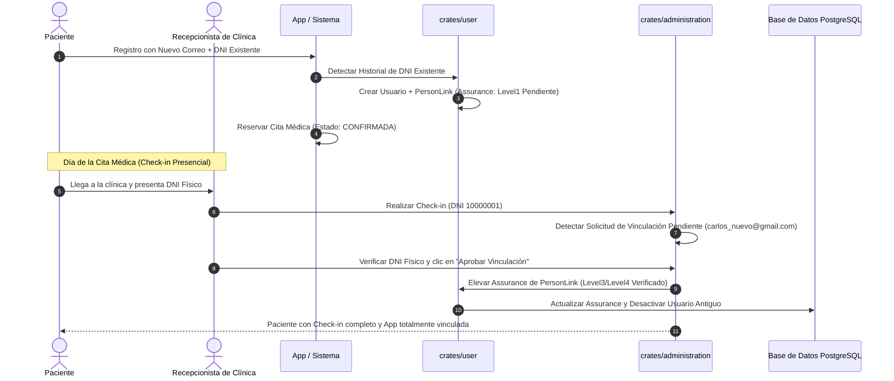
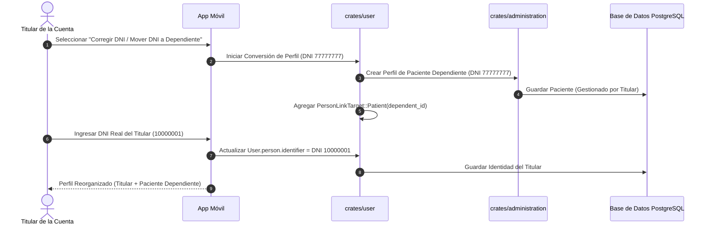
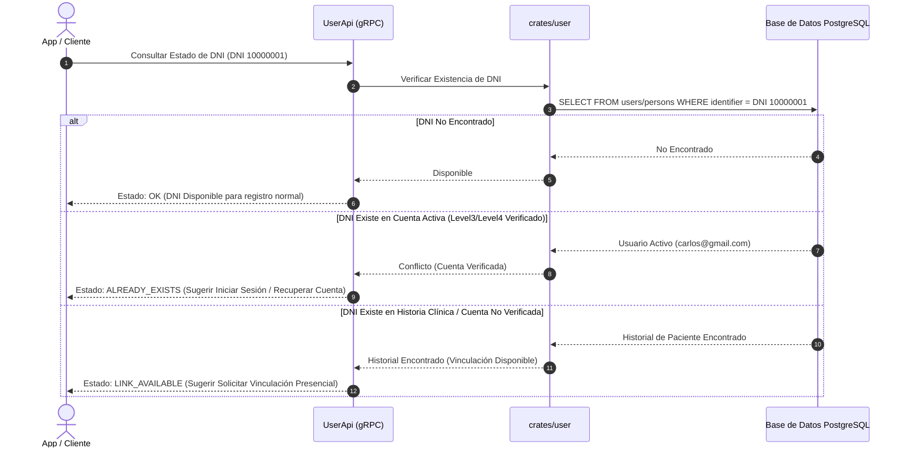
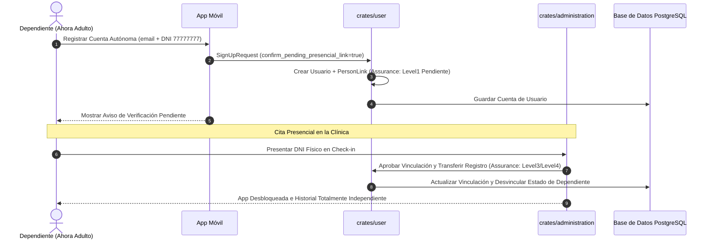
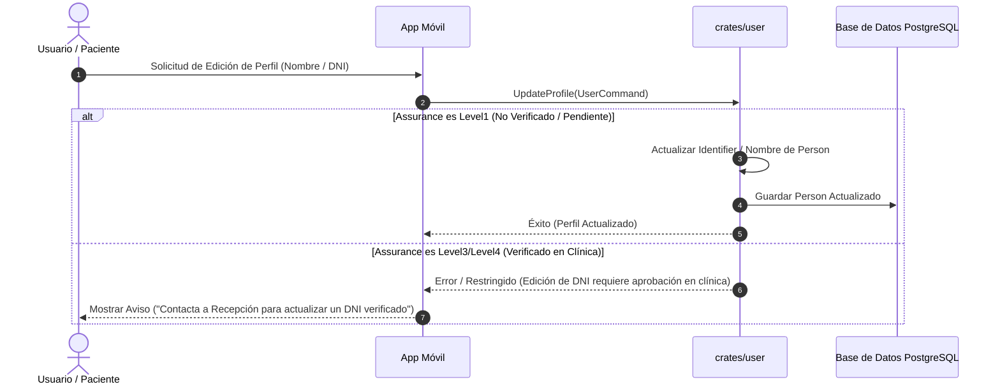

# Casos de Uso del Ciclo de Vida de Cuentas e Identidad

## Caso de Uso 1: Registro Progresivo y Cita Confirmada
El usuario se registra con datos mínimos (Google OIDC/Email). Al agendar una cita médica, el DNI y Teléfono se vuelven obligatorios. La cita se guarda **100% CONFIRMADA** en la agenda de la clínica.

## Caso de Uso 2: Recuperación de Credenciales y Re-vinculación Presencial
El usuario perdió acceso a su correo/teléfono antiguo. Registra una nueva cuenta con su DNI. La cuenta se crea con `LinkAssuranceLevel::Level1` (Pendiente). La cita se guarda **100% CONFIRMADA**. El día de la cita, la recepcionista verifica el DNI físico al hacer Check-in, elevando la certeza a `Level3`/`Level4` (Verificado).

## Caso de Uso 3: Corrección de DNI Registrado por Error y Conversión a Perfil Familiar
El usuario registró por error el DNI de un familiar (ej. hijo o padre) en su cuenta principal. El usuario convierte el DNI del familiar en un perfil gestionado de `Patient` (`PersonLinkTarget::Patient`) e ingresa su propio DNI en la cuenta principal.

## Caso de Uso 4: Consulta Previa por DNI y Opciones Dinámicas
La App consulta a la API antes o durante el registro. El backend verifica la existencia y estado del DNI para guiar las opciones de interfaz.

## Caso de Uso 5: Independización de Perfil Dependiente (Hijo cumple 18 años)
Un hijo registrado como dependiente (`Patient` vinculado a la cuenta del padre) registra su propia cuenta `User` autónoma con su correo y DNI.

## Caso de Uso 6: Actualización de Datos de Perfil y Controles por Nivel de Certeza
El usuario intenta actualizar campos de identidad (Nombre, DNI, Teléfono). Las actualizaciones se permiten libremente en cuentas no verificadas (`Level1`) y se restringen/auditan en cuentas verificadas (`Level3`/`Level4`).

